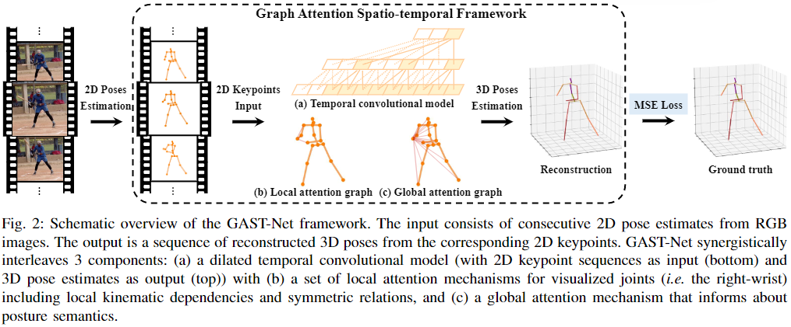

### GAST-Net

**Paper: [A Graph Attention Spatio-temporal Convolutional Network for 3D Human Pose Estimation in Video ](https://arxiv.org/abs/2003.14179)**

#### Abstract

在三维姿态估计中，时空信息是解决遮挡和深度模糊的关键，以前的方法侧重于时间上下文或嵌入固定长度时空信息的局部 to 全局的架构，到目前为止，还没有有效的方案来同时灵活地捕捉变化的时空序列，并有效地实现实时三维姿态估计。在这项工作中，我们改进了对人体骨骼运动学约束的学习：姿势、局部运动学连接和对称性，通过注意机制建模局部和全局空间信息。为了适应单帧和多帧估计，采用扩展时间模型处理变化的骨架序列。此外，重要的是，我们精心设计了空间语义与时间依赖性的交替，以实现协同效应。为此，我们提出了一种简单而有效的图注意力时空卷积网络 (GAST-Net)，该网络由交替的时间卷积和图注意力模块组成。在两个具有挑战性的基准数据集 (Human3.6M 和 HumanEva-I) 和 YouTube 视频上的实验表明，我们的方法有效地缓解了深度模糊和自遮挡，并推广到上半身估计，并在 2D 到 3D 视频姿态估计上取得了较好的性能。

**Code：http://www.juanrojas.net/gast/**

#### 1. Introduction

尽管目前基于视频的 2D-to-3D 方法取得了相当大的进展，但它们都没有集成以下显著特征：

- 从二维关键点序列的层次结构和姿态语义中提取更多信息的上下文时空信息来解决深度模糊，减轻自我遮挡，平滑运动。
- 灵活的输入帧长度处理，注意到视频有效地显示不同长度的序列。
- 无需冗余中间帧计算的三维姿态实时估计。实时估计有利于高语义视觉任务的下游组合;如将基于骨骼的动作识别与人-机实时交互相结合。

这些挑战激励我们研究更丰富的时空表征和灵活的时空信息交错。为此，我们贡献了一个交错的图注意力时空网络，通过图注意力块更好地学习人类运动学约束的三个方面，并利用扩张卷积建模长期时间上下文。图注意块学习骨骼关节的对称性、远端关节的局部运动学关系和全局姿态关节语义。扩张的时间卷积网络 (TCNs) 可以灵活地捕捉变化序列，并与因果卷积 (啥东西) 一起工作，实现实时姿态估计 [7], [9] (见图 2(a))。对于单帧场景，可以用步长卷积代替扩张卷积，无需重新训练新的模型 [7] 即可快速推断。在我们的工作中，我们理解空间和时间数据是异构的。因此，我们独立地对待它们，但以协同的方式交替执行它们，使我们能够利用 TCNs 的好处。

在空间建模方面，来自局部连接和对称性的局部空间特征通过图卷积网络 (GCNs) 建模，在我们的系统中称为 “Local Attention Graph’s” (见图 2(b))，对于全局空间特征，我们从 [10] 和利用图注意网络 [11] 中汲取灵感，用数据驱动学习表达姿态语义，这些块被称为 “Local Attention Graph’s”，如图 2(c)所示。图注意模块有效地表达了人体的层次对称结构，并随着时间的推移自适应地提取全局语义信息，特别是将局部和全局空间块与时间块交替进行，有效提取和融合二维关键点序列的时空特征 (如图 3 所示)。

#### 3. Approach

本文的任务是给定从视频中预测的 2D 姿态坐标序列，然后输出 3D 姿态坐标序列，本文提出的方法就是一个图注意力时空交错网络，如图 3 所示，其中时间成分用的是扩张时间卷积网络进行设计，其中扩张是为了处理长期模式，对于空间成分，网络中有一个局部空间注意力网络，来建模分层的和对称的人体骨架结构，以及一个全局空间注意力网络，来自适应提取全局语义信息以更好地对人体的空间特征进行编码，本文提出的网络具有 27 帧的感受野。

##### A. Temporal Convolutional Network

本文将输入的 2D 姿态坐标序列表示为一个 3 维向量 (T, N, C)，其中 T 表示时间感受野的大小 (帧数)，N 表示每帧需要估计的关节关键点数量，C 表示坐标的维度 (即 2)，其中时间卷积模型中用的是在第一个维度 (帧) 上的一维卷积，看图 3 中给的模型，第一个维度相当于图像分辨率，第三个维度相当于卷积核的深度，不知道这里有没有分离深度，然后第 2 个维度就不理解了，一直都没变过，那么是不是不同关键点之间的信息是没有交互的，但这样做感觉不合理，还是说在时间卷积模型中没有交互，在后面的空间注意力模块中存在交互。

##### B. Local Attention Graph

后面的图卷积网络没看懂。

