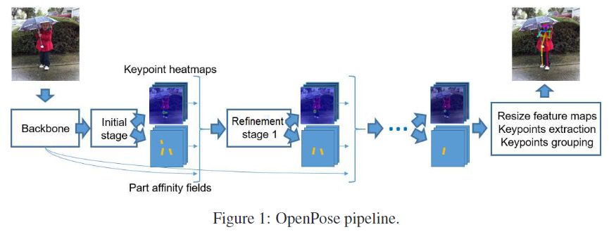
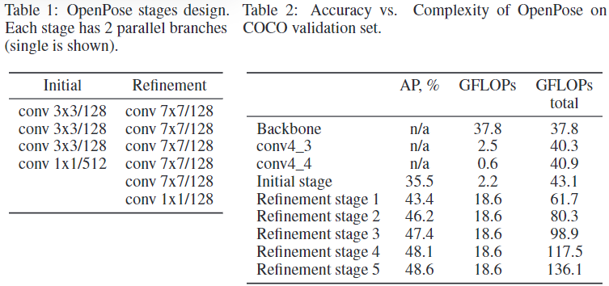
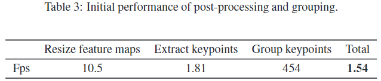
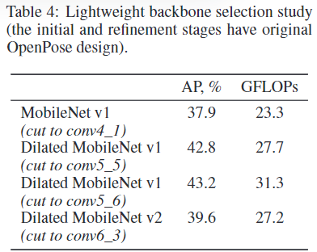
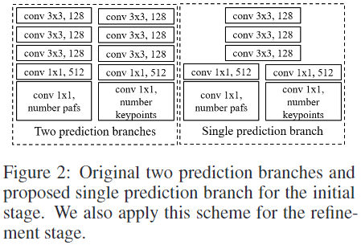
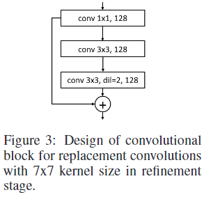
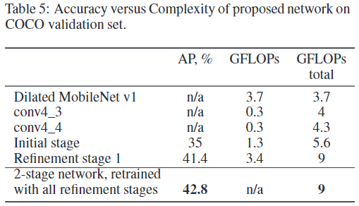
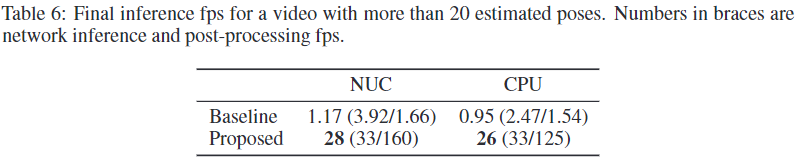

### Lightweight OpenPose

**Paper: [Real-time 2D Multi-Person Pose Estimation on CPU:Lightweight OpenPose](https://arxiv.org/abs/1811.12004)**

#### Abstract

本文主要对 OpenPose 框架进行轻量化改进，改进后的方案分别能够在 Intel® NUC 6i7KYB mini PC 和 Core i7-6850K CPU 上以 28 和 26 fps 运行。网络模型参数量为 4.1M，浮点操作数为 9G FLOPs，仅为 2 阶段 OpenPose 的 ~15%，同时估计的质量几乎相同，代码和模型能够作为 Intel® OpenVINOTM Toolkit 一部分获取。

#### 3. Analysis of the Original OpenPose

##### 3.1  Pipeline

这篇论文讲的感觉和原论文中讲的不一样，这里是每一个阶段都预测了关键点置信图和 PAFs，原论文是前几个阶段只预测 PAFs，后几个阶段只预测置信图。

##### 3.2  Complexity Analysis

原始实现使用 VGG-19 backbone 中 conv4_2 层之前的部分作为特征提取器，然后加了 2 个额外的卷积层，随后进行初始和 5 个细化阶段。

每个阶段包含两个平行的分支：一个估计关键点置信图，一个估计 PAFs，两条支路有相同的设计，如表 1 所示，我们设置网络输入分辨率为 368x368，并使用与原文相同的COCO验证子集，进行单尺度测试，测试 CPU 为 Intel® CoreTM i7-6850k, 3.6GHz，表 2 显示了精度和细化阶段数量之间的权衡，可以看出，后面的阶段每加一个 GFLOPs 只能给予较少的改进，所以对于优化版本，我们只保留前两个阶段：初始阶段和一个细化阶段。

后处理阶段的数据总结在表 3 中，这些数据是通过运行代码获得的，该代码使用 OpenCV[2] 用 C++ 编写的，尽管分组本身是轻量级的，但其他部分需要进行优化。

#### 4. Optimization

##### 4.1  Network Design

所有的实验都是在原始论文的默认训练参数下进行的，我们使用COCO数据集 [12] 进行训练。如上所述，我们只保留初始和第一个细化阶段。然而，其余的阶段可以提供正则化效果，所以最后的网络被再训练了额外的阶段，但测试时只有前两个阶段被使用。这种方法可以改善约 1% 的AP。

###### 4.1.1  Lightweight Backbone

我们用 MobileNet family 取代 VGG 作为 backbone 提取特征，从 MobileNet-V1 开始。

在一种简单的方式中，如果将新 backbone 保持到输出特征图尺寸与原来的相同时，这会导致显著的精度下降，这可能因为特征表示很浅且弱，为了节省空间分辨率和重用骨干权重，我们使用了扩展卷积 [17]。去除 conv4_2/dw 层的 stride，将扩张参数值设为2，使conv5_1/dwlayer保持接受域。我们使用所有的图层tillconv5_5block，conv5_6block的加入提高了精度，但以性能为代价。我们也尝试了更轻量的 backbone MobileNet v2，但是效果并不好，如表 4 所示。

###### 4.1.2  Lightweight Refinement Stage

为了生成关键点置信图和 PAFs 的新估计，细化阶段从主干提取特征，并与之前的关键点置信图和 PAFs 估计连接起来。基于这个事实，我们决定在置信图和 PAFs 之间共享大部分计算，并在初始和细化阶段使用单一的预测分支。我们共享所有层，除了最后两个层，后者直接产生关键点置信图和 PAFs ，见图2。

将 7x7 卷积核进行如下代替：

我们还用3个深度可分离卷积替换了conv4_3，通道数量从256减少到128。所提出的网络设计的复杂性和准确性如表5所示，

##### 4.2  Fast Post-processing

我们分析了代码，删除了额外的内存分配，并使用opencv的例程并行化了关键点提取。这大大提高了代码的速度，最后一个瓶颈是将特征图的大小调整到输入图像的大小。

我们决定跳过调整大小的步骤，直接在网络输出上执行分组，但准确性显著下降。因此，上采样特征图的步进是不可避免的，但对上采样至输入图像大小却没有必要。我们的实验表明，上采样因子 8 的精度没有损失，最终我们使用上采样因子为 4。

##### 4.3  Inference

模型推理使用 Intel® OpenVINOTM Toolkit R4 [1]，最终的表现如表 6 所示，他们是在一个具有挑战性的视频，估计超过20个姿势。

