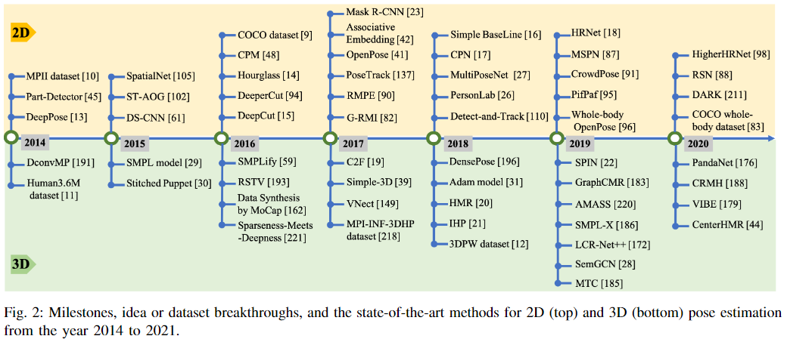
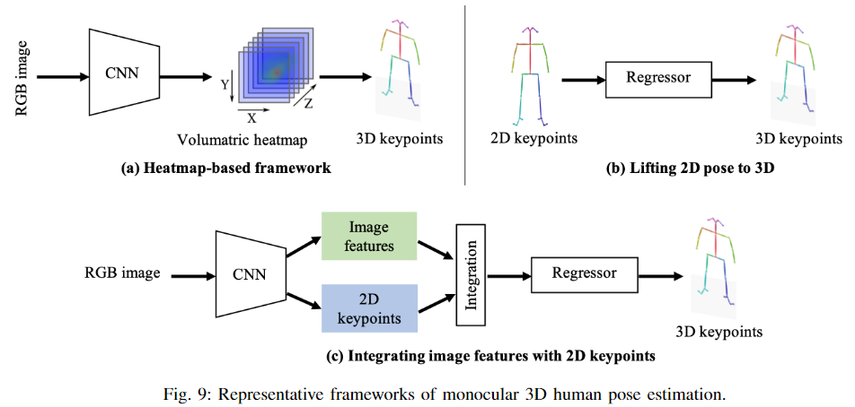
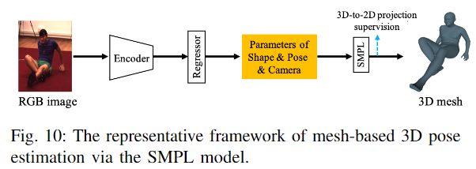

### Deep Monocular Human Pose Estimation Survey

**Paper: [Recent Advances in Monocular 2D and 3D Human Pose Estimation: A Deep Learning Perspective. ArXiv, 2021.](https://arxiv.org/abs/2104.11536)**

#### Abstract

本文总结了 2014 年以来主流的和里程碑式的方法 2D to 3D 人体姿态估计方法，并且通过系统总结这些方法之间的差异和联系，进一步分析了具有挑战性的案例的解决方案。我们还总结了流行方法的姿态表现风格、基准、评价指标和量化性能。最后，我们讨论了挑战，并对未来的研究方向进行了深入思考。

#### 1. Introduction

##### A. Motivation

单目人体姿态估计 (Monocular Human Pose Estimation, MHPE)，是计算机视觉中一项基本且具有挑战性的任务，旨在从单目图像或视频中预测人体的姿态信息，如身体关节的空间位置和 / 或身体形状参数。

MHPE 已被广泛应用于许多计算机视觉任务，如行人重识别 [1] [2]，人体解析 [3] [4]，人体动作识别 [5] [6]，人机交互 [7] [8]等。由于 MHPE 不需要复杂的多摄像头或可穿戴标记点，它已成为许多现实世界应用的重要组成部分，如虚拟现实、3D 电影制作/编辑、自动驾驶、运动和活动分析，以及人机交互。

MHPE 的分类和数据集：

2014 ~ 2020 年相关主流会议 (CVPR, ICCV, ECCV 等) 和期刊 (TPAMI, TIP, TOG 等)上 MHPE 相关论文数量如下图，最近的工作主要集中在网络设计与优化[13]-[22]，多任务交互[23]-[27]，模型探索[28]-[31]等。

本文贡献：

1. 总结了统一框架中常用的二维和三维姿态估计网络。
2. 对人体三维表现、三维数据集、三维形状恢复方法以及三维姿态估计面临的挑战和下一步的工作进行了深入的分析。
3. 发布了一个详细的三维姿态数据处理[代码工具箱](https://github.com/Arthur151/SOTA-on-monocular-3D-pose-and-shape-estimation)。

在图 2 中，我们总结了一个时间轴，显示了 2014 ~ 2021 年的里程碑，方法或者数据集突破，以及 2D 和 3D 姿态估计的 SOTA 方法。可以看到，新的方法和新的数据集是相互促进的。自2016年以来，二维姿态估计取得了爆炸性的发展，在方法和数据集两个方面都取得了突破，同时，近年来三维姿态估计也发展迅速。

##### B. Overview of Deep Learning Framework for MHPE

人体是非刚性的，并且具有高自由度姿态的灵活性，因此单目摄像机预测人体姿态面临着复杂或奇异姿态、人-物/人-人交互或遮挡、拥挤场景等诸多挑战，不同的相机视图和复杂的场景也会带来截断、图像模糊、低分辨率和小目标人的问题。

为了解决这些问题，现有的方法探索了深度学习的强大表征，以挖掘更多的线索进行姿态估计。虽然它们在全局设计和详细优化上有所不同，但里程碑方法的网络架构具有内在的相似性。

如图 3 所示，目前流行的大多数单人姿态估计网络 [14]、[16]-[18]、[20]、[39]、[40] 可以认为是由一个姿态编码器 (也称为特征提取器) 和一个姿态解码器组成的。前者的目标是通过高分辨率到低分辨率的过程提取高级特征。后者以基于检测或基于回归的方式估计目标输出、2D/3D 关键点位置或 3D 网格。对于姿态解码器，基于检测的方法生成特征图或热图，而基于回归的方法直接输出目标参数。在统一框架下，我们分别在第三节和第四节描述二维和三维姿态估计的网络设计细节。

对于多人场景，为了估计每个人的 2D 或 3D 姿态，现有的作品采用了自上而下 (top-down) 的范式或自下而上 (bottom-up) 的范式。自上向下的框架首先检测人区域，然后从它们中提取 bounding box 级别特征。这些特征被用来估计每个人的姿势结果。相反，自下而上模式首先检测所有的目标输出，然后通过分组 [41]-[43] 或抽样 [44] 将它们分配给不同的人。如图4所示，两种代表性的多人姿态估计方法的模式也依赖于基于姿态的编码器和解码器体系结构，网络输入要么是检测到的边界框，要么是整个图像。

因此，如何设计有效的姿态编码器和解码器是姿态估计中一个普遍而流行的话题。与分类、检测和语义分割不同，人体姿态估计需要处理身体各部分之间的细微差异，特别是在不可避免的截断、拥挤和闭塞情况下。为此，探索和设计了主体结构模型 [45]-[47]、多尺度特征融合[14]、[18]、多级管道 [41]、[48]、从粗到细的提取 [19]、[49]、多任务学习 [23]、[26]、[27]等。我们将在第三节和第四节详细介绍。

此外，对于单目图像的三维姿态估计，另一个挑战是复杂环境下三维训练数据不足。由于设备的限制，常见的三维姿态数据集通常是在受限的实验环境中捕获的。例如，最广泛使用的3D姿势数据集 Human3.6M [11] 只包含 7 个人进行的 15 项室内活动。因此，人体姿态、形状和场景的多样性是极其有限的。仅在这些数据集上训练的模型很容易在复杂环境下的图像上失败。为了解决这一问题，许多方法都将 2D 姿态作为中间代表或额外监督，然后从复杂环境下的 2D 姿态信息中学习。然而，在这个过程中存在固有的歧义，即一个二维姿态可能对应多个三维姿态，反之亦然。为了解决这些固有的模糊性，我们必须考虑如何充分利用人体前的共同结构、运动的连续性和多视角的一致性。

综上所述，考虑到该任务面临的主要挑战和代表性范式的统一框架，本文系统分析了2014年以来提出的基于深度学习的 2D 和 3D MHPE 方法。本文的其余部分组织如下。在第二节中，我们首先介绍了姿态估计的背景，这是理解 MHPE 任务的基础。然后在第三节中，我们介绍了二维姿态估计的代表性方法，分别包括单人姿态估计、多人姿态估计、视频姿态估计以及二维姿态估计的相关任务。然后在第四节，对于三维姿态估计，我们详细介绍了他们的动机和挑战的方法。此外，我们还介绍了在第五节中广泛使用的 2D 和 3D 姿态基准，并比较了它们最先进的方法。最后，在第六部分，我们总结了本文，并对未来的研究提出了一些见解。

#### 2. Background

##### A. Representations for Human Body

为了描述复杂的人体姿态，人们开发了各种各样的人体表现形式。它们表现出不同的特性来应对不同的姿态估计挑战。现有表示可以分为两类：1) 基于关键点的表示；2) 基于模型的表示。

(1) 基于关键点的表示：人体关键点的 2D 或 3D 坐标是人体骨架的简单而直观的表示，有几种表示形式。

- **2D/3D 关键点坐标：**身体关键点可以通过 2D/3D 坐标明确描述。如图 5(a) 所示，关键点沿固有的人体结构连接。身体部分的方向可以从这些相连的肢体推导出来。
- **2D/3D 热图：**为了使坐标更适合用卷积神经网络进行回归，许多方法用热图的方式表示关键点坐标。如图 5(b) 所示，每个关键点的高斯热图在对应的 2D/3D 坐标上响应值高，其他位置响应值低。
- **方向图：**一些方法 [41]、[51] 以人体关键点方向图作为热图的辅助表示。OpenPose[41] 开发了众所周知的部分亲和场 (PAFs) 来表示四肢之间的 2D 方向。如图 5(c) 所示，一个 PAF 是一个二维向量场，它将一个肢体的两个关键点联系起来。场域中的每个像素都包含一个2d矢量，从肢体的一个部分指向另一个。Orinet[51] 进一步发展为 3D 方位图，可以明确地建模肢体方位。
- **分层骨向量：**在组合人体姿态 (CHP)[52] 中提出了二维层次骨表示方法，即关节和骨载体的结合。Xu et al.[53] 和 Li et al.[50] 进一步将其推广到 3D。如图 5(d) 所示，三维人体骨骼由一组骨骼向量表示，每个骨向量沿着运动学树从父关键点指向子关键点，每个父关键点都与一个局部球坐标系相关联，在这个系统中骨向量可以用球坐标表示。

(2) 基于模型的表示：基于模型的表示是根据人体固有的结构特征发展起来的。它提供了比基于关键点的描述更丰富的身体信息。基于模型的表示可以分为基于零件的体积模型和统计的三维人体模型。

- **基于零件的体积模型：**基于零件的体积模型是为了解决现实中的挑战而开发的。例如，在 [54] 中，圆柱体模型被开发来生成闭塞零件的标签。如图 5(e) 中的蓝色模型所示，每个肢体都表示为一个圆柱体。每个圆柱体的位置是通过顶部和底部的表面中心与肢体的三维关键点进行对其。同样，如图 5(e) 的粉色模型所示，提出了以椭球体为主体部分 [55] 的基本单位的椭圆体模型，它比圆柱体柔韧性好。
- **详细统计的三维人体模型：**与基于零件的体模型相比，统计三维人体网格描述了更详细的身体姿态和形状信息。我们介绍了目前应用最广泛的皮肤多人线性模型 (SMPL)[29]，即骨骼驱动的人体模型。SMPL 将人体的形状和姿态解耦，并将三维网格编码为低维参数，建立了一个有效的映射$M(\boldsymbol{\beta}, \boldsymbol{\theta} ; \Phi): \mathbb{R}^{|\boldsymbol{\theta}| \times|\boldsymbol{\beta}|} \mapsto \mathbb{R}^{3 \times 6890}$，从形状 $\beta$ 和姿态 $\theta$ 到一个有6890个顶点的三角网格。

##### B. 3D-to-2D 投影

3D-to-2D 投影将 3D 空间与 2D 成像平面连接起来。介绍这个工具对于更好地理解使用它的方法是很重要的。3D-to-2D 投影使用相机模型来生成 3D-2D 姿态对[50], [56]，使用 2D 姿态标注[20], [40], [57] 监督 3D 姿态，或通过 3D 姿态投影 [53] 改进 2D 姿态。透视相机模型和弱透视相机模型是两种应用广泛的相机模型。

- **透视相机模型：**透视相机模型通常用于将三维空间中的点投影到图像平面上的二维像素坐标上。
- **弱透视相机模型：**在大多数情况下，输入的二维图像是未经校准的，很难检索到完整的透视相机参数。因此，在现有的计算2D投影的方法中，弱透视相机模型的应用更为广泛。

#### 3. Monocular 2D Pose Estimation

单目二维姿态估计可以预测图像或视频中身体关键点的二维位置。根据输入/输出，该任务可分为图像级和视频级的单人姿态估计和多人姿态估计。由于人体的灵活性，二维姿态估计需要处理各种姿态、自遮挡以及身体与场景的交互等问题，特别是在多人场景中，人群和遮挡问题尤为突出，进一步挑战了算法的性能。在本节中，我们根据上述类别介绍具有代表性的方法，并总结在表 1 中。此外，我们还简要介绍了使用二维姿态估计的相关任务，如行人重识别、动作识别、人物交互、人体解析等。

##### A. Single Person Pose Estimation

如图 3 所示，典型的单人姿态估计方法的框架可以表述为由姿态编码器和解码器组成。姿态编码器是提取高级特征的骨干，而姿态解码器则以回归或检测的方式生成关键点的二维位置。

大多数姿态编码器都基于图像分类网络，如ResNet[125]，在 ImageNet 等大规模数据集上使用预先训练好的模型。相反，很少有工作设计特定任务的姿态编码器。例如，堆叠的 hourglass 网络 [14] 利用跳过连接层以相同的分辨率连接镜像特性。PoseNAS[126] 利用 NAS[127] 发现任务驱动的可搜索特征提取器块。它直接搜索用可搜索单元堆叠成的面向数据的姿态编码器，可以为特定的姿态任务提供最优的特征提取器。

近年来的研究多集中在姿态解码器的设计上，越来越多的人关注于对语义信息和身体结构固有特性的探索。Toshev 等人 [13] 提出了 DeepPose，它是最早基于深度卷积神经网络的人体姿态估计方法之一。通过基于 DCNN 的姿态预测器的级联，DeepPose 将关键点估计作为一个回归问题。它不同于以往的传统方法，如手工设计的图形模型 [128]、[129] 和部分检测器 [130]-[132]。迭代误差反馈 (IEF) 网络 [69] 利用了一种自校正回归模型。它是一种自上而下的反馈，逐步改变初始关键点预测。Sun 等人 [52] 引入了组合姿态回归，这是身体结构感知的。[24] 中的方法解决了多任务方式下基于回归的关键点预测和人体动作识别的问题。

由于基于回归的方法直接将图像映射到人体关节的坐标，因此它是一个非线性问题，对于复杂的姿态可能失败。取而代之的是，基于检测的姿态解码器生成关键点的热图，而不是直接回归 [45]。由于基于检测的姿态解码器在现有的许多方法中得到了广泛的应用，下面我们将根据它们的设计类别进行介绍：

- **结构身体模型：**结合基于 DCNN 的整个身体特征表示，许多研究探索了图形模型来描述具有空间关系的结构和局部部件，如图 6(a) 所示。
- **多阶段 Pipeline：**研究表明，多阶段 Pipeline 和多阶段特征融合 (如图 6(c) 所示) 对于捕捉人体的细节是有用的。其中一个代表性的工作是堆叠的 hourglass 网络 [14]，如图 6(b) 所示。每个 hourglass 网络由自下而上的处理 (从高分辨率到低分辨率) 和自上而下的处理 (从低分辨率到高分辨率) 之间的不对称分布组成。它使用带有跳过层的单一管道来保存每个分辨率下的空间信息。与中间监督相结合，整个网络将多个沙漏模块连续堆叠在一起。对于具有各种网络设计优化的变体[64]-[66]，它已经成为坚实的基线。
- **姿态改进：**对网络输出进行细化可以提高姿态估计的最终性能。图 6(d) 显示了常用的由粗到细的改进 pipeline 的框架。
- **多学习任务：**如图 6(e) 所示，多任务学习通过利用相关任务的互补信息，可以为姿态估计提供额外的线索。
- **提高效率：**随着模型性能的发展，如何提高模型的速度也引起了人们的广泛关注。图 6(f) 为常用的提高模型效率的框架，包括使用轻量算子、网络二值化、模型蒸馏等。

##### B. Multi-person Pose Estimation

多人姿态估计需要检测和定位图像中所有人的关键点，而这些关键点的人数是事先未知的。根据处理范式，有代表性的方法可以分为两大类，即自顶向下的方法和自底向上的方法。前者是一个两阶段的流水线，首先检测输入图像中的所有人，然后检测被检测框中每个人的关键点。不同的是，自下而上的流水线一次预测所有的关键点，然后将这些关键点分配给不同的人。我们将介绍这两类具有代表性的方法。

(1) 自顶向下的方法：这种方法首先检测和裁剪图像中的每个人，然后给定一个裁剪好的只包含一个人的图像补丁，他们使用单人姿态估计模型，然后进行后处理，如非最大抑制 (NMS) [81]，来预测每个人的最终关键点输出。理论上，第三节 A 小节介绍了单人方法，可以应用在图像裁剪后。然而，与单人场景相比，多人场景需要处理截断、环境遮挡、人-人遮挡和小目标。因此，具有代表性的自顶向下方法不仅注重挖掘 CNN 的潜力，探索丰富的语义信息融合或交换来设计网络，而且还关注复杂的场景。

- **两阶段 Pipeline：**Papandreou 等人 [81] 提出了第一个基于深度学习的两阶段自顶向下管道，名为 G-RMI，它实现了具有挑战性的 COCO 2016 关键点任务的 SOTA 结果。他们使用 FasterRCNN 探测器来检测每个人，然后利用一个全卷积的 ResNet[125] 来联合预测关键点的密集热图和偏移量。他们还引入了基于关键点的 NMS，而不是 box-level 的 NMS，以提高关键点的置信度。此外，如图 7(a) 所示，Xiao 等人 [16] 提供了一个简单有效的模型，该模型由一个 ResNet 骨干和三个去卷积层组成，以提高空间分辨率。这表明一个设计良好的简单自顶向下模型可以达到令人惊讶的效果。
- **多任务学习：**多任务学习通过在姿态估计相关任务之间共享特征，可以为姿态估计提供更好的特征表示。例如，Mask-RCNN[23] 可以检测人的包围框，然后裁剪相应提案的特征图来预测人的关键点。由于人的关键点和人的语义部分是相互关联、相互补充的，许多研究[83]-[85]设计了多任务网络来共同预测关键点和分割语义部分。此外，ZoomNet[82] 将人体姿态估计器、手/脸检测器和手/脸姿态估计器统一为一个网络。该网络首先定位身体的关键点，然后放大手/脸区域，以更高的分辨率预测这些关键点。它可以处理人类不同部位之间的规模差异。此外，针对全文数据缺乏的问题，COCO-whole-body数据集被提出，它利用全文注释扩展了COCO数据集。
- **多阶段或多分支融合：**针对单一模型的瓶颈，提出了多阶段或多分支融合策略。[17] 的工作提出了一个级联金字塔网络 (CPN)，如图 7(b) 所示，它由一个全局网络和一个细化网络组成，逐步细化关键点预测。它还提出了一个在线硬关键点挖掘 (OHKM) 损失来处理硬关键点。CPN 在 COCO 2017 关键挑战赛中获得第一名。[86] 的工作通过引入通道 shuffle 模块和空间通道注意残差瓶颈来改进 CPN，以增强原始模型。MSPN[87] 是COCO 2018关键点挑战的获胜者，它在多阶段管道中扩展了 CPN。它将 CPN 的全局网络作为各个单级模块，通过跨级特征聚合融合不同阶段的特征，并通过粗到细的损耗函数对整个网络进行监控。HRNet[18]，如图 7(c) 所示，指出高分辨率表示对硬键离子检测很重要。HRNet 通过整个网络保持高分辨率表征，并逐渐增加高分辨率到低分辨率的子网络，形成多分辨率特征。对于姿态估计和许多其他计算机视觉任务来说，它是一个可靠和优越的模型。此外，为了考虑关键点的关系并细化粗略预测，Graph-PCNN[89] 提出了一个图位优化模块，通过一个模型不可知的两阶段框架。2019 年 COCO 关键点挑战赛的第一名的作品 [88] 利用了一个带有残差步骤网络 (RSN) 模块的多级管道来聚合层内功能。利用 RSN 获得的精细局部表示，提出了一个姿态优化机 (Pose Refine Machine, PRM) 模块来进一步平衡局部/全局表示并优化输出关键点。由此产生的体系结构在 COCO 和 MPII 数据集上建立了新的 SOTA。
- **处理复杂场景：**
- **部分亲和场：**目前最流行的自底向上的姿态估计方法 OpenPose[41] 通过部分亲和场 (PAF) 联合学习关键点位置及其关联。如图 5(c) 所示，PAF通过一组二维向量场对肢体的位置和方向进行编码。PAF 中点的方向从肢体的一部分到另一部分。然后利用多人关联算法对候选关键点进行二部匹配。如图 8(a) 所示，OpenPose 通过两分支和多阶段架构实现了与图像中人数无关的实时性能。[95]-[97] 进一步探讨了 PAF 的思想。
- **关联嵌入：**这种关联嵌入是一种检测和分组的方法，它检测出关键点，并将其分组成具有嵌入特征或标签的人。Newell等人[42]提出生成关键点热图及其嵌入标签用于多人姿态估计。如图 8(b) 所示。

##### C. 2D Pose Estimation in Videos

##### D. 2D Pose Estimation for Other Tasks

- **Person Re-Identification:**
- **Action Recognition:**
- **Human-Object Interactions:**
- **Human Parsing:**

#### 4. Monocular 3D Pose Estimation

根据输出表示，单目三维姿态估计可分为基于骨架的三维姿态估计和基于网格的三维姿态估计。前者预测人体关节的三维位置，而后者根据人体网格拓扑或统计的三维人体模型输出三维人体网格。与二维姿态估计相比，单目二维图像的三维姿态估计更具挑战性。除了二维部分的所有挑战外，单目三维姿态估计还面临着缺乏室外三维数据和固有的二维到三维模糊的问题。

第一个大挑战是缺乏足够的室外数据和精确的 3D 标注。现有的三维姿态数据集大多缺乏多样性。精确地捕捉二维图像的三维姿态标注是一件困难且昂贵的事情，尤其是在室外条件下。现有的 3D 姿态数据集往往倾向于特定的环境 (如室内)，动作有限。例如，著名的 3D 姿态数据集 Human3.6M[11]，只包含 11 个演员执行 15 个活动。相比之下，二维姿态数据更容易收集，其中包含了更丰富的姿态和环境。因此，常用二维姿态数据集 [9]，[10]，[189] 来提高三维算法的泛化能力。例如，现有的 3D 姿态估计方法大多采用 2D 姿态作为中间表示[28]、[40]甚至网络输入[39], [169]，以降低难度。此外，许多方法提出了无监督[152]、[158]或弱监督[157]、[161]框架，以减轻完全监督方法对数据集的依赖。

此外，深度信息的丢失可能会导致三维姿态估计中固有的二维到三维模糊问题。特别是两种基于阶段的三维姿态估计方法，首先尝试从图像中估计二维姿态，然后将二维姿态提升到三维姿态。这些方法固有的模糊问题甚至是严重的，因为多个三维姿态可以映射到相同的二维关键点。许多方法试图通过使用各种先验信息来解决这个问题，如几何先验知识[56]，[155]，统计模型[20]，[29]，以及时间平滑度[179]，[190]。

在本节中，我们根据姿态表示的方式，将具有代表性的三维姿态估计方法分为 1) 基于骨架的范式和 2) 基于网格的范式。此外，我们还介绍了一些想法，以解决缺乏室外三维数据，固有的 2D-3D 模糊，以及多人场景的情况。我们在表 2 中总结了所有有代表性的方法。

##### A. Skeleton-based 3D Pose Estimation

如图 9 所示，目前常用的单人三维姿态估计方法一般采用三种框架，即基于 1) 体积热图，2) 将二维姿态提升为三维姿态，3) 融合图像特征与二维姿态。此外，本文还总结了两种常见的三维姿态估计问题的解决方法：4) 3D 数据的缺乏，5) 2D-3D 固有的模糊性

- **基于热图的方法：**不同于基于回归的方法 [191] 直接预测每个关键点的三维位置，基于热图的方法将每个三维关键点表示为热图中的**三维高斯分布**。然后在后期处理中，通过获取局部最大值，可以很容易地从估计的体积热图中解析出三维关键点坐标。因此，如图 9(a) 所示，基于热图的方法通过端到端框架直接从单目图像中估计体积热图。

- **将 2D 姿态提升到 3D：**得益于稳健的 2D 姿态估计方法，如图 9(b) 所示，许多方法都专注于通过简单的回归器将 2D 姿态提升到 3D。整个管道可分为两部分：1) 从单目图像中估计 2D 姿态，2) 将估计的 2D 姿态提升到 3D。这样就可以在二维姿态估计的基础上建立三维方法。模型的复杂度大大降低，泛化能力得到提高。

- **结合图像特征与 2D 关键点：**如图 9(c) 所示，一些方法试图将基于热图的姿态和提升 2D 姿态整合到 3D 框架中。一方面，2D 关键点提供的人体信息有限，这可能会使 2D 到 3D 的提升在具有挑战性的场景中变得模糊不清。另一方面，图像特征提供了更多的背景信息，这有助于确定准确的 3D 姿态。

- **解决数据不足问题：**大多数 3D 姿态数据集捕捉室内环境中少数演员非常有限的活动。与二维姿态数据集相比，三维姿态数据集在姿态和环境的多样性方面较差。为了解决这个问题，许多方法尝试以无监督或弱监督的方式训练模型。除了先前的主体结构，许多方法提出了使用多视图一致性进行监督。此外，还提出了从数据合成中学习模型的方法。

  一个想法：可以通过类似游戏 3D 建模建立一个数据集吗，我记得之前一个手势数据集就是通过一个游戏模型建立的，这可能会比较难。

- **解决固有模糊性问题：**由于在深度上固有的模糊性，一个2D姿势可能对应多个3D姿势，特别是在将 2D 姿态提升到 3D 的过程中。因此，使用各种先验约束来确定具体的姿态。许多方法利用时间一致性和动力学来解决单二维姿态的模糊。例如RSTV[193]方法直接从包围框的时空体积到中心框架中的三维姿态进行回归，该方法通过训练两个网络来预测连续帧之间的大的身体移动，然后对其进行优化，从而实现运动补偿，Fang 等人 [56] 通过一个双向 RNN 层次结构明确地将身体先验 (包括运动学、对称性和驱动关节协调) 纳入模型，通过这种方式，3D姿势预测在监督下遵循身体的先验约束和时间动态。

  除了时间一致性，其他一些方法试图通过发展一个更接近身体结构的表示来解决模糊性。例如 Xu 等人 [53] 和 Li 等人 [50] 采用层次骨表示，如第 2 - a 节所介绍的。在这种层次骨表示中，明确地建立了相邻关节的几何依赖关系，主要关注骨的长度和关节的方向。利用层次化骨骼表示方法，三维人体骨骼可分离，易于混合合成新的骨骼。

- **多人 3D 姿态估计：**一般情况下，真实场景中总会有多人。与多人二维姿态估计面临的挑战类似，三维案例也预测每个人的根深度和关键点相对深度。根据处理流程，现有的多人三维姿态估计方法大致可分为两类：1) 自顶向下范式和 2) 自底向上范式。自上而下的方法首先检测人，然后分别估计每个人的3D姿势。而自下而上的方法首先检测关键点，然后将关键点分组，形成每个人的三维姿态。

##### B. Mesh-based 3D Pose Estimation

基于网格的单幅图像三维姿态估计方法已经引起了广泛的关注，因为它可以提供除关键点位置之外的额外的体型信息。这个方向最近的工作大致可以分为两类。**第一类是直接从输入图像回归三维人体形状**，它使用一个包含数千个顶点的三维网格来表示人体。例如，基于预先定义的网格拓扑，GraphCMR [183] 可以使用图卷积神经网络 (GCNNs) 对 3D 网格顶点进行回归。类似地，Pose2Mesh[194] 提出了使用 GCNN 的级联模型。另外，I2L-MeshNet[195] 提出了一种图像到像素 (线+像素) 的预测网络，它预测1D热图上的每像素似然来回归每个网格顶点坐标。

与网格顶点回归不同，其他类型的方法**采用统计的三维人体模型**，如SMPL[29]，作为表示法，可以得到强几何先验。通过这种方法，他们制定了三维姿态估计作为估计 SMPL 的姿态和形状参数。如图 10 所示，总体框架是直接从一个单人 2D RGB 图像估计相机和 SMPL 参数。如第2 - a节所介绍的，我们可以从SMPL参数中推导出三维人体网格，并从网格中回归三维关键点。该领域的研究主要集中在：1) 如何解决三维数据短缺问题；2) 如何更好地表示基于网格的三维姿态估计；3) 如何处理实际应用场景中的多人情况。

无论是基于骨架的方法还是基于网格的方法，三维姿态估计都得到了很大的改进。借助二维位姿估计和非监督或弱监督方法，可在一定程度上解决三维数据缺乏的问题。同时，随着对三维体的表示方法的进一步探索，基于网格的三维姿态估计也向更准确、更有效的方向发展。

#### 5. Evaluation Metrics and Datasets

##### A. Evaluation Metrics

**(1)  二维姿态估计的评价指标：**二维姿态估计的评价旨在衡量预测的二维位置的准确性。根据数据集的特点，常用的评价指标有：部位正确率 (Percentage of Correct Parts, PCP)[199]、关键点正确率 (Percentage of CorrectKeypoints, PCK)[129] 和平均精度 (Average Precision, AP)[9], [129]，具体介绍如下：

- **部位正确率 (PCP)** 被提出用来衡量人体部位预测的准确性。如果估计的对应肢体的两个端点在地面真实端点的一个阈值(50%)内，那么身体部位预测是准确的。具体来说，[10] 中的 PCPm 是通过使用整个测试集的平均地面真实段长度的 50% 作为 PCP 的匹配阈值来定义的。然而，PCP有一个缺点，即透视缩短影响了在不同视角和范围内对身体部位的正确测量。

- **关键点百分比 (PCK)** [129] 是一种广泛使用的度量指标，用于测量2D关键点预测的准确性。在[129]中，测量 ground-truth 关键点的阈值被定义为人的包围框大小的一小部分。类似地，PDJ，检测关节的百分比，将阈值设置为每个测试样本的躯干高度归一化的像素半径[128]。PCKh@0.5是对PCK的一个小小的修改。它采用的匹配阈值为为人头段长度的50%。通过使用头的尺寸作为参考，PCKh使测量的清晰度独立。通过改变阈值百分比，可以生成曲线下面积(Area Under the Curve, AUC)，进一步评估不同姿态估计算法的能力。

- **平均精度 (AP)**，首先称为关键点平均精度 (APK)，在[129]中提出，用于测量在测试时没有标注的边界框的真实系统中的姿态估计。一个被检测到的关键点候选被认为是正确的(真阳性)，如果它是在 ground-truth 的阈值之内。每个关键点分别计算其与 ground-truth 姿态的对应关系。AP 正确地惩罚漏检和误报。在 [9] 中，对于多人估计，AP是通过测量对象关键点相似度 (OKS) 来计算的。类似于 IoU 在物体检测中的作用，OKS 测量了预测和实际情况之间的相似性：

  

**(2) 三维姿态估计评价指标：**

- **平均每个关节位置误差 (MPJPE)** 是**目前应用最广泛的三维姿态估计指标**。它测量了从 3D 姿势预测到 ground-truth 的平均欧几里得距离，单位是毫米。预测和地面真实关键点与骨盆关键点对齐进行比较。
- **Procrustes Aligned MPJPE (PA-MPJPE)** 是MPJPE的一种改进，可以通过将预测的姿态与 ground-truth 严格对齐 (以毫米为单位) 获得。它也被称为重构误差。通过 Procrustes 对齐，消除了平移、旋转和缩放的影响，使得 PA-MPJPE **专注于评估重建的三维骨骼的精度**。
- **3D PCK & AUC**：3D PCK是 PCK 度量的3D版本。在不同的方法中，成功预测的阈值通常设置为50mm或150mm。相应的，AUC，即 PCK - 阈值曲线下的总面积，是通过改变阈值从0到200mm来计算 PCK。
- **平均关节角误差 (MPJAE)** 以度数测量预测关键点方位与 ground-truth 方位之间的角度。在SO(3) 中测量方向差作为测地线距离。详细的定义可以在[200]中找到。另外，只使用四肢和根部的角度进行评估。
- **Procrustes Aligned MPJAE (PA-MPJAE)** 测量所有预测方向的旋转矩阵归一化的 MPJAE，旋转矩阵由 Procrustes alignment 得到。类似地，PA-MPJAE忽略全局不匹配。

##### B. Datasets

本节将介绍近年来具有代表性的数据集。它们大多是高质量的、大规模的数据集，对不同的拍摄场景都有很好的注释。

**(1) 2D 姿态数据集：**我们根据 1) 图像级或视频级和 2) 单人或多人的类别引入2D数据集。数据集摘要如表 III 所示。部分示例图像如图 11 所示：

> **图像级 2D 单人数据集：**
>
> - Leeds Sports Pose (LSP) Dataset [189]
> - Frames Labeled in Cinema (FLIC) Dataset [128]
> - MPII Dataset [10]：表 Ⅳ 为不同方法在 MPII 数据集上的表现。

> **图像级 2D 多人数据集：**
>
> - Microsoft Common Objects in COntext (COCO) Dataset [9]：表 Ⅴ 为不同方法在 COCO 数据集上的表现。
> - AI-Challenger Dataset [201]
> - CrowdPose Dataset [91]

> **视频级 2D 单人数据集：**
>
> - J-HMDB Dataset [203]
> - Penn Action Dataset [204]

> **视频级 2D 多人数据集：**
>
> - PoseTrack Dataset [118], [137]：表 Ⅵ 为不同方法在该数据集上的表现。
> - Human-in-Events (HiEve) Dataset [202]

**(2) 三维姿态数据集：**介绍了目前广泛使用的三维单人数据集、多人数据集以及基准分析。表 Ⅶ 总结了广泛使用的三维姿态基准，示例图像如图 11 所示：

> **3D 单人数据集：**
>
> - Human3.6M [11] 
> - HumanEva-I [216] 
> - MPI-INF-3DHP [218]
> - MoVi [219]
> - SURREAL Dataset [164]
> - AMASS [220]

> **3D 多人数据集：**
>
> - 3DPW [12] 
> - CMU Panoptic Dataset [217], [224]
> - Joint Track Auto (JTA) Dataset [121]

> **基准分析：**
>
> - 三维姿态估计和三维网格恢复的**基准排行榜**分别如表 Ⅷ 和表 Ⅸ 所示。我们可以看到，三维姿态估计方法在室内单人 3D 姿态基准，Human3.6M 和 HumanEva 获得更好的三维姿态精度。三维网格恢复方法更适合于更全面的三维人体分析和可视化。此外，3DPW [12] 是一个新的室外多人 3D 姿态基准。三维网格恢复方法在此基础上表现出良好的泛化能力。
>
> - **姿态空间的分析：**单目三维姿态估计的主要挑战之一是缺乏足够的训练数据，尤其是多样性。因此，我们分析了四个三维基准的位姿空间，并将统计结果可视化。详细地，我们首先将所有数据集的三维姿态标注对齐到骨盆，然后进行聚类分析。这里，我们使用 k-means 聚类算法均匀划分位姿空间。为了可视化，使用 UMAP[225] 进行降维。统计结果如图 12 所示。
>
>   不同活动在位姿空间和不同簇的分布如图 12 的第一幅图所示。姿态空间中的样品密度极不均匀。大多数样本是收集在一起的。从四个基准的聚类结果可以得出类似的结论。我们已经观察到，大多数样品的三维姿态接近行走或站立的姿态。位姿空间分布存在偏差，限制了数据集的多样性。

#### 6. Conclusion and Future Directions

本文综述了基于深度学习的二维和三维单目人体姿态估计方法。我们根据基于图像级数据集或视频级数据集的单人和多人场景，总结了 200 多篇关于 2D 和 3D 任务的论文。在一些常用框架下，基于深度学习技术的姿态任务设计使人体姿态估计方法取得了显著进展。尽管取得了巨大的成功，但仍有许多挑战和新兴课题值得进一步调查和研究。

- **复杂姿态和拥挤场景的姿态估计：**
- **具有表情的脸，手，头发和衣服的真实身体：**
- **多人三维姿态估计：**
- **与 3D 世界和其他代理互动：**
- **具有情感、语言和交流的虚拟数字人类的生成：**

综上所述，单目人体姿态估计是一项具有挑战性和实用性的任务。姿态估计深度学习的发展前景广阔，令人兴奋。在未来，人体姿态估计的研究和应用既有许多机遇，也有许多挑战。单目人体姿态估计的未来将在很大程度上取决于算法、数据和应用场景的实际重点和进展。
