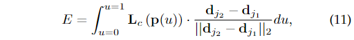

### OpenPose

**Paper: [OpenPose: Realtime Multi-Person 2D PoseEstimation using Part Affinity Fields](https://arxiv.org/abs/1812.08008)**

#### Abstract

实时多人二维姿态估计是使机器了解图像和视频中的人体的关键组成部分。在这项工作中，我们提出了一种实时检测图像中多人的二维姿态的方法。该方法使用非参数表征，称之为部位亲和场 (PAFs)，来学习将身体部位与图像中的个体关联起来。这种自底向上的系统实现了高精度和实时性，无论图像中有多少人。在之前的工作中，PAFs 和身体部位位置估计是在训练阶段同时细化的。我们证明，只进行 PAF 细化，而不是 PAF 和身体部位定位细化，可以大幅提高运行时间性能和准确性。我们还提出了第一个结合身体和脚关键点探测器，基于我们已经公开发布的内部注释脚数据集。结果表明，组合检测器不仅比顺序运行减少了推理时间，而且保持了每个组件单独运行的准确性。这项工作在 OpenPose 的发布中达到顶峰，这是第一个用于多人 2D 姿势检测的开源实时系统，包括身体、脚、手和面部关键点。

#### 1. Introduction

在图片中推断多个人的姿态是一项独特的挑战。首先，每张图片可能包含未知数量的人，这些人可以以任何位置或比例出现。第二，人与人之间的互动会导致复杂的空间干扰，因为可能的接触、闭塞或肢体连接。第三，运行时复杂度会随着图像中人数的增加而增加，这使得实时性能成为一个挑战。

一种常见的方法是使用单人检测器，然后对每次检测进行单人姿态估计，这种自顶向下的方法直接利用现有的技术来估计单人姿态，但是没有早期的保证，如果人探测器失败了——当人们离得很近时，它很容易失败——就没有办法恢复了。此外，它们的运行时间与图像中的人数成正比，对于每个检测到的人都要运行一次单人姿态估计器。

相反，自底而上的方法很有吸引力，因为它们为早期的保证提供了鲁棒性，并有可能将运行时的复杂性与图像中的人员数量解耦，但是自底而上的方法并不使用其他身体部位和其他人的上下文线索，最初的自底向上的方法 [1] [2] 并没有保持效率上的提高，因为最终的解析需要昂贵的全局推断，每张图像花费几分钟。

在本文中，我们提出了一种有效的多人姿态估计方法，在多个公共基准上具有竞争性能。我们通过部位亲和场 (PAFs) 提出了第一个自底而上的关联评分表示，PAFs 是一组编码图像域上肢体的位置和方向的 2D 向量场。我们证明，同时推理这些自底向上的检测和关联编码表示，能够充分编码全局上下文来实现高质量的结果，同时只需计算成本的一小部分。

这个手稿的早期版本出现在 [3] 上。这个版本有几个新的贡献。首先，我们证明了 PAF 的精细化是提高精度的关键，而身体部分预测精细化则不是那么重要。我们增加了网络深度，但去掉了身体部分的细化阶段 (章节3.1和3.2)。经过改进的网络速度和准确度分别提高了约 200% 和 7% (第5.2节和第5.3节)。其次，我们提出了一个带注释的足数据集 1，其中包含公开发布的 15K 人足实例 (第4.2节)，我们表明，一个结合身体和足关键点的模型可以训练，在保持仅身体模型的速度的同时保持其准确性 (第5.5节)。第三，我们通过将该方法应用于车辆关键点估计 (第5.6节) 的任务来证明我们方法的通用性。最后，本文记录了 OpenPose [4] 的发布。这个开源库是第一个可用于多人2D姿态检测的实时系统，包括身体、脚、手和面部关键点 (第4节)。我们还包括与 MaskR-CNN [5] 和 Alpha-Pose [6] 的运行时比较，显示了我们自下而上方法的计算优势 (第5.3节)。

#### 2. Related Work

在早期的工作 [3] 中，我们提出了部位亲和场 (PAFs)，它是由一组流场组成的表征，编码了可变数量的人的身体部位之间的非结构化成对关系。与 [1] 和 [2] 相比，我们可以有效地从PAFs 中获得成对的分数，而无需额外的训练步骤。这些分数对于贪婪分析来说是足够的，可以获得高质量的实时性能的结果，用于多人估计。

在本文工作中，我们对我们早期的工作[3]做了几个扩展。我们证明了 PAF 优化是实现高精度的关键和充分条件，在增加网络深度的同时去除身体部位置信图的优化。这导致了一个更快、更准确的模型。我们还提出了第一个组合的身体和脚关键点探测器，创建从注释脚数据集，将公开发布。我们证明了结合两种检测方法不仅比独立运行减少了推断时间，而且保持了各自的准确性。最后，我们提出了OpenPose，第一个实时身体、脚、手和面部关键点检测的开源库。

#### 3. Method

图 2 显示了我们方法的整体流程。系统输入为尺寸为 $w \times h$ 的彩色图像 (图 2a)，然后生成图像中每个人的解剖关键点的 2D 位置 (图2e)。首先，一个前馈网络预测了一组身体部位位置的 2D 置信度图 $\mathbf{S}$ (图 2b) 和一组部位亲和场 (PAFs) 的 2D 向量场 $\mathbf{L}$，它们编码了部位之间的关联程度 (图2c)。集合 $\mathbf{S} = (\mathbf{S}_1, \mathbf{S}_2, \dots, \mathbf{S}_J)$，有 $J$ 个置信度图，每个关节部位对应一个，其中 $\mathbf{S}_j \in \mathbb{R}^{w \times h}, j \in \{1, \dots, J\}$，集合 $\mathbf{L} = (\mathbf{L}_1, \mathbf{L}_2, \dots, \mathbf{L}_C)$ 有 $C$ 个向量场，每个肢体部位对应一个，其中 $\mathbf{L}_c \in \mathbb{R}^{w\times h \times 2}, c\in \{1 ,\dots ,C\}$，为了清晰起见，我们将成对的代表四肢，但有些成对的并不是人体四肢 (例如脸等)。图像在 $\mathbf{L}_c$ 中的每个位置编码了一个 2D 向量 (图1)。最后，通过贪婪推理 (图ed) 对置信度图和 PAFs 进行解析，输出图像中所有人的 2D 关键点。

注： $\mathbf{L}_c$ 的维度为 $w \times h \times 2$，其中第 3 个维度为 2 表示向量场中每个向量的维度为 2，即对于图像中每个位置都有一个维度为 2 的向量。

##### 3.1  Network Architecture

我们的架构，如图 3 所示，迭代地预测编码部位之间关联性的亲和场 (以蓝色显示)，然后检测置信度图 (以米色显示)。按照 [20] 设计的迭代预测架构，细化了连续阶段的预测，$t∈\{1, …,T\}$，其中每个阶段都有中间监督。

网络深度相对于 [3] 增加了，在最初的方法中，网络架构包括几个 7x7 的卷积层。在我们当前的模型中，通过将每个 7x7 卷积核替换为 3 个连续的 3x3 核，保留了感受野同时减少了计算量。此外，3 个卷积核的每个输出都被串联起来，采用类似于 DenseNet[52] 的方法。非线性层数增加了三倍，同时保持了低阶和高阶特性。第 5.2 节和 5.3 节分别分析了准确性和运行速度的提高。

##### 3.2  Simultaneous Detection and Association

图像由CNN分析 (由 VGG-19[53] 的前 10 层初始化并进行微调)，生成一组输入到第一阶段的特征映射 $\mathbf{F}$，在这个阶段，网络产生一组部位亲和场 (PAFs) $\mathbf{L}^1 = \phi^1(\mathbf{F})$ ，其中 $\phi^1$ 表示在阶段 1 进行推理的 CNN，在每个后续阶段中，前一阶段输出的预测和原始图像特征 $\mathbf{F}$ 被串联在一起然后被用来生成更加精确的预测：

其中 $\phi^t$ 表示在阶段 $t$ 进行推理的 CNN，$T_p$ 表示总共 PAF 阶段的数量，经过 $T_p$ 次迭代后，从最后的 PAF 预测开始，对置信图检测重复这个过程：

其中 $\rho^t$ 表示在阶段 $t$ 进行推理的 CNN，$T_C$ 表示总共置信图阶段的数目。

这种方法与 [3] 不同，[3] 中的 PAF 和置信图分支都在每个阶段被细化。因此，每个阶段的计算量减少了一半。我们在第 5.2 节的经验观察到，精炼的亲和场预测提高了置信度图的结果，而相反则不成立。直观上，如果我们看 PAF 通道输出，就可以猜测身体部位的位置。然而，如果我们只看到一堆没有其他信息的身体部位，我们就无法将它们分析为不同的人。

图 4 为各阶段亲和场的细化图。而置信度图结果是在最新和最精确的 PAF 结果上进行预测，结果在置信图的各个阶段几乎没有明显的差异。为了指导网络在第一个分支迭代预测身体部位的 PAFs，以及在第二个分支预测置信度图，我们在每个阶段的末尾应用了一个损失函数 ，我们使用了一个估计预测和 GT 之间的 $L_2$ 损失，其中我们在空间上对损失函数进行加权以解决一个实际问题，即一些数据集不能完全标记所有人，特别来说，阶段 $t_i$ 中 PAF 分支的损失函数和阶段 $t_k$ 中置信图分支的损失函数为：

其中 $\mathbf{L}^*_c$ 表示 GT PAF，$\mathbf{S}^*_j$ 表示 GT 置信图，$\mathbf{W}$ 是一个二值掩膜，当在像素 $\text{p}$ 上的标注丢失时有 $\mathbf{W}(\text{p}) = 0$，该掩膜被用来避免惩罚训练中真阳性的预测，每个阶段的中间监督通过周期性的补充梯度以解决梯度消失的问题 [20]，整体目标函数为：

##### 3.3  Confidence Maps for Part Detection

为了在训练期间评估等式 (6) 中的 $f_{\mathbf{S}}$，我们从标注的 2D 关键点生成 GT 置信图 $\mathbf{S}^*$，每个置信图是一个 2D 表征，即一个具体的身体部位能够定位在每个像素上的置信度。理想情况下，如果一个人出现在图像中，在每个置信图中都应该出现一个峰值（如果相应的部位能够看见），如果多人同时出现在图像中，那对于每个人每个可见的身体部位都会有一个相应的峰值（所以多人姿态估计中，一个置信图中应该有多个峰值）。

我们首先对每个人 $k$，生成单人的置信图 $\mathbf{S}^*_{j.k}$，令 $\mathbf{x}_{j,k} \in \mathbb{R}^2$ 表示图像中行人 $k$ 的身体部位 $j$ 的真实位置，$\mathbf{S}^*_{j.k}$ 中位置 $p \in \mathbb{R}^2$ 上的值定义为：

其中 $\sigma$ 控制峰的伸展（应该就类似一个高斯分布），通过网络被预测 GT 置信图是个体置信图通过一个最大算子的聚合：

取置信度图的最大值而不是平均值，是为了使山峰附近的精度保持明显，如下图所示，在测试时间，我们预测置信图，并通过执行非最大抑制获得候选身体部位。

##### 3.4  Part Affinity Fields for Part Association

给定一组检测到的身体部位 (如图 5a 中的红色和蓝色点所示)，我们如何在人数未知的情况下将它们分配成多个完全的姿态？我们需要对每对检测到的身体部位的关联进行置信度测量，置信度即它们属于同一个人可能性。测量关联的一种可能的方法是检测所有可能关联的中点，然后判断该中点是不是位于一个肢体上，如图 5b 所示。然而，当人们聚集在一起时——他们倾向于这样做——这些中点很可能支持错误的关联 (如图 5b 中的绿线所示)。这种错误的联想是由于表象中的两个限制而产生的：(1) 它只编码每一肢体的位置，而不是方向;（2）它使肢体的支撑区域缩小到一个点。

部位亲和场 (PAFs) 解决了这些限制，它们保存了整个肢体支持区域的位置和方向信息 (如图 5c 所示)。每个 PAF 是每个肢体的 2D 矢量场，如图 1d，对于属于特定肢体的区域中的每个像素，一个 2D 矢量编码从肢体的一部分指向另一部分的方向。每种类型的肢体都有相应的 PAF 连接其两个相关的身体部位。

考虑下图所示的单肢，

令 $\mathbf{x}_{j_1,k}$ 和 $\mathbf{x}_{j_2,k}$ 为身体部位 $j_1$ 和 $j_2$ (来自图像中的行人 $k$ 肢体 $c$) 的 GT 位置，如果一个点 $\text {p}$ 位于该肢体上，那么 $\mathbf {L}^*_{c,k} (\text{p})$ 的值是一个从 $j_1$ 指向 $j_2$ 的单位向量，而对于所有其他点的值为 0。为了在训练中评估等式 (6) 的 $f_{\mathbf{L}}$ ，我们定义在图像中点 $\text{p}$ 上的 GT PAF 为：

其中 $\mathbf{v}=\left(\mathbf{x}_{j_{2}, k}-\mathbf{x}_{j_{1}, k}\right) /\left\|\mathbf{x}_{j_{2}, k}-\mathbf{x}_{j_{1}, k}\right\|_{2}$ 表示该肢体方向的单位向量，在肢体上的点的集合定义为那些到肢体线段部分的距离在一个阈值之内的点，即：

其中 $\sigma_l$ 为肢体宽度，$l_{c, k}=\left\|\mathbf{x}_{j_{2}, k}-\mathbf{x}_{j_{1}, k}\right\|_{2}$ 为肢体长度，$\mathbf{v}_{\bot}$ 是一个垂直与 $\mathbf{v}$ 的向量。

GT 部位亲和场平均了图像中所有人的亲和场：

其中 $n_c(\text{p})$ 是所有 $k$ 个人在点 $\text {p}$ 上非零向量的数量。

在测试过程中，我们通过沿着连接两个候选部件位置的线段计算对应 PAF 上的线积分来测量候选部件检测之间的关联。换句话说，我们通过连接检测到的身体部位来测量预测的 PAF 与候选肢体的对齐。具体来说，对于两个候选的部件位置 $d_{j_1}$ 和 $d_{j_2}$，我们沿着线段采样预测的部位亲和场，以测量其关联的置信度:

实际中，我们通过对等间距的 $u$ 进行采样和求和来近似积分。

##### 3.5  Multi-Person Parsing using PAFs

我们对检测到的置信图进行非最大抑制，以获得一个离散的部件候选位置集。对于每个部件，我们可能会有几个候选位置，因为图像中有多个人或假阳性 (图 6b)，

这些候选部分定义了大量可能的肢体，即候选肢体，我们使用 PAF 上的线积分 (等式 11) 计算每个候选肢体的评分，找到最优解析的问题对应于一个 $K$ 维匹配问题 (NP 难 [54]) (图 6c)，本文中，我们提出了一个贪心松弛，能够持续产生高质量匹配。我们推测由于 PAF 网络的感受野很大，成对关联得分隐式编码了全局信息。

我们首先获取一个人体部位检测的候选集 $\mathcal{D}_{\mathcal{J}} = \{d^m_j : \text{for} j \in \{1,\dots, J\}, m \in \{1,\dots,Nj\} \}$，其中 $N_j$ 是部位 $j$ 候选位置的数目， $d^m_j \in \mathbb{R}^2$ 是人体部位 $j$ 第 $m$ 个侯选位置，这些部位候选位置需要与同一个人其他部位进行关联，换句话说，我们需要找到一对对部位对应实际连接的肢体，我们定义一个变量 $z^{mn}_{j_1j_2} \in \{0,1\}$ 来指示是否两个部件侯选位置 $d^m_{j_1}$ 和 $d^m_{j_2}$ 是关联的，然后目标是找到所有可能连接集合的最优分配，所有可能的连接集合如下：
$$
\mathcal{Z}=\left\{z_{j_{1} j_{2}}^{m n}:\right. for \left.j_{1}, j_{2} \in\{1 \ldots J\}, m \in\left\{1 \ldots N_{j_{1}}\right\}, n \in\left\{1 \ldots N_{j_{2}}\right\}\right\}
$$
如果我们考虑第 $c$ 个肢体的一对部件 $j_1$ 和 $j_2$ (例如颈部和右髋)，寻找最佳关联可简化为最大化权重二部图匹配问题 [54]，这种情况如图 5b 所示。在这个图匹配问题中，图的节点是身体部位检测的候选 $\mathcal{D}_{j_1}$ 和 $\mathcal{D}_{j_2}$，边缘是候选检测对之间所有可能的连接。此外，每条边由公式 11 (部件亲和度聚合) 进行加权，二部图中的匹配是边的子集，选择的方法是不允许任何两条边共享一个节点，我们的目标是为所选的边找到一个权值最大的匹配，

其中 $E_c$ 表示与肢体 $c$ 匹配的整体权重，$\mathcal{Z}_c$ 是 $\mathcal{Z}$ 中关于肢体 $c$ 的子集，$E_{mn}$ 是部件 $d^m_{j_1}$ 和 $d^m_{j_2}$ 间的部件亲和度 (由公式 11 定义)，等式 14 和 15 强制两条边不能共用一个节点，即不允许两条同样类型的肢体共享一个部件。我们可以**使用匈牙利算法[55]来获得最优匹配**。

当要找到多个人的整个身体姿态时，确定 $\mathcal{Z}$ 是一个 $K$ 维匹配问题。这个问题是NP-Hard[54]，存在许多松弛的地方。在本文工作中，我们专门针对我们的领域在优化中添加了两种松弛。首先，我们选择最小的边数来获得人体姿态的生成树骨架，而不是使用完整的图，如图 6c 所示。其次，我们将匹配问题进一步分解为一组二部匹配子问题，并在相邻树节点中独立确定匹配，如图 6d 所示。我们在第 5.1 节中给出了详细的比较结果，这些结果表明，最小贪婪推理很好地逼近了计算代价的一小部分的全局解。这是因为 PAFs 对相邻树节点之间的关系进行了明确的建模，而在内部，非相邻树节点之间的关系则由CNN隐式建模。这个属性的出现是因为CNN是用一个比较大的感受野训练的，同时来自非相邻树节点的 PAFs 也会影响预测的 PAF。

有了这两种松弛，优化被简单地分解为:

因此，我们使用公式 13 - 15 分别获得每种肢体类型的肢体连接候选。有了所有的肢体连接候选项，我们可以将共享相同部位检测候选项的连接组合成多个人的全身姿势。我们在树形结构上的优化方案比在完全连通图 [1]，[2] 上的优化方案快几个数量级。

我们目前的模型还包含了冗余的 PAF 连接(例如，耳朵和肩膀之间，手腕和肩膀之间，等等)。这种冗余反而提高了拥挤图像的精度，如图 7 所示。为了处理这些冗余连接，我们稍微修改了多人解析算法。原来的方法是从根组件开始的，我们的算法根据它们的 PAF 评分对所有成对的可能连接进行排序。如果一个连接试图连接两个已经被分配给不同人的身体部位，算法会识别出这将与一个具有更高置信度的 PAF 连接相冲突，当前的连接随后被忽略。

#### 4. OpenPose

越来越多的计算机视觉和机器学习应用需要2D人体姿态估计作为其系统[56], [57], [58], [59], [60], [61], [62]的输入。为了帮助研究团体推进他们的工作，我们公开发布了 OpenPose[4]，这是第一个实时多人系统，在单张图像上联合检测人体、脚、手和面部关键点 (共 135 个关键点) ，整个系统的示例如图8所示。

Github：https://github.com/CMU-Perceptual-Computing-Lab/openpose

#### 5. Datasets and Evaluation

略
