### Survey of AutoML

**Paper: [A Survey of the State-of-the-Art[J]. Knowledge-Based Systems, 2021.](https://www.sciencedirect.com/science/article/pii/S0950705120307516)**

#### Abstract

深度学习(DL)很多方面取得了显著的成就，但为特定任务构建高质量的DL系统高度依赖于人的专业知识，阻碍了其广泛应用。此时，自动机器学习(AutoML)是一种比较有前景的解决方案，可以在无需人工协助的情况下构建DL系统，目前正在进行广泛的研究。本文对AutoML中的最新技术（SOTA）进行了全面的回顾，介绍了AutoML方法——涵盖数据准备、特征工程、超参数优化和神经架构搜索（NAS）——其中特别关注NAS，因为它目前是AutoML的热门子主题。我们总结了具有代表性的NAS算法在CIFAR-10和ImageNet数据集上的性能，并进一步讨论了NAS方法的以下主题：一/两阶段NAS、one-shot NAS、联合超参数和架构优化以及resource-aware NAS。最后，我们讨论了与现有AutoML方法相关的一些有待进一步研究的问题。

#### 1. Introduction

为了降低开发DL系统繁重的成本，出现了一种自动化整个机器学习（ML）流程的思想，即自动化机器学习（AutoML）。

如下图所示，AutoML流程包括数据准备、特征工程、模型生成和模型评估几个步骤，其中模型生成可以分为两类：传统ML模型（如SVM和KNN）和神经网络。优化方法分为超参数优化（HPO）和体系结构优化（AO），前者表示与训练相关的参数（例如学习率和批量大小），后者表示与模型相关的参数（例如神经网络的层数和KNN的邻域数）。

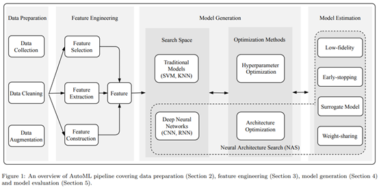

NAS由三个重要组成部分组成：神经结构的搜索空间、AO方法和模型评估方法。AO方法也可参考搜索策略[10]或搜索策略[11]。Zoph等人[12]是最早提出NAS的人之一，他们使用强化学习训练RNN来自动搜索表现最好的网络结构，自从[12]成功地得到了一种与当时最好的人工模型效果相当地网络架构后，对AutoML的研究就多了，其中大部分关注于NAS，NAS通过从预定义的搜索空间中选择和组合不同的基本操作来搜索一个鲁棒且性能良好的神经架构。

本文将常用的搜索空间分为全结构化[12,13,14]、基于单元的[13,15,16,17,18]、分层的[19]和基于形态的[20,21,22]搜索空间。常用的AO方法包括强化学习（RL）[12,15,23,16,13]、基于进化的算法（EA）[24,25,26,27,28,29,30]和梯度下降（GD）[17,31,32]、基于代理模型的优化（SMBO）[33,34,35,36,37,38,39]和混合AO方法[40,41,42,43,44]。

除本文外，已经存在一些优秀的相关综述文章，[10,45,46]只关注NAS，本文根据完整的AutoML流程总结了相关的方法，我重点关注NAS部分，其他部分大概看一下就好了。

#### 2. Data Preparation

数据准备的工作可以从3个方面介绍：数据收集（建立数据库，包括数据搜索和数据生成）、数据清洗（去除噪声）和数据扩充（增加模型鲁棒性）。

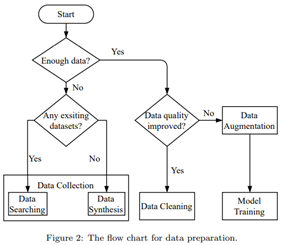

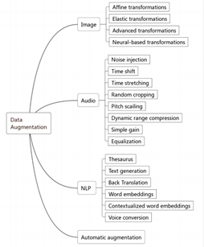

#### 3. Feature Engineering

略

#### 4. Model Generation

模型生成分为两部分：搜索空间和优化方法，搜索空间定义了原则上可以设计和优化的模型结构，模型的类型可以分为传统的ML模型和深度神经网络，优化方法的目标参数有2类：用于模型设计的超参数和用于训练的超参数，下图显示了NAS的流程。

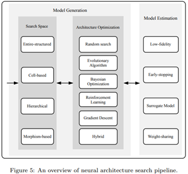

##### 4.1  Search Space

一个神经架构可以表示为一个包含B个有序节点的直接非循环图(DAG)，DAG中，每个节点和有向边分别表示一个特征张量和一个运算，常用运算包括卷积、池化、激活函数、跳跃连接、串联、加法等等。

为了进一步提高模型性能，许多NAS方法使用某些高级人工设计的模块作为原始操作，如深度可分离卷积[124]、扩展卷积[125]和压缩与激励（SE）模块[126]，这些操作的选择和组合因搜索空间的设计而异。换句话说，搜索空间定义了AO方法可以探索的结构范式。

基于现有的NAS研究，下面我们列出了常用的搜索空间：

###### 4.1.1  Entire-structured Search Space

全结构搜索空间[12,13]是最直观、最直接的搜索空间之一。下图给出了全结构模型的两个简化示例，这些模型通过堆叠预定义的节点构建的，其中每个节点表示一个层并执行指定的操作。左侧模型比较简单，右侧模型相对复杂，增加了跳跃连接[2]；实践证明，这些连接是有效的[12]。尽管全结构很容易实现，但它有几个缺点。例如，一般模型越深，其泛化能力越好；然而，搜索一个很深的网络代价非常大，并且计算成本很高。此外，生成的体系结构缺乏可迁移性，比如在在小数据集上生成的模型可能不适合较大的数据集。

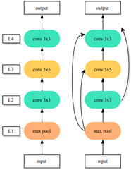

###### 4.1.2  Cell-based Search Space

基于单元的搜索空间[15,16,13]的出现是为了实现一般模型的可迁移性，该方法中，神经架构由固定数量的重复单元结构组成，这种设计基于这样的观察：许多性能良好的人工模型就是通过堆叠固定数量的模块来构建的，比如ResNet有ResNet50、ResNet101和ResNet152，本文将这种重复的模型称为单元。

下图显示了一个基于单元搜索的神经网络的实例，该网络由2种单元构成：常规单元和降维单元，因此搜索完整的神经结构的问题被简化为在基于单元的搜索空间中搜索最优单元结构。其中常规单元的输出和输入空间维度相同，常规单元的重复次数根据需求手动设置（感觉可以作为一个超参数进行学习）；降维单元主要用于下采样，其输出相对于输入，高和宽更小，深度更大。

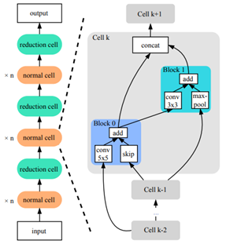

与全结构搜索空间相比，基于单元的搜索空间构建的模型可以通过简单地添加更多单元而不重新搜索单元结构来扩展，同时花费的代价更小，另外许多方法[17,13,15]已经通过实验证明了在基于细胞的搜索空间中生成的模型的可转移性，例如在CIFAR-10上构建的模型，该模型还可以在ImageNet上实现与SOTA进行比较的结果，其中Zoph等人[15]是最早提出基于细胞的搜索空间的人之一。

**Two-stage Gap:** 基于单元搜索空间的NAS方法通常包括两个阶段：搜索和评估。在搜索阶段，为了减少GPU内存消耗，一般会将单元的重复数量固定的比较小，搜索选择性能最佳的模型；而在评估阶段，会将搜索得到的最优单元重新堆叠成更深的模型，从头开始对其进行训练或微调，两个阶段之间的模型深度存在很大差距。如下图所示，对于DART[17]，在搜索阶段生成的模型仅包含8个单元，而在评估阶段，单元数量扩展到20个。

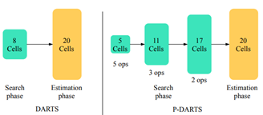

上述过程存在一个问题，就是对于浅层模型来说，搜索得到的单元可能是最优的，但是对于深度差距较大的深层模型，该单元是否还是最优的呢？换句话说，就是将在浅层模型中搜索得到的单元堆叠成深层模型和直接搜索得到的深层模型(耗费更多资源)之间可能在性能上有较大的差距。

为了缩小这一个差距，有研究将DARTS改进成渐进式方法P-DARTS[128]，该方法将搜索阶段分为多个阶段，在每个阶段结束时小幅增加搜索网络的深度，从而缩小搜索和评估之间的差距。然而，在搜索阶段增加单元格数量可能会导致更大的计算开销。因此，为了减少计算量，P-DARTS通过搜索空间近似方法将候选操作的数量从5个逐渐减少到3个，最终得到比DARTS效果更好的深层模型。

我对于P-DARTS的理解：第一个搜索阶段应该和DARTS相同，这个阶段的搜索空间应该比较大，然后得到一个最优单元后，小幅增加模型深度的同时，降低候选操作的数量，这一步相当于缩小了搜索空间，以减小开销，P-DARTS将这个过程再重复2次，将最后一个搜索阶段(模型较深)得到最优单元堆叠成目标深度的模型进行评估。我没有仔细了解，感觉这种渐进式的搜索应该比直接搜索深层模型开销更少，但比只有两阶段的DARTS方法开销更大，同时效果更接近与直接搜索得到的深层模型。

###### 4.1.3  Hierarchical Search Space

基于单元的搜索空间实现了生成模型的可转移性，大多数基于单元的方法[13、15,23,16,25,26]遵循两级层次结构：内层为单元级，来选择单元中每个节点的操作和连接，外层为网络级，来控制空间分辨率的更改。然而，这些方法侧重于单元级，而忽略了网络级。

为了共同学习可重复单元和网络结构的适当组合，Liu等人[129]定义了网络级结构的一般公式，如下图所示，从中可以复制许多现有的良好网络设计。通过这种方式，我们可以充分探索网络中各层的不同通道数量和特征图大小。

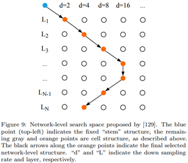

对于单元级，单元中的块数(B)是在搜索阶段手动预定义和固定的。为了解决这个问题，Liu等人[19]提出了一种新的分层遗传的表示方案，即HierNAS，通过迭代合并较低级别的单元来生成较高级别的单元。如下图所示，一级单元可以是一些基本操作，如1×1和3×3卷积和3×3最大池化，组合这些操作构成二级单元。然后使用二级单元生成三级单元，最高级别的单元就是一个完整架构。类似地还有Liu等人[18]提出的渐进式NAS（PNAS）。

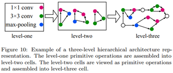

对于HierNAS和PNA，一旦搜索到一个单元结构，它将用于所有网络层，这限制了层的多样性。此外，为了同时实现高精度和低延时，一些研究[130,131]提出寻找复杂和碎片化的单元结构。代表的是Tan等人提出的MnasNet[130]。

考虑到计算量，大多数可微分NAS技术(如DARTS)先在代理数据集(CIFAR-10)上搜索合适的单元结构，然后将其迁移到更大的目标数据集(ImageNet)，Han等人提出的ProxylessNAS[132]，使用BinaryConnect[133]在目标数据集和硬件平台上直接搜索神经网络，解决了高内存消耗的问题。

###### 4.1.4  Morphism-based Search Space

Chen等人提出了Net2Net技术[20]，通过神经网络层之间插入身份态射(IdMorph)变换，在现有网络的基础上设计新的神经网络，IdMorph如下图所示，好像身份态射就是使网络变得更宽或更深。

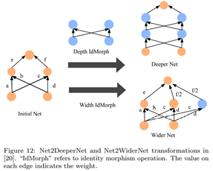

而网络态射(Network Morphism)相当于身份态射的进阶版，该方法允许子网络继承其训练有素的父网络的所有知识，并在缩短的训练时间内继续成长为更健壮的网络，详细了解需要看专门的文献[21]，这里就列举一下提到的几种方法。

Jin等人[22]提出了一个框架，使贝叶斯优化能够指导网络形态，从而实现高效的神经架构搜索。Wei等人[136]在更高的层次上进一步改进了网络态射，即通过将卷积层引入神经网络的任意模块中。此外，Tan和Le[142]提出了EfficientNet，它重新检查了模型缩放对卷积神经网络的影响，并证明了仔细平衡网络深度、宽度和分辨率可以获得更好的性能。

##### 4.2  Architecture Optimization

定义完搜索空间后，我们需要搜索性能最佳的体系结构，称为架构优化（AO）。一般神经网络的体系结构被视为一组超参数，它们根据在验证集上观察到的性能进行调整。手工设计网络时这一过程高度依赖于人类专家，需要大量时间和资源进行反复试验。因此，人们提出了许多AO方法来将人类从这个繁琐的过程中解放出来，并自动搜索新的体系结构。

###### 4.2.1  Evolutionary Algorithm

进化算法(EA)是一种基于种群的元启发式优化算法，它吸收了生物进化的灵感。与穷举法等传统优化算法相比，EA是一种成熟的全局优化方法，具有较高的鲁棒性和广泛的适用性。它可以有效地解决传统优化算法难以解决的复杂问题，而不受问题性质的限制。

###### 4.2.2  Reinforcement Learning

Zoph等人[12]是最早将强化学习(RL)应用于神经架构搜索的人之一，其中的方法如下图所示，使用一个RNN作为控制器，在每个步骤t，控制器从搜索空间中采样一个神经网络，并从环境中结构状态St和奖励Rt，来更新控制器的采样策略，其中环境指对控制器采样得到的神经网络进行训练的结果。

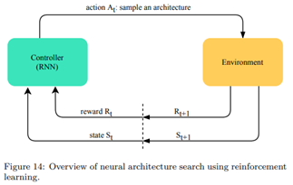

许多后续方法[23,15,16,13]都使用了该框架，但控制器策略和神经结构的编码不同。Zoph等人[12]首先使用策略梯度算法[150]来训练控制器，同时将神经网络编码成字符串。研究[15]则使用近端策略优化（PPO）算法[151]来更新控制器，并提出了一种方法来构建基于单元的神经架构。MetaQNN[23]是一种元建模算法，使用Q-学习和                                贪婪搜索策略及经验回放来顺序搜索神经结构。

尽管上述基于RL的算法在CIFAR-10和PTB数据集上取得了SOTA结果，但它们需要大量的时间和计算资源。例如[12]中的作者花了28天和800 块K40 GPU才搜索到性能最好的体系结构，MetaQNN[23]也花了10天和10 块GPU完成搜索。为此，一些改进的基于RL的算法出现了。BlockQNN[16]使用分布式异步框架和提前停止策略，使用一块GPU仅在在20小时内完成搜索。高效的神经架构搜索（ENAS）[13]更好，它采用了一种参数共享策略，其中所有子架构都被视为超网络的子架构；这使这些架构可以共享参数，无需从头开始训练每个子网络，结果，ENAS使用一块GPU搜索CIFAR-10数据集上的最佳体系结构只需大约10个小时，比[12]快近1000倍。

###### 4.2.3 Gradient Descent

基于进化算法和强化学习的方法都是从离散搜索空间中抽取神经结构样本。后来有人开创性的提出了DARTS[17]，它是第一种基于梯度下降（GD）的方法，通过使用softmax函数松弛离散空间，在连续可微的搜索空间上搜索神经架构：
$$
\bar{o}_{i, j}(x)=\sum_{k=1}^{K} \frac{\exp \left(\alpha_{i, j}^{k}\right)}{\sum_{l=1}^{K} \exp \left(\alpha_{i, j}^{l}\right)} o^{k}(x)
$$
其中 $o(x)$ 表示对输入 $x$ 执行的操作，$\alpha_{i, j}^{k}$ 表示一对结点 $(i, j)$ 间操作的权重，$k$ 是预定义候选操作的数量，经过松弛后，搜索结构的任务转化为对神经结构 $\alpha$ 和其权重 $\theta$ 的联合优化，这两类参数交替优化，是一个双层优化问题，具体而言， $\alpha$ 和 $\theta$ 分别通过验证集和训练集进行优化，训练和验证损失分别用 $\mathcal{L}_{train}$ 和 $\mathcal{L}_{v a l}$ 表示。因此，总损失函数可导出如下：
$$
\begin{array}{cl}
\min _{\alpha} & \mathcal{L}_{v a l}\left(\theta^{*}, \alpha\right) \\
\text { s.t. } & \theta^{*}=\operatorname{argmin}_{\theta} \mathcal{L}_{train }(\theta, \alpha)
\end{array}
$$
下图大概说明了DARTS方法，其中一个单元有N个有序结点构成(其中N=4)，节点zk(k从0开始)连接到节点 $z_i, i \in \{k+1, \ldots, N\}$ ，每个边 $e_{i,j}$ 上的操作最初是候选操作的混合，每个操作的权重相等，因此神经架构  是包含所有可能的子网络的超网络，在搜索结束时，通过在所有混合操作中仅保留最大权重操作来导出最终架构。

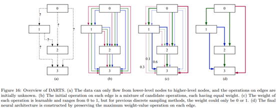

虽然DARTS大大缩短了搜索时间，但存在一些问题，DARTS将神经结构和权重的联合优化描述为一个双层优化问题，但是这个问题很难直接解决，因为架构 $\alpha$ 和权重 $\theta$ 都是高维参数，一个解决方案是单级优化，可以表示为：
$$
\min _{\theta, \alpha} \mathcal{L}_{train}\left(\theta, \alpha\right)
$$
上式同时优化神经架构和权重，虽然单阶段优化问题可以作为一个常规训练被有效解决，但搜索到的架构                                通常在训练集上过拟合，在验证集上的性能无法保证，[153]中的作者提出了混合级别优化：
$$
\min _{\alpha, \theta}\left[\mathcal{L}_{\text {train }}\left(\theta^{*}, \alpha\right)+\lambda \mathcal{L}_{\text {val }}\left(\theta^{*}, \alpha\right)\right]
$$
其中 $\lambda$ 是控制训练损失和验证损失的非负正则化变量，当 $\lambda=0$ 时，上式降低为单级优化；相反，上式变成了双层优化。文献[153]中给出的实验结果表明，混合水平优化不仅会克服单级优化的过拟合问题，而且避免了双级优化的梯度误差。

在DARTS中，每条边的输出是所有候选操作输出的加权和。在整个搜索阶段，这导致GPU内存需求随着候选操作的数量线性增加。为了减少资源消耗，许多后续研究[154、155、153、156、131]开发了一种可微分的采样器，通过使用重新参数化技巧（Gumbel Softmax[157]），从超级网中对子体系结构进行采样。神经结构被完全分解并建模成具体分布[158]，提供了一种对子结构进行采样的有效方法，并允许梯度反投影，表述如下：
$$
\bar{o}_{i, j}^{k}(x)=\sum_{k=1}^{K} \frac{\exp \left(\left(\log \alpha_{i, j}^{k}+G_{i, j}^{k}\right) / \tau\right)}{\sum_{l=1}^{K} \exp \left(\left(\log \alpha_{i, j}^{l}+G_{i, j}^{l}\right) / \tau\right)} o^{k}(x)
$$
在GDAS[154]的前向传递过程中，仅选择每个边具有最大可能性的操作，而梯度根据上式反向传播。换句话说，仅选择超级网的一条路径进行训练，从而减少GPU内存使用。此外，ProxylessNAS[132]通过路径二值化减轻了资源消耗。它将实值的路径权重[17]转换为二值门，只激活混合操作的一条路径。

另一个问题是不同的操作一起优化，因为它们可能相互竞争，从而产生负面影响。

另一个问题是将不同的操作优化在一起，因为它们可能相互竞争，从而产生负面影响。研究[159,128]发现，跳跃连接操作在DARTS的后期搜索阶段进行，这会导致网络变浅，并导致性能显著下降。为了解决这个问题，DARTS+[159]使用了一个额外的提前停止准则，例如当两个或更多的跳跃连接出现在一个单元中时，搜索过程停止。而P-DARTS[128]则通过执行操作级dropout来控制训练和评估期间发生的跳跃连接操作的比例，从而正则化搜索空间。

###### 4.2.4  Surrogate Model-based Optimization

基于代理模型的优化(SMBO)算法[33、34、160、161、162、163、164、165、166、18、161]的核心概念是，通过反复记录过去的评估结果来构建目标函数的代理模型，并使用代理模型预测性能最好的体系结构。这些方法可以大大缩短搜索时间并提高效率。

贝叶斯优化[170,171]是超参数优化最常用的方法之一。最近许多研究[33、34、160、161、162、163、164、165]都试图将SOTA 贝叶斯方法应用于架构优化。例如，在[172、173、160、165、174、175]中，生成的神经架构的验证结果被建模为高斯过程，指导了对最佳神经结构的搜索。但是在基于高斯过程的贝叶斯方法不能有效地处理变长神经网络。Camero等人[176]提出了三种定长编码方案，通过使用RF作为代理模型来处理可变长度问题。类似地，[33]和[176]都使用RF作为代理模型，并且[177]表明，与基于高斯过程的方法相比，RF在设置高维度方面效果更好。

另外一个研究使用神经网络作为代理模型，例如，在PNAS[18]和EPNAS[166]中，LSTM作为代理模型，来预测可变大小的体系结构。同时，NAO[169]使用了更简单的多层感知器(MLP)，与PNAS相比，NAO在CIFAR-10上获得了更好的结果。White等人[164]训练了一组神经网络来预测候选神经结构验证结果的均值和方差。

###### 4.2.5  Grid and Random Search

网格搜索和随机搜索都是应用于多个NAS研究[178,179,180,11]的简单优化方法，例如，Geifman等人[179]提出了一个模块化的体系结构搜索空间。[180]中的作者对SOTA NAS方法和随机搜索进行了有效性比较。结果表明，随机搜索是一个有竞争力的NAS baseline。具体而言，具有提前停止策略的随机搜索的性能与ENAS[13]相当，后者是一种基于RL的领先NAS方法。此外，Yu等人[11]证明SOTA NAS技术并不明显优于随机搜索。

###### 4.2.6  Hybrid Optimization Method

上述架构结构优化方法各有优缺点。1）EA是一种成熟的全局优化方法，具有很高的鲁棒性。然而，它需要大量的计算资源[26,25]，其进化操作（如交叉和突变）是随机执行的。2）尽管基于RL的方法（例如ENAS[13]）可以学习复杂的体系结构模式，但RL控制器的搜索效率和稳定性并没有得到保证。3） 基于梯度下降（GD）的方法通过将分类候选操作松弛为连续变量，大大提高了搜索效率，然而，本质上，他们都是从超网中寻找子网络，这限制了神经结构的多样性。因此，有人提出了一些方法，将不同的优化方法结合起来，以充分发挥它们的优势。

##### 4.3  Hyperparameter Optimization

大多数NAS方法在整个搜索阶段对所有候选体系结构使用相同的超参数集；因此，在找到最有希望的神经结构后，有必要重新设计超参数集，并使用它来重新训练或微调结构。由于一些超参数优化方法（如贝叶斯优化和随机搜索）已应用于NAS，这里只介绍这些方法。

###### 4.3.1  Grid and Random Search

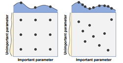

如上图所示，网格搜索将搜索空间划分为规则间隔，并在评估所有点后选择性能最佳的点；而随机搜索则从一组随机抽取的点中选择最佳点。

网格搜索非常简单，但是当超参数空间非常大时，由于试验数量随超参数的维数呈指数增长，因此计算成本高且效率低。为了缓解这一问题，Hsu等人[182]提出了一种从粗网格到细网格的搜索方法。类似地，Hesterman等人[183]提出了一种收缩网格搜索算法，该算法首先计算网格中每个点的可能性，然后以最大似然值为中心生成一个新网格。新网格中的点间距减少到旧网格上的一半。迭代上述过程，直到结果收敛到局部最小值。

尽管[181]中的作者从经验和理论上证明了随机搜索比网格搜索更实用、更有效，但RS并不能保证最优值。这意味着，尽管更长的搜索时间会增加找到最优超参数的概率，但也会消耗更多的资源。Li和Jamieson等人[184]提出了一种hyperband算法，以在超参数性能和资源预算之间进行权衡。hyperband的算法通过在训练过程结束前很长时间内连续丢弃最差的一半配置设置，将有限的资源仅分配给最有希望的超参数。

###### 4.3.2  Bayesian Optimization

贝叶斯优化（BO）是一种有效的全局优化方法，可以参考[171,170,185,186]中的优秀调查进一步了解。

BO是一种SMBO方法，它构建了从超参数到验证集上评估的目标度量的概率模型映射。很好地平衡了探索（评估尽可能多的超参数集）和开发（将更多资源分配给有前景的超参数），BO方法常用的代理模型有GP、RF和TPE，下表总结了现有的开源BO方法：

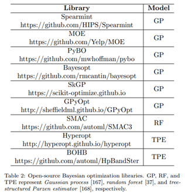

此外，Falkner和Klein等人[38]提出了基于BO的超带（BOHB）算法，该算法结合了基于TPE的BO和超带的优点，性能比标准的BO方法要好得多。另外，FABOLAS[35]是一个更快的BO程序，它将验证损失和训练时间映射为数据集大小的函数，即在逐渐增大的子数据集上训练生成模型。在这里，FABOLAS比其他SOTA-BO算法快10-100倍，并识别出最有前途的超参数。

###### 4.3.3  Gradient-based Optimization

略

#### 5. Model Evaluation

对于生成的新的神经网络，需要对其性能进行评估。一种直观的方法是训练网络至收敛，然后评估其性能，但是这种方法需要大量的时间和计算资源，本节总结了几种加速模型评估过程的算法。

##### 5.1  Low fidelity

模型训练时间与数据集和模型大小相关，通过不同的方式加速模型评估。首先可以减少图像的数量或图像的分辨率。例如，FABOLAS[35]在训练集的子集上训练模型，以加速模型评估。在[194]中，提供了ImageNet64×64及其变体32×32、16×16，而这些低分辨率数据集可以保留与原始ImageNet数据集相似的特征。其次，低保真度模型评估可以通过减小模型大小来实现，例如通过每层使用较少的过滤器进行训练[15,26]。与集成学习类似，[195]提出了转移级数展开（TSE），它通过线性组合一系列基本的低保真估值器来构造集合估计器，从而避免了使用单个低保真估值器可能产生的偏差。此外，Zela等人[34]证明，短时间或长时间训练后，性能之间的相关性较弱，因此证实无需长时间搜索网络配置。

##### 5.2  Weight sharing

在[12]中，一旦对网络进行评估，就会将其丢弃。因此，权值共享技术被用于加速NAS的过程。例如，Wong和Lu等人。[196]提出了迁移神经AutoML，它使用先前任务的知识优势来加速网络设计。ENAS[13]在子网络之间共享参数，导致网络设计速度比[12]快一千倍。基于网络态射的算法[20,21]也可以继承以前体系结构的权重，而单路径NAS[197]使用参数化ConvNet上的单路径，以共享卷积核参数对所有体系结构决策进行编码。

##### 5.3  Surrogate

基于代理的方法[198,199,200,43]是一种类似于黑箱函数的强大工具。一般来说，一旦获得了一个好的近似值，就很容易找到直接优化原始目标的配置。例如，渐进式神经架构搜索（PNAS）[18]引入了一个代理模型来控制搜索方法。尽管ENAS已被证明非常有效，但PNAS的效率更高，因为PNAS评估的模型数量是ENAS评估的五倍多，而PNAS的总计算速度快八倍。一个性能良好的代理通常需要大量标记的体系结构，而优化空间太大且难以量化，并且每个配置的评估都非常昂贵[201]。为了缓解这一问题，[202]提出了半监督NAS方法SemiNAS，该方法利用大量未标记的体系结构来训练代理，代理是一个体系结构准确性而无需评估的控制器。最初，仅使用少量标记数据对（架构、精度）来训练代理，然后将生成的数据对逐渐添加到原始数据中，以进一步改进代理。

##### 5.4  Early stopping

早期停止首先用于防止经典机器学习中的过度拟合，最近的几项研究[203、204、205]中使用了早期停止，通过停止预计在验证集上表现不佳的评估来加速模型评估。例如，[205]提出了一种学习曲线模型，它是从文献中选择的一组参数曲线模型的加权组合，从而能够预测网络的性能。此外，[206]提出了一种基于快速计算梯度局部统计信息的早期停止新方法，该方法不再依赖于验证集，并允许优化器充分利用所有训练数据。

#### 6. NAS Discussion

在本节中，本文总结和比较上述NAS算法的性能，更清楚、更全面地了解NAS方法的发展。然后讨论了NAS技术的一些主要主题。

##### 6.1 NAS Performance Comparison

为了确保有效的比较，本文考虑准确性和算法效率作为比较指标，其中效率使用GPU Days来评估：GPU Dasy = N×D，其中N表示GPU的数目，D表示搜索花费的天数。

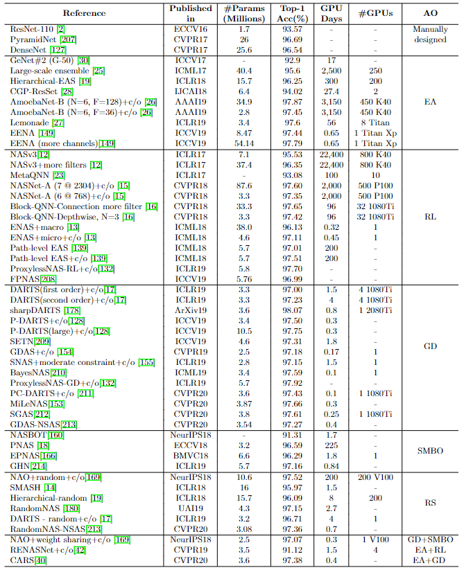

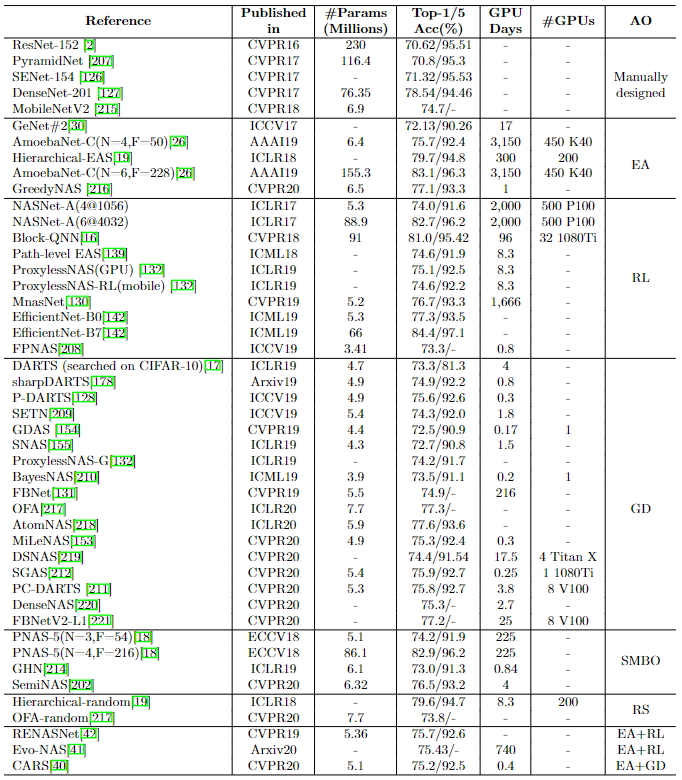

论文中Table 3和4分别显示了不同NAS方法在CIFAR-10和ImageNet上的性能。由于大多数NAS方法首先基于小数据集（CIFAR-10）搜索神经结构，然后将结构迁移到更大的数据集（ImageNet），因此两个数据集的搜索时间相同。

表中显示，早期对基于EA和RL的NAS方法的研究更关注高性能，而不考虑资源消耗。随后的NAS研究试图提高搜索效率，同时确保搜索模型的高性能。ENAS[13]是第一个采用参数共享策略的基于RL的NAS方法之一，它将GPU预算数量减少到1个，并将搜索时间缩短到不到一天。基于梯度下降的架构优化方法可以大大减少搜索的计算资源消耗，并实现SOTA结果。另外基于RS的方法也可以获得类似的结果。[180]一文中的作者指出，具有权重共享的RS可以超越一系列强大的方法，如ENAS[13]和DARTS[17]。

###### 6.1.1  Kendall Tau Metric

大多数NAS方法包括两个阶段：1）在培训集上搜索性能最佳的体系结构，2）将其扩展到更深层次的体系结构，并在验证集上对其进行评估。然而，这两个阶段之间通常存在很大的差距。因此，许多NAS研究使用Kendall Tau度量[223]来评估搜索和评估阶段之间模型性能的相关性，而不仅仅是考虑最终精度和搜索时间成本。
$$
\tau = \frac {N_C - N_D} {N_C + N_D}
$$
其中 $N_C$ 和 $N_D$ 表示一致和不一致对的数量，$\tau \in [-1,1]$，并且 $\tau$ 越大搜索和评估阶段之间模型性能的相关性越大。

###### 6.1.2  NAS-Bench Dataset

虽然论文中表3和表4给出了不同NAS方法之间的比较，但不同方法的结果是在不同的设置下获得的，并不公平，例如与训练相关的超参数（例如，批量大小和训练时间）和数据扩充。

NAS-Bench-101[224]是提高再现性的开创性工作，它提供了一个表格数据集，包含423624个从固定的基于图形的搜索空间生成和评估的独特神经网络，并映射到它们在CIFAR-10上经过训练和评估的性能。同时，NAS-Bench-201[225]对NAS-Bench-101进行了扩展，具有不同的搜索空间、多个数据集（CIFAR-10、CIFAR-100和ImageNet-16-120[194]）的结果以及更多诊断信息。类似地，Klyuchnikov等人[226]为NLP任务提出了NAS试验台。这些数据集使NAS研究人员能够专注于验证其AO算法的有效性和效率，帮助NAS社区开发。

##### 6.2  One-stage vs. Two-stage

NAS方法可以根据流程大致分为两类：两阶段和一阶段，如下图所示：

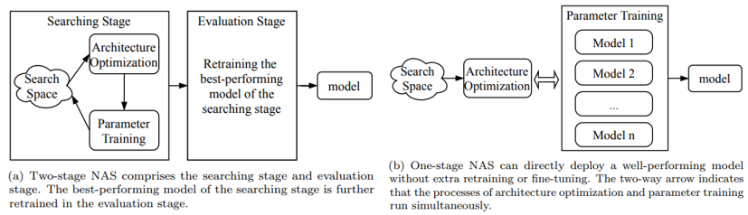

**两阶段NAS:**包括搜索阶段和评估阶段。搜索阶段包括两个过程：架构优化（找到最优架构）和参数训练（训练找到的架构参数）。最简单的想法是从头开始训练所有可能架构的参数，然后选择最佳架构。但是这样资源消耗太大，这对于大多数公司和机构来说是不可行的。因此，大多数NAS方法（如ENAS[13]和DARTS[17]）在搜索阶段对许多候选体系结构进行采样和训练，然后在评估阶段进一步重新训练性能最佳的体系结构。

**单阶段NAS:**通过同时运行AO和参数训练，可以导出设计良好且经过良好训练的神经结构，而无需额外的再训练。这样，效率就可以大大提高。然而，模型结构及其权重参数是高度耦合的，很难同时对它们进行优化。最近的几项研究[217、227、228、218、219]试图克服这一挑战。

##### 6.3  **One-shot/Weight-sharing**

One-shot≠one-stage。如上所述，根据流程可以将NAS方法分为单阶段和两阶段，而NAS算法是否属于one-shot方法取决于候选架构是否共享相同的权重。作者观察到，大多数单阶段NAS方法都基于one-shot方法。

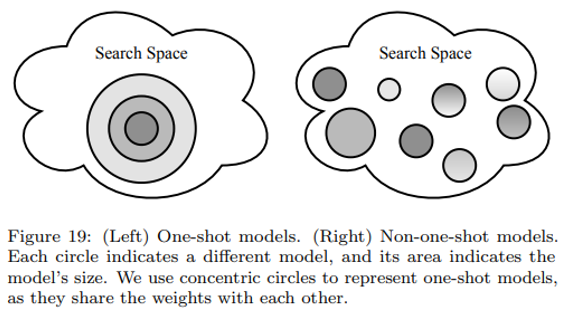

One-shot NAS方法将搜索空间嵌入到超参数化的超网络中，因此，所有可能的体系结构都可以从超网派生。上图显示了One-shot和非One-shot NAS的搜索空间之间的差异。每个圆圈表示不同的体系结构，其中One-shot NAS方法的体系结构共享相同的权重。根据如何处理AO和参数训练，One-shot NAS方法可分为两类：耦合优化和解耦优化[229,216]。

##### 6.4  **Joint Hyperparameter and Architecture Optimization**

大多数NAS方法在整个搜索阶段固定相同的训练相关超参数设置。搜索之后，性能最佳的体系结构的超参数将进一步优化。然而，这种范式可能会导致次优结果，因为不同的体系结构往往适合不同的超参数，这使得模型排名不公平[233]。因此，一个有希望的解决方案是联合超参数和架构优化（HAO）[34,233, 234,235]。

##### 6.5  **Resource-aware NAS**

早期的NAS研究[12,15,26]更关注于寻找能够获得更高性能的神经结构，而不管相关的资源消耗。因此，许多后续研究调查了资源感知算法，以权衡性能和资源预算。为此，这些算法将计算成本作为资源约束添加到损失函数中。这些算法在计算成本的类型上有所不同，包括1）参数大小；2） 乘法累加（MAC）运算的次数；3）浮点操作（触发器）的数量4）真正的延迟。例如，MONAS[236]将MAC视为约束，并且由于MONAS使用基于策略的强化学习算法进行搜索，该约束可以直接添加到奖励函数中，MnasNet[130]提出了一种定制的加权乘积。

根据可微神经结构搜索（DNAS）框架，损失函数应该是可微的。为此，FBNet[131]使用延迟查找表模型，根据每个运营商的运行时间估计网络的总体延迟。在SNAS[155]中，生成的子网络的时间成本对于one-hot随机变量是线性的，确保资源约束的可微性。

#### 7. Open Problems and Future Directions

本节讨论了现有AutoML方法的几个尚未解决的问题，并提出了一些未来的研究方向。

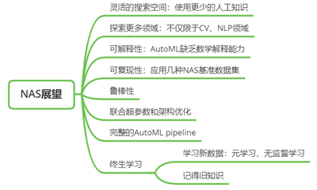
