### DOTS

**Paper: [DOTS: Decoupling Operation and Topology in DifferentiableArchitecture Search. CVPR, 2021.](https://openaccess.thecvf.com/content/CVPR2021/html/Gu_DOTS_Decoupling_Operation_and_Topology_in_Differentiable_Architecture_Search_CVPR_2021_paper.html)**

#### Abstract

DARTS 主要关注于操作搜索，然后从学习到的操作权重派生出单元拓扑，但是，操作权重不能表示单元拓扑的重要性，导致拓扑评价的正确性较差，针对这个问题，本文提出了解耦操作和拓扑结构搜索 (Decoupling Operation and Topology Search, DOTS)，将拓扑表示与操作权重解耦，并进行明确的拓扑搜索。

#### 1. Introduction

在 DARTS 中，操作选择被参数化为可学习的操作权重，并且在超网络的训练中进行更新，训练完成后，操作权重被用来给操作和拓扑结构 (结点之间的边) 的重要性进行排序，边的重要性表示为边上操作权重的最大值，DARTS 最后为每个节点保留 2 条最重要的边，以此生成最终的单元拓扑结构。这有一个问题：由操作权重来表示边的重要性是否能准确对独立模型性能进行排序，本文发现并没有这种排序相关性，这表明了 DARTS 并不会比随机选择的边有更好的效果。此外，DARTS 的人工固定边数目的策略也限制了寻找更灵活的单元结构的能力。

针对上述问题，本文提出了解耦操作和拓扑结构搜索 (DOTS)，解耦有两重含义，(1) 将拓扑结构表征从操作权重中解耦，细节上，本文提出一个包含边的对组合的拓扑结构搜索空间，并且这个拓扑结构搜索空间是连续松弛的，直接反映了搜索目标，且易于扩展以支持灵活的边数。(2) 将操作和拓扑搜索过程解耦，整个搜索过程分为操作搜索阶段和拓扑搜索阶段，分别更新操作权值和边组合权值。

#### 3. Review of DARTS

##### 3.1.  Preliminary of DARTS

每个可微分的 NAS 都要回顾下 DARTS，累了。

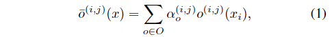

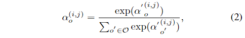

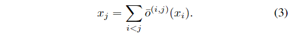

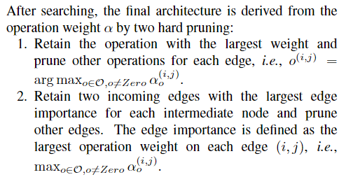

##### 3.2. Coupling Problem in DARTS

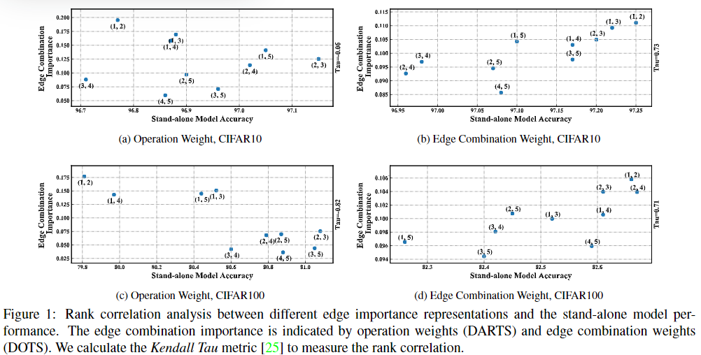

DARTS 根据边上最大操作权值的排序保留了两条边，本文做了一个排序相关性实验来探索边的重要性是否能用操作权值准确表示 (用 *Kendall Tau* 度量，即 *Tau* 越大，相关性越高)，实验中将两条边的重要性之和作为混合边的重要性，实验中有 5 条边，有 10 种不同的边组合，分别表示一种单独的模型，每个模型的训练设置相同。

如图 1(a) 和 1(c)，纵坐标是边组合的重要性，横坐标和对应模型得到的准确率，实验表明模型准确率与用操作权重表示的边的重要性没有明显的排序相关性，这说明了 DARTS 搜索的单元并不一定是最优的。直观上看，最大的操作权重只能表示操作对于特定边的相符性，但并不意味着这条边就应该保留在最终的搜索结果种。如图 1(b) 和 1(c) 所示，本文提出的边组合权重分别在 CIFAR10 和 CIFAR 100 上实现了 0.73 和 0.71 的相关性度量，说明了该方法用于选择边的有效性。

#### 4. Methodology

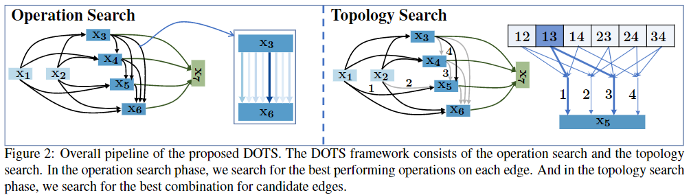

如上图，整个搜索过程被分为操作搜索和拓扑结构搜索，在操作搜索阶段，我们为每一条边搜索最优的操作，在拓扑结构搜索阶段，我们搜索侯选边的最佳组合。

##### 4.1. Topology Search

###### 4.1.1  Handcraft Policy for the Number of Edges

为了实现将边重要性从操作权重中解耦，本文定义了一个从操作搜索空间分离出的拓扑结构搜索空间，形式上，第 $j$ 个中间节点 $x_j$ 通过边 $(i,j)$ 连接所有的先前节点 $x_i (i<j)$，按照 DARTS 的人工策略给每个中间节点限制 2 条边，令 $x_j$ 的拓扑结构搜索空间 $\mathcal{E}_{x_j}$ 为所有入边的对组合。
$$
\mathcal{E}_{x_{j}}=\left\{\left\langle\left(i_{1}, j\right),\left(i_{2}, j\right)\right\rangle \mid 0<i_{1}<i_{2}<j\right\}
$$
假设节点 $x_j$ 共有 $n$ 条入边，那么搜索空间 $\mathcal{E}_{x_j}$ 包含 $C^2_n$ 个候选组合，对于每个节点 $x_j$，本文将他的拓扑结构搜索空间松弛化为连续的，即
$$
\beta_{x_{j}}^{c}=\frac{\exp \left(\beta_{c}^{\prime x_{j}} / T_{\beta}\right)}{\sum_{c^{\prime} \in \mathcal{E}_{x_{j}}} \exp \left(\beta^{\prime x_{j}}{c^{\prime}} / T_{\beta}\right)}
$$
其中 $\beta_{x_{j}}^{c}$ 表示选择边组合 $c$ 的归一化可能性，虽然拓扑搜索空间是在边组合上定义的，但在实际应用中我们不需要获取每一个边组合特征，为了减少内存消耗，我们对于边 $e^i_j$ 计算搜索包含改边的组合权重的和，即：
$$
\gamma^{(i, j)}=\sum_{c \in \mathcal{E}_{x_{j}},(i, j) \in c} \frac{1}{N(c)} \beta_{x_{j}}^{c}
$$
得到的 $\gamma^{(i, j)}$ 就表示边 $e^i_j$ 的权重，其中 $N(c)$ 表示包含边 $e^i_j$ 的组合数目，最后我们使用边的权重计算所有输入的加权和，得到节点 $x_j$ 的输出：
$$
x_{j}=\sum_{i<j} \gamma^{(i, j)} \cdot \bar{o}^{(i, j)}\left(x_{i}\right)
$$
其中 $\bar{o}^{(i, j)}$ 表示边 $e^i_j$ 上的混合操作。

如同在 ASAP [38] 和 SNAS [50] 中讨论的一样，超网络和派生的子网络之间的优化差异造成了性能的下降，他们利用架构退火来处理搜索过程中的优化差异，我们将这个退火思想推广到拓扑结构搜索中，在公式 (2) 中，$T_{\beta}$ 是退火温度，我们采用指数退火方法：
$$
T(t) = T_0 \theta^t
$$
该方法从一个初始温度 $T_0$ 开始，并随着训练步骤 $t$ 增加。

DARTS 使用了双层优化来避免过拟合，但是，[18,28] 表明了单层优化也是稳定且准确的，在我们的拓扑搜索阶段，大大减少了对每条边的操作，消除了过拟合的风险。因此，我们采用一级优化来更新网络权值 $w$ 和拓扑权值 $\beta$，即
$$
\begin{aligned}
w_{t} &=w_{t-1}-\eta_{t} \partial_{w} L_{\text {train }}\left(w_{t-1}, \beta_{t-1}\right) \\
\beta_{t} &=\beta_{t-1}-\delta_{t} \partial_{w} L_{\text {train }}\left(w_{t-1}, \beta_{t-1}\right)
\end{aligned}
$$
其中 $\eta_{t}$ 和 $\delta_{t}$ 表示学习率，操作参数 $\alpha$ 的更新呢，按照上面的公式，网络权重和拓扑权重参数都是用训练集上的梯度更新的，那操作参数 $\alpha$ 是不是也是用训练集上的梯度更新。

###### 4.1.2  Flexible Number of Edges

上一小节中的拓扑结构搜索空间是按照 DARTS 中固定每个结点保留 2 条入边的策略构造的，但是这样不能自动学习到边的数量，因此，本文对拓扑结构搜索空间进行扩展，使其能够支持任意数目的边，具体来说，我们采用二进制编码来描述搜索空间，对于有 $n$ 个入边的中间节点 $x_j$，共有 $M = \sum^n_{k=1} C^k_n = 2^n -1$ 个包含不同数量边的组合，第 $m$ 个边组合的二进制编码表示为：
$$
c_m = \{e_1, e_2, \dots , e_n\}
$$
其中 $e_i \in \{ 0, 1\}$ 表示边 $i$ 是否在这个组合中，那么节点 $x_j$ 的拓扑结构搜索空间可以定义为：
$$
\mathcal{E}_{x_j} = \{c^1, c^2, \dots, c^M\}
$$
相比与上一小节，我们只是将公式 (1) 的搜索空间换成了公式 (8)，接下来的架构松弛和优化均保持不变。

##### 4.2.  Operation Search

###### 4.2.1  Incorporating Gradient-Based NAS Methods

DARTS 中的基于梯度下降的方法可以很容易合并到 DOTS 的操作搜索中，DARTS 为每一条边的候选操作引入了一系列权重 $\alpha = \{\alpha^{(i,j)}\}$，本文按照 DARTS 中的搜索策略来获得训练好的操作权重 $\alpha$，然后具有最大权重的操作被保留，即
$$
o^{(i, j)}=\arg \max _{o \in \mathcal{O}} \alpha_{o}^{(i, j)}
$$

###### 4.2.2  Operation Search with Group Strategy

总体上，操作可以被分为拓扑相关的 (如跳跃连接) 和拓扑无关的 (如深度可分离卷积)，如果按照 4.2.1 小结中的方法，只保留每条边上的最优操作，这样可能会消除潜在的拓扑选择，因为在拓扑搜索之前会删除一些与拓扑相关的操作 (跳跃连接)，为此，本文采用组策略 [20, 28] 来进行操作搜索，组策略可以确保为拓扑搜索保留与拓扑相关和与拓扑无关的操作。

形式上，在组操作搜索中，操作搜索空间 $\mathcal{O}$ 被分为几个子空间 $\mathcal{O} = \{\mathcal{O}_1, \mathcal{O}_2, \dots,\mathcal{O}_p \}$，其中 $p$ 表示组的个数，每个操作子空间都单独进行松弛连续，在进行搜索后，每个子空间中具有最大权重的操作被选择来构建一个新的操作搜索空间 $\mathcal{O}_n$，即
$$
\begin{gathered}
o_{p}^{(i, j)}=\arg \max _{o_{p} \in \mathcal{O}_{p}} \alpha_{o_{p}}^{(i, j)} \\
\end{gathered}
$$

$$
\mathcal{O}_{n}=\left\{o_{1}^{(i, j)}, o_{2}^{(i, j)}, \ldots, o_{p}^{(i, j)}\right\}
$$

本文实验会对不同的组策略进行讨论，因为 $\mathcal{O}_n$ 包含了不止一种操作，我们需要在拓扑结构搜索阶段对 $\mathcal{O}_n$ 进行搜索，因为同时更新操作和拓扑结构增加了权重共享的子模型，是不准确的 [8, 29]，为了解决这个问题，本文使用一个比 $T_{\beta}$ 更低的温度 $T_{\alpha_{\mathcal{O}_n}}$ 对操作权重进行退火，如图 3 所示 (看不懂)。

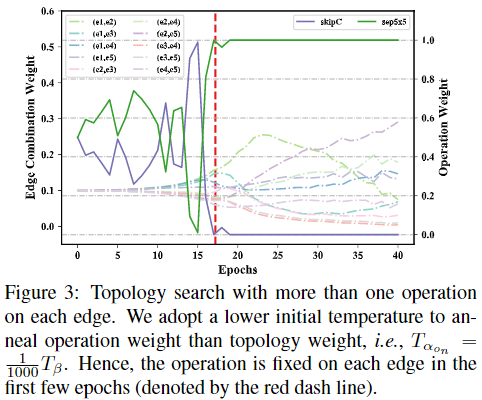

#### 5. Experiment

##### 5.1. Evaluation on CIFAR10/100

**搜索设置**：本文分别在框架 Pytorch、Mindspore、Jittor 上实现 DOTS，整个搜索过程花了 70 个 epoch，其中 30 个 epoch 用于操作搜索，40 个 epoch 用于拓扑架构搜索，在操作搜索阶段网络由 8 个单元构成，在拓扑结构搜索阶段为 20 个单元，搜索过程在 1 块 Tesla V100 上花了 6.3 hours (0.26 GPU days)。

**评估设置**：网络结构由 20 个单元 (18 个常规单元和 2 个下采样单元)，初始通道数为 36，batch size = 96, num_epochs = 600… (应该和 DARTS 中的一样)

结果如下图：

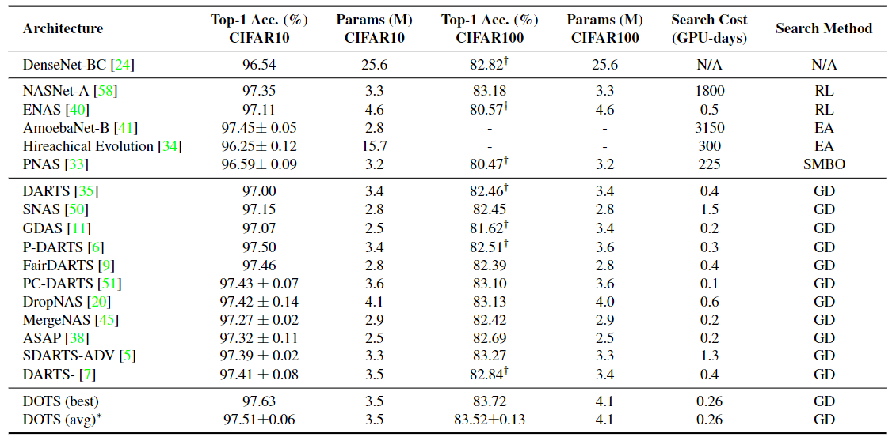

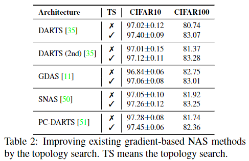

##### 5.2. Evaluation on ImageNet

**搜索设置**：只说与 CIFAR10 实验不同的，两个阶段的网络都是 14 个单元…

**评估设置**：resize = 224, 14 cells (2 normal + 2 reduction), initial channel = 46, num_epochs = 250, batch size = 1024 …

结果如下图：

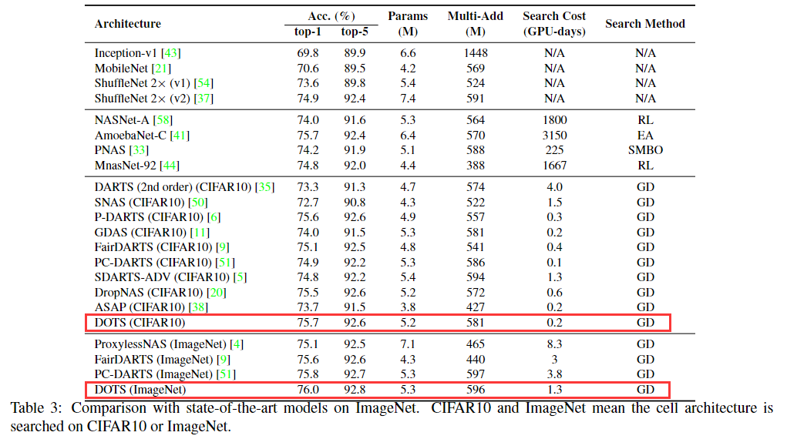

##### 5.3. Ablation Study

- 已有的基于梯度的 NAS 方法 + 本文提出的拓扑结构搜索：表 2

- 不同的拓扑结构参数化策略：

  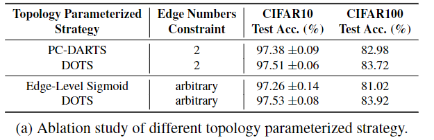

- 不同的操作搜索策略：

  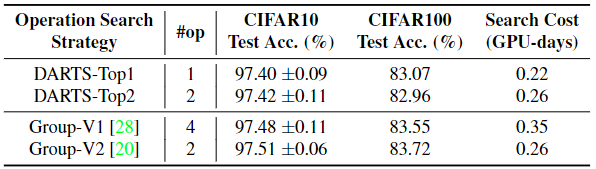

