### FP-NAS

**Paper: [Facebook AI, FP-NAS: Fast Probabilistic Neural Architecture Search. CVPR, 2021.](https://openaccess.thecvf.com/content/CVPR2021/html/Yan_FP-NAS_Fast_Probabilistic_Neural_Architecture_Search_CVPR_2021_paper.html)**

#### 3. Fast Probabilistic NAS

##### 3.1. Background

本文的方法是对 PARSEC [4] 的改进，作为一种可微的 NAS，都需要 DARTS 的理论支持：
$$
\mathrm{x}^{l+1}=\sum_{o \in O} \frac{\exp \left(\alpha_{o}^{l}\right)}{\sum_{o^{\prime} \in O} \exp \left(\alpha_{o^{\prime}}^{l}\right)} o\left(\mathrm{x}^{l}\right)
$$
一句话总结就是第 l 层的输出为输入通过不同操作的加权和 (即混合操作)，似乎和 DARTS 原文有些不同，DARTS 中一个单元中每个节点的输出是所有之前节点的输出通过混合操作的和，这里公式中只用到了上一个节点的输出。

一个架构 $\mathrm{A}$ 可以被一系列操作唯一定义，即 $\mathrm{A} = (A^1,\dots,A^L)$，其中 $A^l$ 为在第 $l$ 的操作，在 PARSEC 中，在每层的操作选择上引入了一个先验分布 $p(\mathrm{A}|\alpha)$，其中架构参数 $\alpha$ 表示选择不同操作的概率，单独的架构可以表示为从 $p(\mathrm{A}|\alpha)$ 采样得到的离散操作 $\{A^l\}$，因此架构搜索过程相当于在监督信号下学习分布 $p(\mathrm{A}|\alpha)$，简单来说，我们首先假定不同层上的操作都是独立的，然后采样一个架构 $\mathrm{A}$ 的概率为：
$$
P(\mathrm{A}|\alpha)=\prod_{l} P\left(A^{l}|\alpha^{l}\right)
$$
在图像分类中，假设有图像 $\mathrm{X}$ 和标签 $\mathrm{y}$，概率性 NAS 可以表示为通过一个经验贝叶斯蒙特卡罗过程 [3] 优化连续的架构参数 $\alpha$ :
$$
\begin{aligned}
P(\mathrm{y}|\mathrm{X}, \omega, \alpha)=\int & P(\mathrm{y}|\mathrm{X}, \omega, \mathrm{A}) P(\mathrm{A}|\alpha) \mathrm{d} \mathrm{A} \\
& \approx \frac{1}{K} \sum_{k} P\left(\mathrm{y}|\mathrm{X}, \omega, \mathrm{A}_{k}\right)
\end{aligned}
$$
其中 $\omega$ 表示模型权重，数据似然的连续积分通过平均采样架构的数据似然进行近似，我们可以通过采样架构估计梯度 $\nabla_{\alpha} \log P(\mathrm{y} \mid \mathrm{X}, \omega, \alpha)$ 和 $\nabla_{\omega} \log P(\mathrm{y} \mid \mathrm{X}, \omega, \alpha)$ 来联合优化架构参数 $\alpha$ 和模型权重 $\omega$，为了减少过拟合，训练集和验证集分别用来计算关于 $\alpha$ 和 $\omega$ 的梯度，概率性 NAS 以迭代的方式进行，在每一次迭代中，从 $P(\mathrm{A}|\alpha)$ 中采样 $K$ 个架构，然后在训练数据的一个 batch 上计算关于 $\alpha$ 和 $\omega$ 的梯度。

##### 3.2.  Adaptive Architecture Sampling

在 PARSEC 中，每次迭代都采样固定数量的架构来估计梯度，比如在 DARTS 的搜索空间中固定为16，这对于不同大小的搜索空间来说是次优的，在搜索的开始阶段，架构分布 $P(\mathrm{A}|\alpha)$ 是平坦的 (类似均匀分布)，此时需要进行大量的采样来估计梯度，随着搜索的进行，学习到的分布会主要关注一小部分候选集，此时我们可以减少采样的数量来降低搜索消耗。

本文提出一种简单且有效的方法，根据学习到的架构分布自适应采样，在搜索中，我们调整架构采样数量 $K$ 与架构分布 $P(\mathrm{A}|\alpha)$ 的熵成正比，在训练的早期，熵很高，因此采样较多，随着训练的进行熵逐渐降低，架构分布逐渐关注小部分架构，具体地，定义：
$$
K=\lambda H(P(\mathrm{A} | \alpha))
$$
其中 $H$ 表示分布的熵，$\lambda$ 为缩放因子。

##### 3.3.  Coarse-to-Fine Search in Multi-Variate Space

每一层 $A^{l}$ 的搜索空间可以包含多个搜索变量，比如卷积核尺寸，非线性，通道数，在这样的多变量空间中，当我们使用一个普通的联合分布 (JD) 表示，搜索空间中的架构数量是各个变量候选数目的乘积，这会随着变量的增加急剧增加，此时，我们可以将较大的联合分布分解成若干个独立的一维分布，比如对于候选数目分别为 [3, 2, 2, 6, 10] 的 5 个搜索变量，使用联合分布的架构参数量为 3·2·2·6·10 = 720，使用分解的一维分布时的架构参数量为 3+2+2+6+10 = 23.

形式上，在一个有 M 个搜索变量的层操作 $A^{l}$ 搜索空间中，每个层可以表示为一个 M 元组，$A^l = (A^l_1, \dots, A^l_M)$，我们应用如下分解分布 (FD)：
$$
\begin{aligned}
&P\left(A^{l} \mid \alpha^{l}\right)=P\left(\left\{A_{m}^{l}\right\}_{m=1}^{M} \mid\left\{\alpha_{m}^{l}\right\}_{m=1}^{M}\right) \\
&=\prod_{m=1}^{M} P\left(A_{m}^{l} \mid \alpha_{m}^{l}\right) \quad \text { where } A_{m}^{l} \in D_{m}^{l}
\end{aligned}
$$
其中 $D_{m}^{l}$ 表示搜索变量 $A_{m}^{l}$ 的候选集，与 JD 相比，FD 大幅降低了总的架构参数，能够大幅加速搜索，但是，由于 FD 忽视了不同搜索变量之间的关系，因此只能支持一种粗粒度的搜索，因为不同搜索变量之间可能存在关联，比如 MobileNetV3 中 MBConv block 的扩展系数和通道数。

为了支持快速搜索，本文提出一种由粗粒度到细粒度的搜索方法，即在搜索开始阶段使用 FD，经过一定的 epoch 后，转化为 JD 进行搜索。

##### 3.4.  Architecture Cost Aware Search

如果没有任何对架构损失限制，NAS 倾向于搜索更大的架构来更好的拟合训练数据，但这可能不适合对效率比较敏感的应用，本文使用 FLOPS 作为一项架构损失，完整的模型损失如下：
$$
\begin{aligned}
\mathcal{L}(\omega, \alpha) &=-\log P(\mathrm{y} \mid \mathrm{X}, \omega, \alpha)+\beta \log C(\alpha) \\
C(\alpha) &=\int C(\mathrm{A}) P(\mathrm{A} \mid \alpha) \mathrm{d} \alpha \approx \frac{1}{K} \sum_{k=1}^{K} C\left(\mathrm{A}_{k}\right)
\end{aligned}
$$
其中 $C\left(\mathrm{A}_{k}\right) = max(0, \frac{\text{FLOPS}(\mathrm{A}_{k})}{\text{TAR}} - 1)$，$\beta$ 表示架构损失系数，总损失关于 $\alpha$ 的梯度可以表示为：

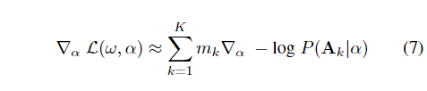

其中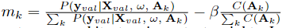，表示架构重要性权重，使用上式对 $\alpha$ 进行更新，在搜索结束后，我们选择学习到的架构分布中最可能的一个。

#### 4. Search Spaces

本文使用了 4 种不同的搜索空间。

**FBNetV2-F space** [33].  这个搜素空间被定义为表 1 中的 marco-architecture 加上表 2 中的 micro-architecture 的第一行，包含了卷积核尺寸、非线性类型、MBConv 的扩展系数和通道数，以及是否使用 SE 模块。

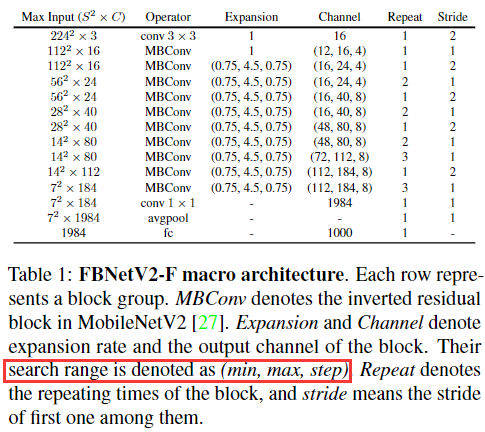

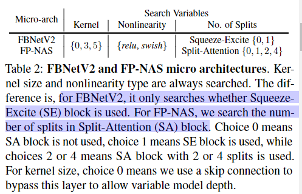

**FBNetV2-F-Fine space**. 相当于 FBNetV2-F 进一步细分的版本。

**FBNetV2-F++ space**. 将 SE 模块替换为 Split-Attention (SA) 模块 (如图 2 所示)，SA 模块将 SE 模块推广为多个 split，该搜索空间定义为 FPNetV2-F macro-architecture 和 FP-NAS micro-architecture,

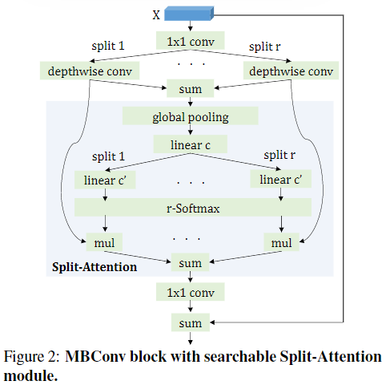

**FP-NAS spaces**. 我们对 FBNetV2-F macro-architecture 定义的搜索空间进行了扩展，增加了可搜索的通道数使模块更宽，增加了模块重复的次数使模型更深，增加了输入图像的分辨率。通过结合扩展的 macro-architectures 和 FP-NAS micro-architecture，我们获得了 3 个较大的搜索空间，t FP-NAS spaces L0-L2 (表 3)，从这些搜索空间搜索到的模型用 FP-NAS-L 表示。

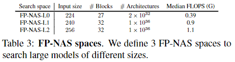

#### 5. Experiments

##### 5.1.  Implementation Details

Pytorch 实现，8 块 Nvidia V100，数据集为从 ImageNet 中随机选择的 100 个类别，称为 ImageNet-100，使用一半的图像作为训练集，用于更新模型权重 $\omega$，一半的图像作为验证集，用于更新架构参数 $\alpha$，论文中给出了实验的默认超参数。

本文在 FBNetV2-F, FBNetV2-F-Fine 和 FBNetV2-F++ 上搜索小模型，在 FP-NAS 上搜索大模型，搜索到的模型在整个 ImageNet 数据集上进行评估，评估时用了 64 块 V100。。。

##### 5.2. The Effectiveness of Adaptive Sampling

###### 5.2.1   How Many Samples Should We Draw?

PARSEC 中使用了固定数量的采样 (FS)，本文提出了自适应采样 (AS)，当 $\lambda=1/4$ 时， AS 在搜索初期会进行 14 次采样，之后随着架构分布的熵降低，采样数量会减少，如下图，这样比 $K=14$ 的 FS 还要好，说明了搜索后期不需要这么多的采样次数也能达到很好的效果，说明了 AS 的有效性。

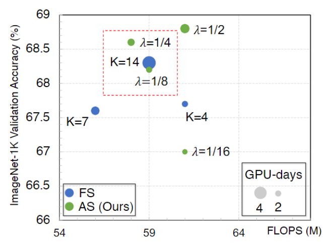

###### 5.2.2  FP-NAS Adapts to Search Space Size

在更大的搜索空间中，如下图，AS 也比 FS 的效果更好。

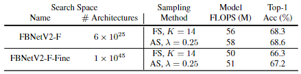

##### 5.3.  Fast Coarse-to-Fine Search

下图中的 $\theta$ 表示从分解分布转化为联合分布的 epoch 数。

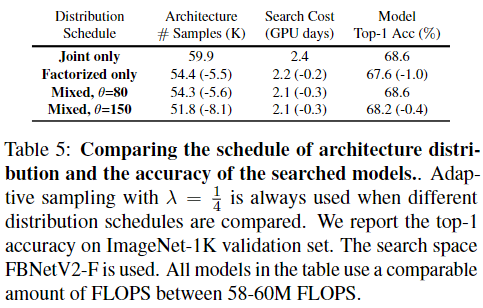

##### 5.4. Comparisons with FBNetV2

在相同的搜索空间中，与 FBNetV2 进行对比，结果如下：

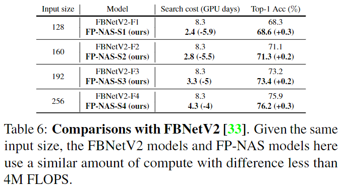

##### 5.5. Searchable Split-Attention Module

将不使用 SA 的 FP-NAS-S1、只使用 2 splits SA 的、只使用 4 splits SA 的、搜索 splits SA 的进行对比，结果如下：

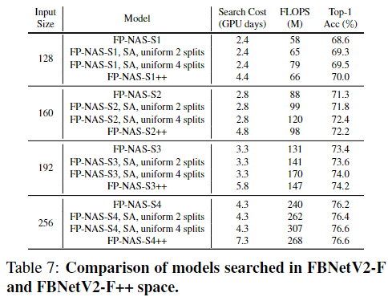

##### 5.6. Searching For Large Models

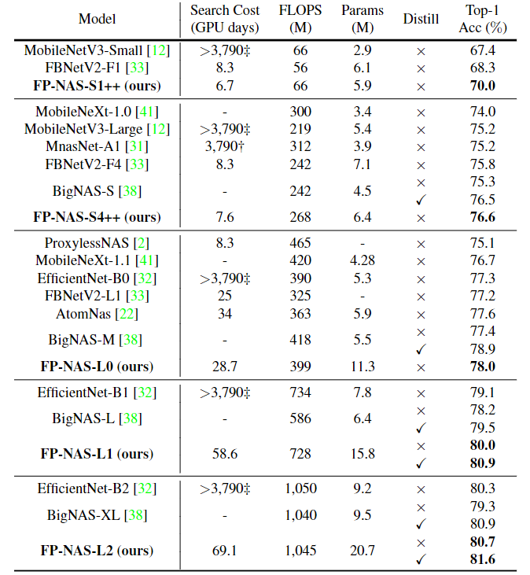

这个表中有一个问题，比如最后一行，什么 FLOPS 差不多，参数量差这么大。
