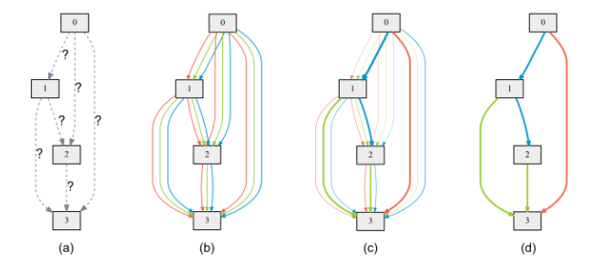
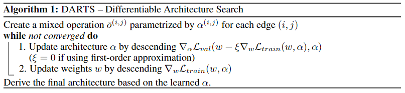
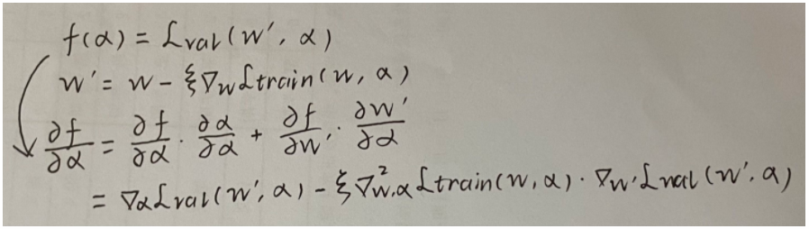
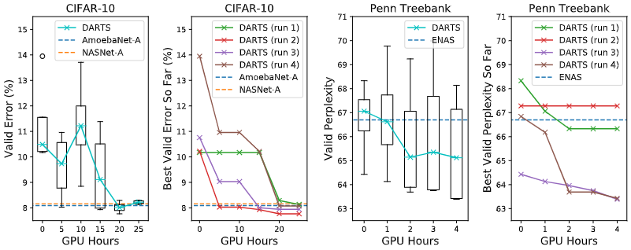
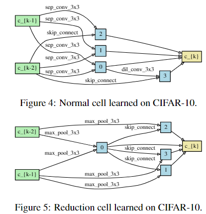
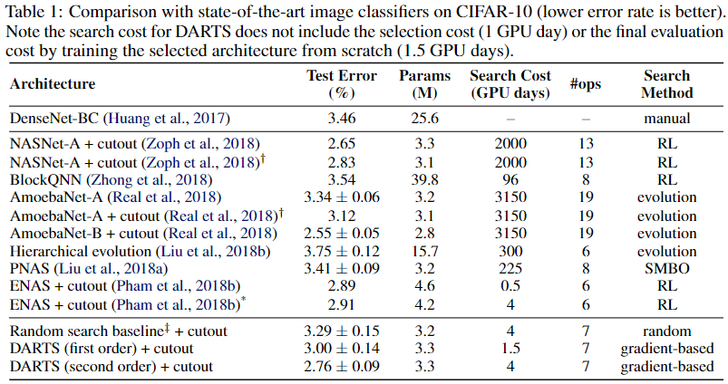
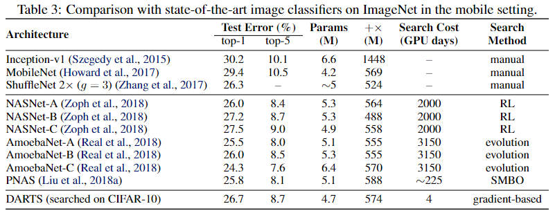

### DARTS

**Paper: [DARTS: Differentiable Architecture Search[C]. ICLR, 2019](https://arxiv.org/abs/1806.09055)**

#### Abstract

第一种基于梯度下降的 NAS 方法。本文通过以可微分的方式制定任务来解决架构搜索的可扩展性挑战。传统方法在离散且不可微的搜索空间上应用进化算法或强化学习的方法，而本文的方法基于架构表征的连续松弛，允许使用梯度下降有效搜索架构。该方法在能达到较高精度的同时，比不可微分的方法快几个数量级 (几个GPU Days即可完成搜索)。

#### 1.  Introduction

现有最好的架构搜索算法在计算上要求很高，尽管它们的性能非常出色。目前已经提出了几种加速的方法，本文从一个不同的角度来处理这个问题，并提出了一种高效的架构搜索方法，称为 DARTS (Differentiable architecture search)。本文方法不是在一组一组离散的候选架构上搜索，而是将搜索空间松弛为连续的，以便可以通过梯度下降来优化架构的验证集性能。

**Code：<https://github.com/quark0/darts>**

#### 2.  Differentiable Architecture Search

在本文的搜索空间中，架构或其中单元的计算过程表示为有向无环图，然后本文为搜索空间引入了一个简单的连续松弛方案，为网络结构及其权重的联合优化提供了一个可微的学习目标，最后本文提出了一种近似方法，使算法在计算上可行且高效。

##### 2.1  **Search Space**

本文寻找一个计算单元作为最终架构的 block，学习到的单元可以堆叠形成卷积网络，也可以递归连接形成循环网络。

单元是由 N 个节点的有序序列组成的有向无环图。每个节点 $x^{(i)}$ 是一个隐含的表征（例如卷积网络中的feature map），并且每个有向边 $(i, j)$ 与变换的 $x^{(i)}$ 某个操作 $o^{(i, j)}$ 相关联。假设某单元有两个输入节点和一个输出节点。对于卷积单元，输入节点定义为前两层单元的输出。对于循环单元，输入节点定义为当前步骤的输入和前一步骤的状态。单元的输出通过对所有中间节点应用缩减操作（例如串联）来获得。

每个中间节点都基于其所有前置节点进行计算：
$$
x^{(j)}=\sum_{i<j} o^{(i, j)}\left(x^{(i)}\right)
$$
在操作中存在一种特殊的零操作，以指示两个节点之间缺少连接。因此，学习单元的任务简化为学习其边缘的操作。

##### 2.2 Continuous Relaxation and Optimization

设 $\mathcal{O}$ 是一组候选操作 (例如：卷积、最大池、零)，其中每个操作表示要应用于的 $x^{(i)}$ 某个函数 $o(\cdot)$ 。为了使搜索空间连续，我们将特定操作的分类选择松弛为所有可能操作的一个softmax操作：
$$
\bar{o}^{(i, j)}(x)=\sum_{o \in \mathcal{O}} \frac{\exp \left(\alpha_{o}^{(i, j)}\right)}{\sum_{o^{\prime} \in \mathcal{O}} \exp \left(\alpha_{o^{\prime}}^{(i, j)}\right)} o(x)
$$
其中节点对 $(i, j)$ 之间的混合操作权重被参数化为一个维度为 $|\mathcal{O}|$ 的向量 $\alpha^{(i,j)}$，然后架构搜索的任务简化为学习一组连续变量 $\alpha = \{\alpha^{(i,j)}\}$，如下图所示，在搜索结束时，可以通过将每个混合操作 $\bar{o}^{(i, j)}(x)$ 替换为最可能的操作，即 $o^{(i, j)}=\operatorname{argmax}_{o \in \mathcal{O}} \alpha_{o}^{(i, j)}$. 在后文中，我们称 $\alpha$ 为架构 (的编码)。

进行了松弛之后，我们的目标是在所有混合操作中共同学习架构 $\alpha$ 和权重 $w$ (例如卷积滤波器的权重)。类似于使用 RL 或进化算法的架构搜索 (其中验证集上的性能作为奖励或适应度)，DARTS 旨在优化验证损失，但使用的是梯度下降。

假设 $\mathcal{L}_{train}$ 和 $\mathcal{L}_{val}$ 分别是训练和验证损失，这两种损失由权重 $w$ 和架构 $\alpha$ 共同决定，架构搜索的目标是找到 $\alpha^*$ 使得验证损失 $\mathcal{L}_{v a l}(w^{*}(\alpha), \alpha^*)$ 最小，其中权重 $w^*$ 与架构相关，通过最小化训练误差获得 $w^{*}=\operatorname{argmin}_{w} \mathcal{L}_{train}(w, \alpha)$.

这是一个双层优化问题，其中 $\alpha$ 作为上层变量，$w$ 作为下层变量。
$$
\begin{matrix}
\min _{\alpha} & L \\
\text {s.t.} & w^{*}(\alpha)=\operatorname{argmin}_{w} 
\end{matrix}
$$

$$
\begin{matrix}
\min _{\alpha} & \mathcal{L}_{v a l}(w^{*}(\alpha), \alpha) \\
\text { s.t. } & w^{*}(\alpha)=\operatorname{argmin}_{w} \mathcal{L}_{train}(w, \alpha)
\end{matrix}
$$
这种嵌套形式也出现在基于梯度的超参数优化中，因此也可以说架构 $\alpha$ 可以看成是一种特殊的超参数，即使它的维度基本上比标量超参数 (比如学习率) 都高，并且更难优化。

##### 2.3 Approximate Architecture Gradient

由于昂贵的内部优化，优化架构的梯度几乎不可能，因此我们提出了一个简单的近似方案：
$$
\begin{aligned}
& \nabla_{\alpha} \mathcal{L}_{v a l}\left(w^{*}(\alpha), \alpha\right) \\
\approx & \nabla_{\alpha} \mathcal{L}_{v a l}\left(w-\xi \nabla_{w} \mathcal{L}_{t r a i n}(w, \alpha), \alpha\right)
\end{aligned}
$$
其中 $w$ 表示算法当前保持的权重，$\xi$ 表示内部优化的学习率，主要的想法就是用单步训练的 $w$ 估计 $w^{*}(\alpha)$，这样就不需要通过将网络训练至收敛以完全解决内部问题。相关的技术被使用于模型迁移中的元学习、基于梯度的超参数优化，以及 unrolled 生成对抗网络。注意：当 $w$ 已经是局部最优解时，近似方案将会等价于 $\nabla_{\alpha} \mathcal{L}_{v a l}(w,\alpha)$，因为此时 $\nabla_{w} \mathcal{L}_{t r a i n}(w, \alpha)=0$.

上图中概述了迭代流程，虽然目前不能保证优化算法的收敛，但实际上可以通过适当的选择 $\xi$ 到达一个固定点，另外，当在权重优化中启用动量时，公式 (4) 中的单步展开学习目标会相应修改，所有的分析也仍然适用。

将链式法则 ([多元复合函数求导法则](https://zh.wikipedia.org/wiki/%E9%93%BE%E5%BC%8F%E6%B3%95%E5%88%99)) 应用到近似架构搜索中得到：

$$
\nabla_{\alpha} \mathcal{L}_{v a l}\left(w^{\prime}, \alpha\right)-\xi \nabla_{\alpha, w}^{2} \mathcal{L}_{t r a i n}(w, \alpha) \nabla_{w^{\prime}} \mathcal{L}_{v a l}\left(w^{\prime}, \alpha\right)
$$
其中 $w^{\prime}=w-\xi\nabla_{w} \mathcal{L}_{train}(w, \alpha)$，表示模型单步向前后的权重，上式在第二项包含了一个昂贵的矩阵-向量乘积，好在可以使用有限差分近似来显著降低复杂度，令 $\epsilon$ 为一个很小的数 ($\epsilon = 0.01/\| \nabla_{w^{\prime}} \mathcal{L}_{v a l}\left(w^{\prime}, \alpha\right) \|$ 在实验中比较精确)，$w^{\pm} = w \pm \epsilon \nabla_{w^\prime} \mathcal{L}_{val}(w^\prime,\alpha)$. 得：
$$
\nabla_{\alpha, w}^{2} \mathcal{L}_{t \operatorname{train}}(w, \alpha) \nabla_{w^{\prime}} \mathcal{L}_{v a l}\left(w^{\prime}, \alpha\right) \approx \frac{\nabla_{\alpha} \mathcal{L}_{\text {train }}\left(w^{+}, \alpha\right)-\nabla_{\alpha} \mathcal{L}_{\text {train }}\left(w^{-}, \alpha\right)}{2 \epsilon}
$$
评估有限差分只需要权重的两次前向传递和 $\alpha$ 的两次反向传递，然后计算复杂度就从 $O(|\alpha||w|)$ 降低至 $O(|\alpha|+|w|)$.

**First-order Approximation**    当 $\xi=0$ 时，等式 (5) 中的 2 阶导数会消失，此时，架构的梯度等于 $\nabla_{\alpha} \mathcal{L}_{val}(w, \alpha)$，对应着通过将当前 $w$ 看作 $w^*(\alpha)$ 的简单优化验证损失，这导致了一些加速但是经验上更糟的表现，这种情况称为一阶近似， $\xi > 0$ 时的情况称为二阶近似。下文有两种情况的对比实验。

##### 2.4 Deriving Discrete Architecture

为了实现离散架构中的每个节点，我们从所有之前的节点收集的所有非零候选操作中保留 top-k 个最强的操作 (来自不同节点)，操作的强度定义为 $\frac{\exp \left(\alpha_{o}^{(i, j)}\right)}{\sum_{o^{\prime} \in \mathcal{O}} \exp \left(\alpha_{o^{\prime}}^{(i, j)}\right)}$. 为了使我们生成的架构可以与现有的工作进行比较，我们对于卷积单元使用 $k=2$，对于循环单元使用 $k=1$.

出于两个原因，上面排除了零操作。首先，我们需要每个节点的精确非零传入边，以便与现有模型进行公平比较。其次，零操作的强度是不确定的，因为增加零操作的 logits 只会影响结果节点表征的规模，并且由于批量归一化的存在而不会影响最终的分类结果。

#### 3.  Experiments And Results

本文的实验在 CIFAR-10 和 PTB 上的实验包括两个阶段，架构搜索和架构评估，在第一阶段，使用 DARTS 搜索单元的结构，并根据其验证性能确定最佳单元。在第二阶段，使用这些单元来构建更大的架构，再从头开始训练并报告它们在测试集上的性能。另外还分别通过在 ImageNet 和 WikiText-2 (WT2) 上评估它们来研究在 CIFAR-10 和 PTB 上学习的最佳单元的可迁移性。

##### 3.1  Architecture Search

###### 3.1.1  Searching for Convolutional Cells on CIFAR-10

在 $\mathcal{O}$ 中包括以下操作：3×3和5×5可分离卷积，3×3和5×5扩张可分离卷积，3×3最大池化，3×3平均池化，identity 和零。所有操作都是步长 1 (如果适用) 并且卷积特征图被填充以保持它们的空间分辨率。使用 ReLU-Conv-BN 顺序进行卷积运算，每个可分离的卷积总是应用两次。

卷积单元由 $N=7$ 个节点组成，其中输出节点定义为所有中间节点 (不包括输入节点) 的深度级联，其余的设置遵循 Zoph et al. (2018); Liu et al. (2018a); Real et al. (2018)，其中一个网络是通过多个单元堆叠在一起而形成的。单元 $k$ 的第一二个节点设置为单元 $k-2$ 和单元 $k-1$ 的输出，并根据需要插入 $1 \times 1$ 卷积。位于网络总深度的 1/3 和 2/3 的单元是降维单元，其中与输入节点相邻的所有操作步长都是 2. 因此架构编码是 $(\alpha_{normal}, \alpha_{reduce})$，其中 $\alpha_{normal}$ 是所有正常单元共享的，$\alpha_{reduce}$ 是所有降维单元共享的。

详细的实验设置见论文的 Sect. A.1.1

###### 3.1.2  Searching for Recurrent Cells on PTB

暂时不了解关于 RNN 的

##### 3.2 Architecture Evaluation

为了确定最终评估的架构，本文用不同的随机种子运行了 4 次 DARTS，然后根据从头开始训练一小段时间 (100 epochs on CIFAR-10 和 300 epochs on PTB)后的验证性能选择最好的单元。这对于循环单元尤其重要，因为优化结果可能对初始化比较敏感，如下图所示。

为了评估选择的架构，本文随机初始化其权重 (在搜索过程中学习到的权重被丢弃) 从头开始训练，然后在测试集上记录它的性能，注意测试集从来不用于架构搜索和选择。

架构评估详细的实验设置见论文的 Sect. A.2.1 和 Sect. A.2.2。除了 CIFAR-10 和 PTB，本文还分别在 ImageNet (mobile setting) 和 WikiText-2 上评估最佳单元的可迁移性，更多实验细节见论文。

##### Results

