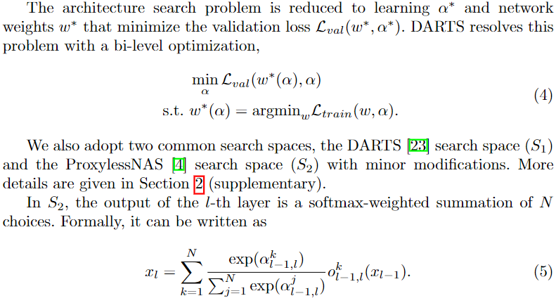

### Fair DARTS

**Paper: [Fair DARTS: Eliminating Unfair Advantages in Differentiable Architecture Search. ECCV, 2020.](https://arxiv.org/abs/1911.12126)**

#### Abstract

可微结构搜索(DARTS)是目前广泛应用的一种权重共享的神经结构搜索方法。然而，由于不可避免的跳过连接聚合，它遭受了众所周知的性能崩溃。本文首先揭示了其根源在于排他性竞争中的不公平优势。通过实验，我们表明，如果两种条件中的任何一种被打破，坍塌就会消失。因此，我们提出了一种新的方法，称为 Fair DARTS，其中的排他性竞争放松为合作。具体来说，我们让每个操作的架构权重独立于其他操作。然而，离散化仍然是一个重要的问题。然后我们提出 0 - 1 损失，来将架构权重推向 0 或 1，这近似于预期的 multi-hot 解决方案。我们在两个主流搜索空间上进行了实验，并在 CIFAR-10 和 ImageNet 上实现了新的 SOTA.

#### 1. Introduction

在DARTS的开源[23]之后，神经结构搜索社区出现了多种不同的变体。他们中的一些人将其扩展到更高层次的架构搜索空间[4,36]，一些人学习随机分布而不是架构参数[36,37,40,11,12]，而另一些人则提供了发现其鲁棒性不足的补救措施[26,6,21,18,39]。

尽管做出了这些努力，但[6,21,2,39]所注意到的 DARTS 中跳跃连接的聚集问题并没有得到完美的解决，P-DARTS[6]观察到聚合会导致最终架构的性能急剧下降，因此利用dropout作为一种变通方法，在优化期间限制跳过连接的数量，DARTS+ 则直接强硬地限制每个单元只有 2 个跳跃连接，RobustDARTS [39] 发现这些解与高验证损耗曲率吻合，在某种程度上，这些方法将性能较差的模型视为解决方案集中的杂质，它们会干预训练过程，需要将它们过滤掉。

相反，我们扩展了解集，并修改了优化过程，使跳跃连接的聚合不再导致崩溃。此外，离散连续架构编码时还存在差异问题。DARTS[23]将其作为未来的工作，但至今尚未深入研究。我们重申DARTS的基本前提是连续解近似于one-hot编码。直观地说，差异越小，当我们将一个连续的解转换成离散的解时，它就越一致。我们将我们的贡献总结如下:

> 首先，我们揭示了导致DARTS崩溃的根本原因，随后我们将其定义为一种不公平优势，在排他性竞争中驱动跳过连接进入垄断状态。这两个不可缺少的因素共同导致了表现的崩溃。此外，如果这两个条件中的任何一个被打破，崩溃就消失了。
>
> 其次，我们提出了第一种协作竞争方法，为每个操作提供一个独立的架构权重。当我们打破第二个因素时，不公平的优势就不再占优势了。进一步，为了解决我们方法中连续架构编码和派生的离散架构编码的差异，我们提出了一种新的辅助损失，称为0-1损失，以引导架构权重到它的极限，即要么完全启用，要么完全禁用。这样，差异就减小到最小。
>
> 第三，基于崩溃的根本原因，我们提供了一个统一的视角来看待当前DARTS，以解决跳跃性连接的聚合。作品中的大多数要么是在跳跃连接上使用 dropout，要么是通过不同的早期停止策略来利用后期的边界epoch[21,39]。它们都可以被认为是在阻止第一个因素的发挥作用。此外，作为一个直接的应用，我们可以推导一个假设，加入高斯噪声也会干扰不公平性，后来证明了这个假设是有效的。
>
> 最后，我们在两个广泛使用的搜索空间中进行了代理和无代理两种搜索方式的实验。结果表明，该方法能够避免性能崩溃。我们还在CIFAR-10和ImageNet上实现了SOTA

#### 3. The Downside of DARTS

在本节中，我们旨在挖掘 DARTS 可能会影响搜索性能的缺点。

##### 3.1  Preliminary of Differentiable Architecture Search

##### 3.2  Performance Collapse Caused by Intractable Skip Connections

当跳过连接成为主导时，DARTS 的性能会显著下降[6,21]。它被描述为一个双层优化中的竞争与合作的问题，然而，这种行为背后的原因并不清楚，我们在此提供一个不同的视角。

首先，为了确认这个问题，我们用不同的随机种子运行DARTS k = 4次。按照DARTS，我们为每个单元选择8个性能最好的操作(4个中间节点各选择2个)。对于某个节点，如果一个操作有所有入边中top2的softmax(a)，那么我们称它是占优势的 (dominant)，结果如图2所示。**一开始，所有的操作都有同样的机会，随着过度参数化的网络逐渐收敛，在20个epoch之后出现了明显的跳跃连接聚合** (极端情况下8个操作中有5个)。

当我们直接在 $S_2$ 中的ImageNet上使用DARTS时，这是一个单分支架构，同样的现象也会严格重现。占优势的跳连接数 (该层所有操作中最高的softmax(α)) 稳步增加，最终达到19层中的11层，如图1的左侧所示。

但为什么会发生这种情况呢？根本原因很少被深入讨论。[6]中对信息流作了简要而浅显的分析。但是，**我们认为过多的跳过连接的原因是各种操作之间的排他性竞争**。在公式2和公式5中，**跳过连接是通过softmax加权到输出中**，类似于ResNet[14]中的基本残差模块。**虽然这个模块极大地有利于训练，但跳跃式连接的架构权重比它的竞争对手增长得快得多**。此外，**softmax操作本质上提供了一种排他性竞争，因为增加一个是在压制其他的代价。因此，在优化过程中，跳过连接逐渐占据主导地位。**我们必须记住，**跳过连接工作得很好，因为它与卷积[14]合作。然而，DARTS选择了性能最好的一个(跳过这里的连接)，并丢弃了它的合作者(卷积)，这导致了一个退化模型。**PS：所以DARTS中的超网络是没有被完全训练好的，或者超网络过拟合非常严重。

我们在CIFAR-10上的实验中通过记录竞争过程进一步研究了这一效应，如图3所示。导出的模型中共有8个跳跃连接。ResNet[14]发现，与没有跳过连接的模型相比，跳过连接在几个epoch之后开始显示出强大的能力。有趣的是，在我们的实验中也观察到类似的现象。我们把这个临界点称为边界 epoch。边界epoch可能因边缘而异，但一般都处于早期阶段。从图3中我们可以看出，在经过一定的边界epoch之后，红橙色的跳过连接逐渐获得了更高的架构权重。与此同时，其他操作受到抑制，并稳步下滑。根据定义1，我们认为残差模块的这种好处是不公平的优势。

**定义1：**不公平的优势，假设在其他操作中选择一个操作是一种竞争。当只能选择有限制的操作时，这种竞争被认为是排他性的。如果排他竞争中的一项操作对竞争的贡献大于对结果网络的性能的贡献，则称该操作具有不公平优势。

通过以上讨论，我们可以得出 **Insight 1：过度跳跃连接的根本原因是内在的不公平竞争。**跳跃式连接具有不公平的优势，**它形成了一个残差模块，便于超网训练，但对残差模块被破坏后的结果网络的性能没有同等的好处。**

##### 3.3  Non-negligible Discrepancy of Discretization

除了上述问题之外，DARTS报告说，当离散连续编码[23]时，它还会遇到误差。为了验证这个问题，我们在CIFAR-10上 $S_1$ 中，以及在 ImageNet 上 $S_2$ 中运行 DARTS。最后一次迭代的softmax(α)值如图4 (S1)和图1 (S2)左下角所示。S1的最大值在0.3左右，最小值在0.1以上。这个范围有点窄，无法区分“好的”操作和“坏的”操作。例如，在下采样单元的第2条边，每条边权重都很接近，很难说哪个更好， $S_2$ 中第 2-7层也是如此。

总之，DARTS 通常与公式3中所要求的 one-hot 表征相去甚远。我们常常不得不在没有高度自信的情况下做出模棱两可的选择。因此，我们学习了 **Insight 2：从离散的分类选择放松到连续的应该做出一个接近的近似。**

#### 4. Fair DARTS

##### 4.1  Stepping out the Pitfalls of Skip Connections

基于 **Insight 1**，我们提出了一种消除不公平优势的合作机制。我们不仅应该利用跳过连接来实现更顺畅的信息流动，而且我们还必须为其他操作提供平等的机会。总之，他们需要避免被跳过连接的不公平优势所困。在这方面，我们对每个操作权重 $\alpha_{o_{i,j}}$ 应用一个 sigmoid 激活 (σ)，使每个操作可以独立地开启或关闭而不被抑制。形式上，我们用下面的公式代替方程2，

PS：就是用 sigmoid 代替 softmax，但是这样的话输出的值变得很大？好像用批归一化值变不变都行。

即使 $σ(α_{skip})$ 饱和为1，其他操作仍然可以协同优化。有希望的操作继续增加他们的架构权重，以减少 $L_{val}$，这导致 multi-hot 近似。相反，DARTS 试图得出一个 one-hot 的估计。不同之处在于我们扩展了解集。因此，它允许我们处理离散化差异。我们需要找出如何使 σ(α) 趋向于每个极值(0或1)。接下来，我们将更详细地讨论它。

##### 4.2  Resolve Discrepancy from Continuous Representation to Discrete Encoding
为了遵守Insight 2，我们明确地强制要求额外的损失，称为0 - 1损失，将架构权重的 sigmoid 值推向0或1。设 $L_{0-1} = f(z)$ 表示损失分量，其中 $z = σ(α)$，为了实现我们的目标，损失设计必须满足三个基本标准，a)它需要在z = 0.5(一个公平的起点)有一个全局最大值，在0和1有一个全局最小值。b) z≈0.5处的梯度大小必须足够小，以允许架构权重波动，但当远离0.5是梯度要足够大，以吸引 z 朝向0或1，c) 对于反向传播，它应该是可微的。

根据第一个要求，我们将σ(α)从0.5移向0或1，以最小化离散化间隙。第二个要求明确地制定必要的约束。特别是，在峰值附近的小坡度避免容易进入两端。在0和1附近设置较大的梯度有助于快速捕获附近的z。很简单，我们提出一个损失函数来满足上述要求，形式上是，

为了控制它的强度，我们用一个系数 $w_{0-1}$ 来衡量这种损失，因此的总损失可以表示为:

就像DARTS[23]一样，架构权重可以通过反向传播进行优化。从式8中，搜索目标是找到一种精度高、从连续编码到离散编码的近似度好的体系结构。

此外，第二个要求是必不可少的，否则基于梯度的方法可能过早地进入局部最小值。这里我们设计了另一个损失作为负面例子，设 $L^{'}_{0-1}$ 为，

很容易看到z>0.5的梯度为 1和z<0.5的梯度为 −1。一旦z远离0.5，它可能在以后的迭代中得到相同的梯度(1或-1)，从而迅速将架构权重推向两端。这种现象如图5所示。

综上所述，通过结合方程4,6和8，我们称之为 Fair DARTS 的方法现在可以正式写成：

同样重要的是要认识到我们的 0-1 损失是为 Fair DARTS 专门设计的。将一条边的σ(α)推向0或1与其他边无关。由于softmax的排他竞争，不能直接应用于DARTS。当体系结构权重收敛到极点时，在我们的方法中很自然地使用阈值 $\sigma_{threshold}$ 来推断子模型，而不是argmax。

#### 5. Experiments and Results

