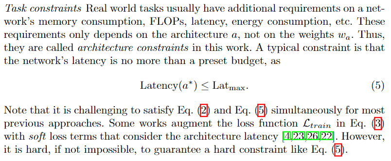

### SPOS

**Paper: [Single Path One-Shot Neural ArchitectureSearch with Uniform Sampling. ECCV, 2020.](https://www.ecva.net/papers/eccv_2020/papers_ECCV/html/2593_ECCV_2020_paper.php)**

#### Abstract

现有的 one-shot NAS 方法很难在 ImageNet 这样的大规模数据集上进行有效的训练，本文提出了一种单一路径 One-shot 模型来应对这个挑战，我们的中心思想是构建一个简化的超网络，其中所有架构都是单路径，从而减轻权重的协同适应问题，而训练是通过均匀路径采样来完成的，所有的架构都是完全且平等的训练。

实验验证了该方法的灵活性和有效性，它易于训练，搜索速度也很快。很容易支持复杂的搜索空间 (例如，构建块，通道，混合精度量化) 和不同的搜索约束 (例如，FLOPs，延迟)。因此，它可以方便地用于各种需求，它在大规模数据集 ImageNet 上实现了 SOTA 性能。

#### 1. Introduction

大多数权值共享方法使用连续松弛来参数化搜索空间。在超网训练过程中，采用基于梯度的方法对体系结构分布参数进行联合优化。优化后，从分布中抽样得到最佳的结构。这种表述有两个问题。首先，超网络中的权重是深度耦合的。目前还不清楚为什么特定体系结构的继承权重仍然有效。其次，联合优化进一步引入了系统参数与超网权重之间的耦合。基于梯度方法的贪婪特性不可避免地会在优化过程中引入偏差，容易误导结构搜索。他们采用了复杂的优化技术来缓解这个问题。

One-shot 范例[3,2]缓解了第二个问题。它定义超级网络并以类似的方式执行权重继承。然而，架构并没有松弛。将体系结构搜索问题与超网络训练解耦，并在单独的步骤中解决。因此,它是顺序的。它结合了上述两种嵌套优化和联合优化方法的优点，体系结构搜索既高效又灵活。

第一个问题仍然是个问题。现有的 One-shot 方法[3,2]在超级网络中仍然存在耦合权值。它们的优化是复杂的，涉及敏感的超参数。在大数据集上没有显示出有竞争力的结果。

本文工作回顾了 One-shot 范例，并提出了进一步简化培训和增强架构搜索的新方法。基于使用继承权值的体系结构的准确性应可预测使用优化权值的准确性的观察，我们提出超网训练应赋予。所有架构都同时优化了权重。这就产生了统一抽样策略。为了减少超级网络中的权值耦合，提出了一种由单路径结构构成的简单搜索空间。该训练是超参数无和易于收敛。

#### 2. Review of NAS Approaches

网络结构搜索定义：

在连续搜索空间上搜索的定义：

在上述优化过程中存在一些问题：

首先，**超网络中每个节点的权重由于是同时优化的，从而是深度耦合的，而对于一个特定的架构，他是继承了超网的部分节点的权重，但这些权重和其他权重是耦合的，因此不能说明这些权重是否还是有效的。**PS：一些 NAS 方法中的权重会在搜索完重新训练，所以不用在意权重，而需要在意的是，比如 DARTS 中，最终训练的是一个超网络，超网络中不同分支的权重也是耦合的，直接去掉低权重的分支是否合理？

其次，结构参数 $\theta$ 和权重 $W$ 引入的联合优化进一步增加了复杂性。求解方程 (3) 在优化过程中不可避免地会对 $\theta$ 中的某些区域和 $W$ 中的某些节点引入偏差。偏差会使图中的一些节点训练良好，而另一些节点训练不良。由于权重的成熟度不同，不同的体系结构实际上是不可比较的。然而，它们的预测精度被用作对$$A(θ)$$ 采样的指导 (例如，作为政策梯度 [4] 的奖励)，这将进一步误导架构抽样。这个问题类似于强化学习中的“开发与探索的困境”问题。为了缓解这类问题，现有的方法采用了复杂的优化技术 (表 1 进行了总结)。PS：这部分没怎么看懂，上面只是翻译，好像是说**在网络还不成熟的时候就对采样的子网络进行评估从而指导架构参数更新，由于不同架构被训练的程度不同，这样是不合理的，可能会使架构优化的方向跑偏。**

另外说了一下任务约束比如 FLOPs，延迟等约束的问题：

#### 3. Our Single Path One-Shot Approach

如上所述，架构参数和权重之间的耦合存在问题，这是由于两者的联合优化造成的。为了缓解这个问题，一个自然的解决方案是将超级网络训练和架构搜索分离成两个顺序的步骤，这就导致了所谓的 One-Shot 方法[3,2]。

一般来说，这两个步骤表述如下，首先将超网络权值进行优化：

与式(3)相比，只有超网络权重而没有架构参数进行优化，然后，架构搜索描述为：

在架构搜索的过程中，每个采样的架构 $a$ 继承了超网络的 $\mathcal{A}$ 的部分权重 $W_\mathcal{A}(a)$，公式 (7) 与公式 (1) 和 (2) 的关键区别在于架构权重是被充分训练的，在验证集上进行评估只需要推理，因此搜索是有效的。

搜索也是灵活的，任何合适的搜索算法都是可行的。并且搜索可以重复很多次，比如使用不同的约束(延迟100ms和200ms)。这些属性在以前的方法中是不存在的。这使得 One-Shot 模式对现实世界的任务具有吸引力。

One-Shot 模式只是将架构参数和权重进行解耦，但第二节中的第二个问题仍然存在，即超网络中的所有权重是同时被优化的，因此是耦合的，所以对于任意的子架构，只其中选择部分权重 $W_\mathcal{A}(a)$ 是否还是有效的。

最近的 One-Shot 方法 [2] 尝试使用 “path dropout” 策略来解耦权重，在公式 (6) 的 SGD 步骤中，超网图中的每条边都被随机丢弃，这样，在训练过程中降低了节点权值的协同适应性 (应该也可以说是耦合程度)。[2] 实验表明，训练对参数 dropout rate 非常敏感。这使得超级网训练变得困难。在我们实施这项工作时，我们还发现验证精度对参数 dropout rate 非常敏感。

##### Single Path Supernet and Uniform Sampling

让我们重新思考一下权重共享背后的基本原则，在公式 (7) 中架构搜索成功的关键是，任何继承权重的模型都是被完全训练的 (而不是微调)。理想情况下，这要求继承的权重 $W_\mathcal{A}(a)$ 近似于公式 (1) 中的最优权重。所以优化的质量就取决于训练损失 $\mathcal{L}_{train}(\mathcal{N}(a,W_\mathcal{A}(a))$ 的最小化程度，这就产生了一个原则，即**超网络权重应该以一种搜索空间中的所有架构都同时优化的方式进行优化**，这表示为：

其中 $\varGamma({\mathcal{A})}$ 表示架构 $a \in \mathcal{A}$ 的先验分布，公式 (8) 是公式 (6) 的一个实现，**在搜索的每一步中，架构都是随机采样的，只有权重 $W(a)$ 被激活和更新**，所以是内存高效的，**在这种方式中，超网络不再是一个有效的网络 (只是用来生成有效子网络的工具罢了)，而是一种概率性超网络**，与公式 (2) 中的不同。

为了减少节点权值之间的协同自适应，我们**提出了一种超网络结构，其中每个子架构都是单路径的**，如图3 (a)所示。与[2]中的 path dropout 策略相比，单路径策略是没有超参数的。我们在相同的搜索空间内比较了这两种策略。图1的结果表明， dropout rate 参数影响很大。不同的 dropout rate 使得超网获得不同的验证精度。因为我们的单路径策略可以将不同操作的权重解耦，所以它效果最好。图1验证了权值解耦的好处。

公式 (8) 中的**先验分布 $\varGamma({\mathcal{A})}$ 也是重要的**。在这项工作中，我们经验地发现**均匀抽样**是好的。这并不奇怪。一个并行的工作 [10] 也发现基于随机超网的纯随机搜索在 CIFAR-10 上是有竞争力的。我们还用一种变体进行了实验，该变体根据架构的约束条件对架构进行统一采样，称为**统一约束采样。具体来说，我们随机选择一个范围，然后重复对架构进行抽样，直到抽样架构的FLOPs落在这个范围内。**这是因为实际任务通常期望找到满足不同约束的多个体系结构。在本文中，我们发现一统一约束采样方法略好，所以我们在本文中默认使用它。

我们注意到，在优化过程中，根据架构分布对路径进行采样已经在以前的权重共享方法中使用过。不同的是，先验分布 $\varGamma({\mathcal{A})}$ 在我们的训练中是固定的，而它在之前的方法中是可学习和更新的 (如 RL[15]，策略梯度[22,4], Gumbel Softmax [23,26], APG[31])。在第 2 节中分析，后者使得超网络权重与架构参数高度相关 (耦合)，优化困难。另一个并行的工作 [10] 也提出在 One-Shot 模型中使用路径的随机抽样，并执行随机搜索以找到优越的体系结构。[10]在 CIFAR-10 上取得了与几种 SOTA NAS方法相当的结果，但没有在大数据集 ImageNet 上验证该方法。他没有验证了单路径采样与“path dropout”策略相比的有效性，也没有分析超网性能与最终评估性能的相关性。这些问题将在我们的工作中得到解答，我们的实验也表明，随机搜索不足以从大的搜索空间中找到优秀的架构。

第4节的综合实验表明，我们的方法比SOTA方法取得了更好的结果。请注意，并没有这样的理论保证，使用一个固定的先验分布本质上优于在培训期间优化分布。我们较好的结果可能表明，但是 Eq.(3) 中的联合优化对于现有的优化技术来说太困难了。

##### Supernet Architecture and Novel Choice Block Design

选择块被用来建造随机的建筑。图 3(a) 给出了一个示例案例。一个选择块包含多个模块选择，对于我们的单路径超网络，每个选择块在同一时间只有一个选择被调用。路径是通过对所有选择块进行抽样得到的。

我们方法的简单性使我们能够定义不同类型的选择块来搜索各种架构变量。具体来说，我们还提出了两个新颖的选择块来支持复杂的搜索空间，**Channel  Number  Search** 和 **Mixed-Precision Quantization Search**.

##### Evolutionary Architecture Search

对于Eq.(7)中的架构搜索，之前的 One-Shot 工作[3,2]使用的是随机搜索，这对于大的搜索空间是无效的。本文使用了一种进化算法。注意，[16]中使用了进化式搜索 NAS，但由于每个体系结构都是从头开始训练的，因此成本很高。在我们的搜索中，每个体系结构只执行推理。这是非常有效的。

