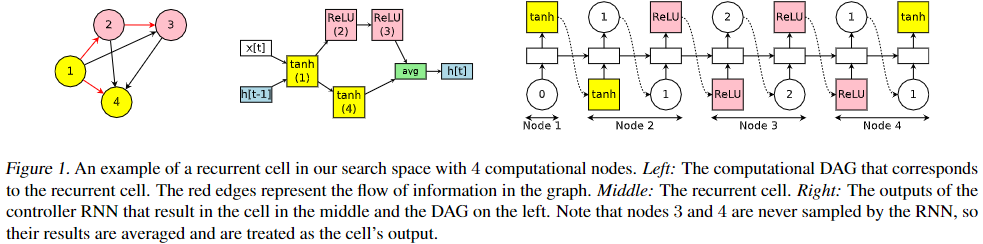
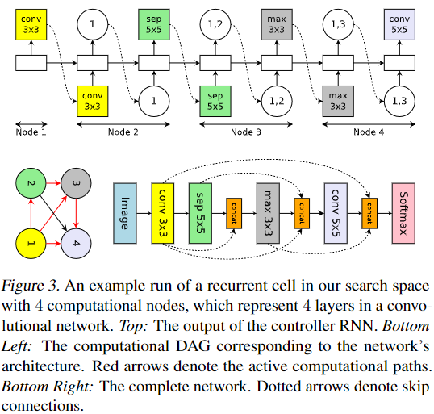
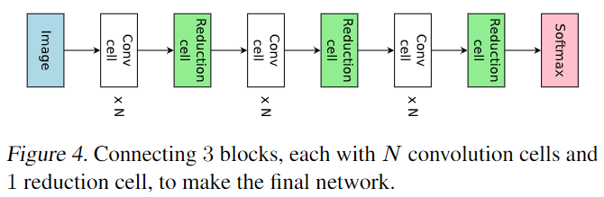
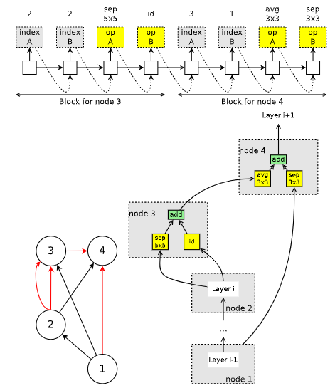
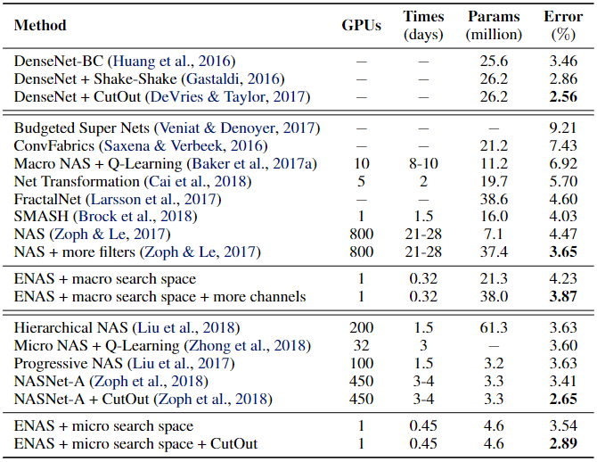
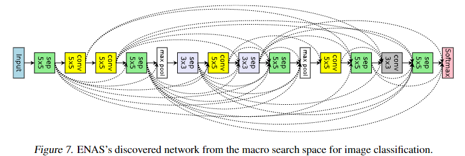
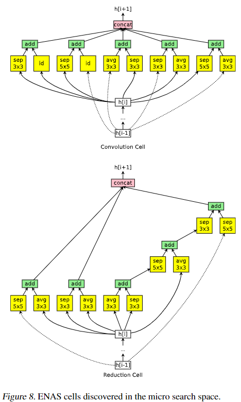

### ENAS

**Paper: [Efficient Neural Architecture Search via Parameter Sharing. PMLR, 2018.](http://proceedings.mlr.press/v80/pham18a.html)**

#### Abstract

本文提出了高效神经架构搜索 (ENAS). 一个快速且花费较低的自动模型设计方法。ENAS 构建了一个大型计算图，其中每个子图代表一个神经网络架构，因此迫使所有架构共享它们的参数。控制器使用策略梯度进行训练，来搜索在验证集上最大化预期奖励的子图，同时对应子图的模型以最小号规范交叉熵损失训练。在子模型之间共享参数允许 ENAS 提供强大的经验性能，同时比现有方法快很多。

#### 1. Introduction

之前的 NAS 的方法尽管能取得不错的结果，但是成本高昂且耗时巨大，比如 Zoph et al. (2018) 使用 450 块 GPU 训练 3-4 天，即 32,400-43,200 个GPU hours，同时，使用更少的资源往往会产生不那么好的结果。作者观察到 NAS 的计算瓶颈是训练每个子模型收敛，只测量其准确性，同时丢弃所有训练的权重。

本文工作的主要贡献是通过强制所有子模型共享权重来避免从头到收敛训练每个子模型，从而提高 NAS 的效率。这个想法有明显的复杂性，因为不同的子模型可能会以不同的方式利用它们的权重，但之前在迁移学习和多任务学习方面的工作给了我们灵感，这些工作确立了在特定任务上为特定模型学习的参数可以用于其他任务上的其他模型 (且几乎没有修改)。

实验结果表明，不仅共享子模型的参数是可行的，而且最终的性能也很强，并且本文所有的实验都只用了一块 1080Ti，搜索时间小于 16 小时。

#### 2. Methods

##### 2.1. Designing Recurrent Cells

为了设计循环单元，本文探索了一个有 N 个节点的 DAG，其中节点表示局部计算 (操作)，边表示信息流 (张量)，ENAS 的控制器是一个 RNN，控制器决定了：1) 哪条边被激活，2) 在 DAG 中每个节点的哪种计算被执行。

为了创建一个循环单元，控制器 RNN 采样了 N 个 block，本文通过一个简单的有4个计算节点的循环单元来说明 ENAS 机制，如上图所示，假设 $x_t$ 是循环单元的输入信号，$h_{t-1}$ 是上一个时间步骤的输出，采样流程如下：

>1. 在节点 1：控制器首先采样一个激活函数，在示例中，控制器选择了 tanh 激活函数，即 $k_1 = \operatorname{tanh}(x_t \cdot W^{(x)} + h_{t-1} \cdot W_{1}^{(h)})$
>2. 在节点 2：控制器接着采样一个上一个节点的序号，以及一个激活函数，在示例中，控制器选择了节点 1 作为上一个节点，激活函数为 ReLU，即 $k_2 = \operatorname{ReLU(k_1 \cdot W_{2,1}^{(h)})}$
>3. 在节点 3：控制器选择了节点 2 作为上一个节点，激活函数为 ReLU，即 $k_3 = \operatorname{ReLU(k_2 \cdot W_{3,2}^{(h)})}$
>4. 在节点 4：控制器选择了节点 1 作为上一个节点，激活函数为 tanh，即 $k_4 = \operatorname{tanh}(k_1 \cdot W_{4,1}^{(h)})$
>5. 对于输出，本文就是平均所有端节点 (出度为0)，在示例中，节点 3 和节点 4 的出度为 0，因此循环单元的输出为 $h_t = (k_3+k_4)/2$.

在上述采样中，每队节点 $j<l$ 之间都有一个独立的参数矩阵 $W_{l,j}^{(h)}$，在上述采样示例中，控制器会通过选择上一个节点的序号，来确定哪些参数矩阵需要被使用，因此，在 ENAS 中，所有在一个搜索空间中的循环单元共享相同的参数集合。

本文搜索空间包括了指数种配置，具体来说，如果循环单元有 $N$ 个节点，同时可选择 4 种激活函数 (tanh, ReLU, identity, sigmoid)，然后搜索空间就会有 $4^N \times (N-1)!$ 个配置，在本文实验中，$N=12$，意味着搜索空间大约有 $10^{14}$ 个模型。

##### 2.2. Training ENAS and Deriving Architectures

本文的控制器网络是一个用 100 个隐含神经元的 LSTM，该 LSTM 以自回归的方式通过 softmax 分类器采样结果：上一步的结果将作为下一步的输入 embedding，在第一步，控制器网络输入空的 embedding.

在 ENAS 中，有 2 种可学习的参数：控制器 LSTM 的参数 $\theta$，所有子模型共享的参数 $\omega$。ENAS 的训练过程包括两个交错的阶段，第一阶段训练子模型共享的参数 $\omega$，这里讲了一些实验的设置，第二阶段训练控制器 LSTM 的参数 $\theta$，训练次数固定，实验中设置为 2000，这两个阶段的详细过程如下：

**Training the shared parameters $\omega$ of the child models：**在这一步，本文固定控制器的策略 $\pi(\mathbf{m};\theta)$，然后对 $\omega$ 执行随机梯度下降以最小化期望损失函数 $\mathbb{E}_{\mathbf{m} \sim \pi}[\mathcal{L}(\mathbf{m} ; \omega)]$，其中，$\mathcal{L}(\mathbf{m} ; \omega)$ 是标准的交叉熵损失，$\mathbf{m}$ 是从 $\pi(\mathbf{m};\theta)$ 采样的模型， 每次采样 $M$ 个 (作者发现 $M=1$ 时就能够工作)。本文使用 Monte Carlo 估计计算梯度：
$$
\nabla_{\omega} \mathbb{E}_{\mathbf{m} \sim \pi(\mathbf{m} ; \theta)}[\mathcal{L}(\mathbf{m} ; \omega)] \approx \frac{1}{M} \sum_{i=1}^{M} \nabla_{\omega} \mathcal{L}\left(\mathbf{m}_{i}, \omega\right)
$$
**Training the controller parameters $\theta$：**在这一步，我们固定 $\omega$ ，然后更新策略参数 $\theta$，旨在最大化期望奖励 $\mathbb{E}_{\mathbf{m} \sim \pi(\mathbf{m} ; \theta)}[\mathcal{R}(\mathbf{m} ; \omega)]$，本文使用 Adam 优化器，用强化学习计算梯度。其中奖励 $\mathcal{R}(\mathbf{m} ; \omega)$ 是在验证集上计算的。在语言模型实验中，奖励函数是 $c/\text{valid\_ppl}$，在图像分类实验中，奖励函数是验证集上的准确率。

**Deriving Architectures：**使用 ENAS 生成新模型的流程如下，首先从训练好的策略 $\pi(\mathbf{m};\theta)$ 中采样几个模型，对于每个模型，计算它在从验证集采样单个 *mini-batch* 上的奖励，然后只选择具有最高奖励的模型从头开始训练，可能从头训练所有采样的模型会有更好的结果。

##### 2.3. Designing Convolutional Networks

在卷积模型的搜索空间中，控制器 RNN 在每个决策块上采样 2 种决策：1) 哪些先前节点需要连接，2) 使用什么操作计算，这些决策构建了卷积模型中的一个层。其中哪些先前节点需要连接允许模型形成跳跃连接，具体来说，在第 $k$ 层，对之前的 $k-1$ 层进行采样，一共有 $2^k-1$ 种可能 (可以和多个先前节点连接)，上图是一个简单的控制器 RNN 采样示例，理解 2.1 节的内容也很容易明白这节的内容。

控制器可选择的 6 个操作：3x3和5x5的常规卷积、3x3和5x5的深度可分离卷积、3x3的最大池化和平均池化。另外，在 ENAS 中，所有在一个搜索空间中的卷积层共享相同的参数集合。

假设每层 L 个节点，一个网络有 L 层，那么在搜索空间中一共有 $6^L \times 2^{L(L-1)/2}$ 个网络，本文实验中设置 $L=12$，有 $1.6 \times 10^{29}$ 个可能的网络。

##### 2.4. Designing Convolutional Cells

本文通过设计模块单元然后将他们堆叠连接在一起构建网络，如上图所示，其中包括卷积单元和下采样单元，这些单元由 ENAS 搜索得到。

本文使用有 $B$ 个节点的 ENAS 计算 DAG 表示在一个单元中的操作，在 DAG 中，节点 1 和节点 2 被看作单元的输入，她们也是网络前两个单元的输出，对于剩下的 $B-2$ 个节点，控制器需要做两组决策：1) 哪两个之前的节点作为当前节点的输入，2) 哪两种操作应用于两个采样的节点。共有 5 种可选操作：identity、3x3和5x5深度可分离卷积、3x3平均池化和最大池化。在每一个节点完成前驱节点和相应操作的采样后，它们得到的结果将会相加作为输出。

文本使用上图中的示例说明搜索空间的机制，其中单元包括 $B=4$ 个节点，细节如下：

>1. 节点 1, 2 是输入节点，所以没有操作，记 $h_1, h_2$ 是它们的输出。
>2. 在节点  3：控制器采样 2 个前驱节点 (同一个节点可以重复采样) 和 2 个相应的操作，如图，输出记为 $h_3 = \operatorname{sep\_conv\_5x5}(h_2) + \operatorname{id}(h_2)$.
>3. 在节点 4：如图，输出记为 $h_4 = \operatorname{avg\_pool\_3x3}(h_3) + \operatorname{sep\_conv\_3x3}(h_1)$.
>4. 因为只有节点 4 是端节点，所以 $h_4$ 被看作该单元的输出，如果有多个端节点，将会把所有端节点的输出在深度上串联起来作为单元的输出

下采样单元也可以用 ENAS 实现：1) 从搜索空间采样一个计算图，2) 将所有操作的步长设置为 2，与一个标准单元的采样过程类似。

估计搜索空间的大小：对于每个单元，有 ${(5 \times (B-2)!)}^2$ 种可能，因为我们独立搜索卷积单元和下采样单元，因此搜索空间的大小为 ${(5 \times (B-2)!)}^4$ (应该是整个网络只搜索一种卷积单元和一种下采样单元，然后将它们进行堆叠，那通道数似乎没有确定)。本文实验中设置 $B=7$，搜索空间大约包括 $1.3 \times 10^{11}$ 个网络。

这一节和上一节似乎是两种不同的方法，一种是网络中每个单元都单独搜索 (搜索空间更大)，一种是只搜索一种常规单元和一种下采样单元 (搜索空间更小)。

#### 3. Experiments

本文实验包括应用 ENAS 在 PTB 数据集上设计循环单元的实验 (略)，以及在 CIFAR-10 上设计卷积单元的实验，另外还有一个消融实验。

##### 3.2. Image Classification on CIFAR-10

**Search spaces:**	1) $macro\ search\ space$：搜索整个卷积模型 (2.3 节)；2) $micro\ search\ space$：只搜索单个卷积单元和下采样单元。

**Training  details:**	略

**Results:**	下表中第 1 块是当时SOTA的手工设计的网络，第 2 块是 ENAS 和已有的搜索整个网络结构的 NAS 方法，第 3 块是 ENAS 和已有的基于单元的搜索空间的 NAS 方法。第 2 块中 "ENAS + macro search space" 在一块 1080Ti 上花了 7 小时，"+ more channels" 表示扩展网络的宽度。第 3 块中 "ENAS + micro search space" 在一块 1080Ti 上花了 11.5 小时，"+ CutOut" 表示 (DeVries & Taylor, 2017) 中的方法。

