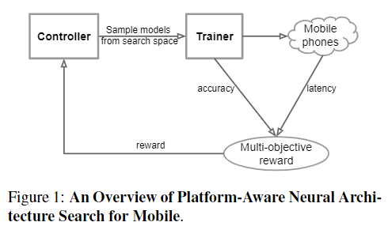
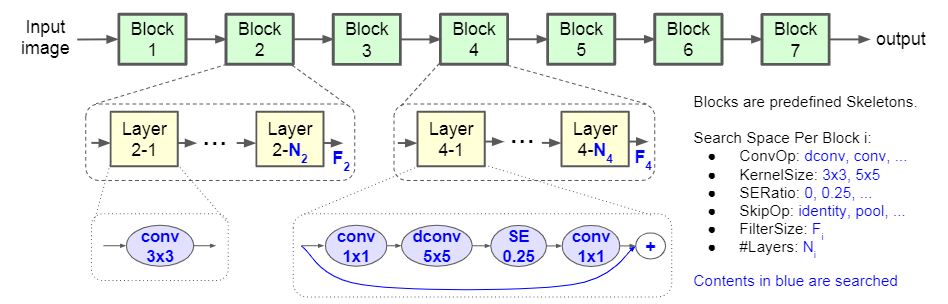
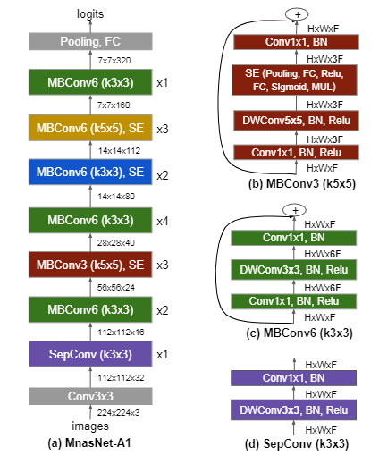

### MnasNet

**Paper: [MnasNet: Platform-Aware Neural Architecture Search for Mobile. CVPR, 2019.](https://openaccess.thecvf.com/content_CVPR_2019/html/Tan_MnasNet_Platform-Aware_Neural_Architecture_Search_for_Mobile_CVPR_2019_paper)**

#### Abstract

本文提出了一种自动mobile神经架构搜索 (MNAS) 方法，该方法将模型延迟纳入主要目标，使得搜索可以识别在准确性和延迟之间取得良好折衷的模型。与之前的工作不同，MNAS 通过在手机上执行模型来直接测量现实世界的推理延迟，而不是通过一个通常不准确的代理(例如，FLOPS)，另外，MNAS 中提出了一种新的分层搜索空间。

Code：<https://github.com/tensorflow/tpu/tree/master/models/official/mnasnet>.

#### 1. Introduction

上图是MNAS方法的概述，MNAS 方法基于2个主要思想:

- 将网络结构设计问题公式化为一个多目标优化问题，同时考虑了 CNN 模型的准确性和推理延迟，其中延迟是通过在真实移动设备上执行模型测量得到。主要考虑是用 FLOPS 代表延迟可能不太准确，比如 MobileNet-V1 和 NASNet 具有相近的 FLOPS (575M : 564M)，但延迟却相差很大 (113ms : 183ms)。
- 提出了一种新的分层搜索空间，因为考虑到之前的 NAS 方法主要搜索几种类型的单元，然后重复堆叠相同的单元得到网络，这样排除了对计算效率很重要的层多样性。

#### 2. Related Work

提高 CNN 模型的资源效率一直是一个活跃的研究课题。一些常用的方法包括: 1) 将 baseline CNN 模型的权重和/或激活量化为低比特表示 [8, 16]，2) 根据 FLOPs [6, 10] 或平台感知度量（例如 [32] 中引入的延迟）修剪不太重要的滤波器。然而，这些方法与基线模型相关，并不专注于学习 CNN 操作的新组合。

另一种常见的方法是直接手工制作更高效的移动架构，如 SqueezeNet [15]、MobileNet[11]、ShuffleNets [33, 24]、CondenseNet [14]、MobileNetV2 [29]，考虑到潜在的巨大设计空间，这些手工制作的模型通常需要大量的人力。

最近比较流行的是使用 NAS 方法自动搜索模型，虽然有些方法可以通过重复堆叠一些搜索到的单元来生成 mobile-size 的模型，但它们并没有将移动平台约束纳入搜索过程或搜索空间，也有一些方法在搜索 CNN 的同时优化模型大小和精度等多个目标，但也仅限于像 CIFAR 这样的小任务上。而本文不仅针对针对现实世界的延迟约束，并专注于 ImageNet 分类和 COCO 目标检测等更大的任务 (壕无人性)。

#### 3. Problem Formulation

给定一个模型 *m* ，令 $ACC(m)$ 表示它在目标任务上的准确率，$$LAT(m)$$ 表示在目标移动平台上的推理延迟，$T$ 是目标延迟。一种常见的方法是将 $T$ 视为硬约束并在此约束下最大化准确率：
$$
\begin{array}{ll}
\underset{m}{\operatorname{maximize}} & A C C(m) \\
\text {subject to} & L A T(m) \leq T
\end{array}
$$
然而，这种方法只最大化单个度量，并没有提供多个 Pareto 最优解。非正式地说，如果模型在不增加延迟的情况下具有最高准确率，或者在不降低准确度的情况下具有最低延迟，则该模型称为 Pareto 最优 [2]。考虑到执行架构搜索的计算成本，我们更感兴趣的是在单个架构搜索中找到多个 Pareto 最优解。

本文使用定制的加权乘积法来逼近 Pareto 最优解，优化目标定义为：
$$
\underset{m}{\operatorname{maximize}} \quad A C C(m) \times\left[\frac{L A T(m)}{T}\right]^{w}
$$
其中权重因子 $w$ 定义为：
$$
w= \begin{cases}\alpha, & \text { if } LAT(m) \leq T \\ \beta, & \text { otherwise }\end{cases}
$$
其中 $\alpha$ 和 $\beta$ 是特定于应用的常数，需要凭经验观察计算得到，文中有说明，作者在实验中，使用 $\alpha = \beta = -0.07$.

#### 4. Mobile Neural Architecture Search

##### 4.1. Factorized Hierarchical Search Space

定义明确的搜索空间对于神经架构搜索极其重要。然而大多数以前的方法 [35, 19, 26] 只搜索几个复杂的单元，然后重复堆叠相同的单元。这些方法不满足层多样性，本文表明这对于实现高精度和低延迟至关重要。

与之前的方法相比，我们引入了一种新的分解层次搜索空间，将 CNN 模型分解为若干个唯一块，然后分别搜索每个块的操作和连接，从而允许不同块中的不同层架构。

上图显示了本文搜索空间的 baseline 结构，CNN 模型被划分为一系列预定义的块，这些块按照顺序输入分辨率逐渐降低，以及滤波器大小 (FilterSize, 应该是指卷积核个数/输出通道数) 逐渐增加，这在许多 CNN 模型中很常见。每个块有一系列相同的层，层中的操作和连接由每个块的子搜索空间决定，具体来说，一个块的子搜索空间包括：

- 卷积操作 ***ConvOp***: 常规卷积 (conv)、深度 (逐通道) 卷积 (dconv)、mobile 倒置瓶颈卷积

- 卷积核尺寸 ***KernelSize***: 3x3、5x5

- Squeeze-and-excitation ratio ***SE Ratio***: 0, 0.25

- 跳跃操作 ***SkipOp***: pooling、identity residual、or no skip

  (不太懂 pooling 为什么算跳跃操作)

- 输出通道数 $F_i$

- 每个Block的层数 $N_i$

对于每个块来说，如果输入和输出分辨率不同，既需要下采样操作，本文令第一层的步长为 2，其余层的步长为 1，这里有个疑问，如果是指卷积步长为 2，感觉可能加一个步长为 2 的操作效果会更好，同时计算量也会降低。

本文在搜索中使用 MobileNet-V2 作为参考，来离散化所有搜索选项：<u>For #layers in each block, we search for{0, +1, -1}based on MobileNetV2</u> (这句话没看懂)，对于每层的通道数，我们搜索它相对于MobileNetV2的大小 {0.75, 1.0, 1.25}.

##### 4.2. Search Algorithm

受最近工作 [35, 36, 25, 20] 的启发，我们使用强化学习方法为我们的多目标搜索问题找到 Pareto 最优解。我们选择强化学习是因为它方便且奖励易于定制，但我们也希望其他方法如进化 [26] 也应该有效。

具体来说，我们遵循与 [36] 相同的想法，将搜索空间中的每个 CNN 模型映射到一个 tokn 序列。这些 token 由来自基于参数 $\theta$ 的强化学习代理 (RNN) 的一系列动作 $a_{1:T}$ 确定。我们的目标是最大化期望奖励：
$$
J=E_{P\left(a_{1: T} ; \theta\right)}[R(m)]
$$
其中，是 *m* 由 $a_{1:T}$ 确定的采样模型，R(m) 是等式 (2) 定义的目标值。

如图 1 所示，搜索框架由三部分组成：基于循环神经网络 (RNN) 的控制器、用于获取模型精度的训练器以及用于测量延迟的基于手机的推理引擎。我们遵循众所周知的样本评估更新 (sample-eval-update) 循环来训练控制器。在每一步，控制器首先通过使用其当前参数 $\theta$ 预测一系列 token 采样一批模型，对于每个采样模型，我们在目标任务上对其进行训练以获取其准确度 $ACC(m)$ ，并在真实手机上运行以获取其推理延迟 $LAT(m)$。然后，我们使用等式 2 计算奖励值 $R(m)$。在每一步结束时，通过使用近端策略优化 [30] 最大化等式 5 定义的预期奖励来更新控制器的参数 $\theta$ 。重复上述样本-评估-更新循环，直到达到最大步数或参数 $\theta$ 收敛。

#### 5. Experimental Setup

在 ImageNet 或 COCO 等大型任务上直接搜索 CNN 模型的成本很高，以前的方法主要针对较小的任务 (如 CIFAR-10 [36, 26]) 执行架构搜索，但我们发现当考虑模型延迟时，这些小代理任务不起作用，因为当应用于更大问题时通常需要扩大模型。在本文中，我们直接在 ImageNet 训练集上执行我们的架构搜索，但训练步骤较少 (5 个 epoch)。结果每个架构搜索在 64 个 TPUv2 上花了 4.5 天 (无情)，控制器在搜索阶段采样了大约 8K 个模型，但只有 15 个表现最好的模型被迁移到完整的 ImageNet，只有 1 个模型被迁移到 COCO。

搜索到的一个代表性模型如下图：

