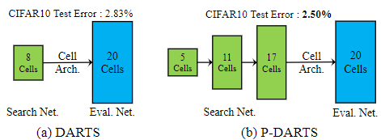
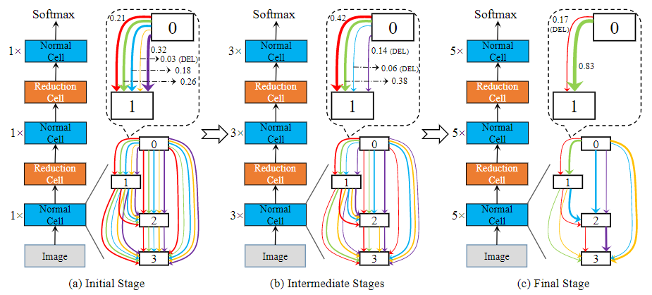
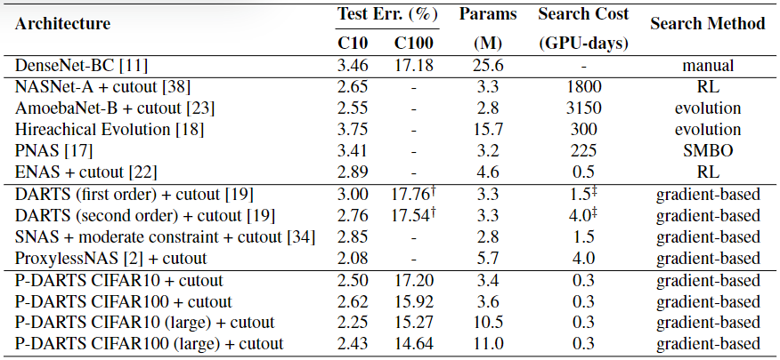
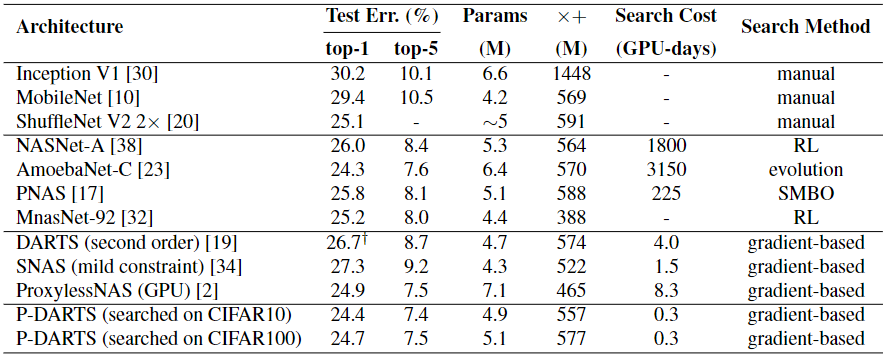
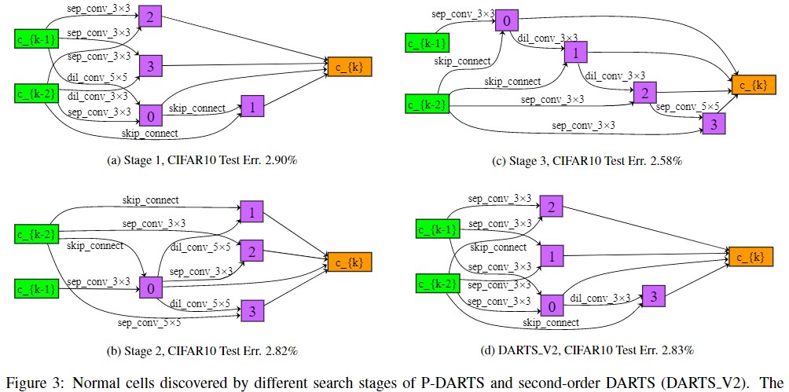

### P-DARTS

**Paper: [Progressive Differentiable Architecture Search: Bridging the Depth Gap Between Search and Evaluation. ICCV, 2019.](https://openaccess.thecvf.com/content_ICCV_2019/html/Chen_Progressive_Differentiable_Architecture_Search_Bridging_the_Depth_Gap_Between_Search_ICCV_2019_paper.html)**

#### Abstract

目前可微分的搜索方法能够减少 NAS 方法的资源消耗，但这些方法在评估搜索到的模型或迁移到另一个数据集时得到的准确率不高，这主要是因为搜索和评估阶段模型深度的差距较大。本文对此提出了一种方法，该方法允许搜索架构的深度在在训练阶段逐渐增长，这会带来两个问题：较重的计算开销和较弱的搜索稳定性，本文分别使用搜索空间近似和正则化来解决。本文的方法在代理数据集 (CIFAR-10 或 CIFAR-100) 和目标数据集 (ImageNet) 上都实现了 SOTA，并且显著减少了搜索时间 (单个 GPU 上约 7 小时)。

**Code：**<https://github.com/chenxin061/pdarts>

#### 1. Introduction

早期的 NAS 方法关注于层类型、滤波器尺寸和数量、激活函数等结构超参数的最优配置，以此来构建一整个网络。后来的一些工作开始研究搜索构建网络的模块 (block)，也称为单元 (cell)，然后将搜索到的单元进行堆叠以构建网络。其中一些基于强化学习和进化算法的方法基本都是在搜索空间采样和从头训练大量模型，导致需要的计算资源难以承受。

最近，一个可微分方法 DARTS 丢弃了架构采样和评估的过程，并且取得了有竞争力的表现，在DARTS 中，一个单元由多种操作连接的多个节点组成，其中操作被分配了权重，作为在搜索阶段学习的参数，由于计算资源的限制，DARTS 以浅层网络为目标搜索单元，然后将单元堆叠成深层网络进行评估，这带来了一个 depth gap 的问题，如下图，即在浅层网络中表现较好的单元，在深度网络中的表现不一定也较好 (不同深度模型的最佳单元可能不同)，这个问题阻碍了这些方法在更加复杂任务 (比如更大的数据集) 中的应用。

本文提出了 Progressive DARTS (P-DARTS), 一种针对 depth gap 问题新的且有效的方法，该方法将搜索过程分为多个阶段，不同阶段的网络深度逐渐加深，因为更深的网络需要更多的计算资源，本文提出了搜索空间近似 (search space approximation)，即随着网络深度增加，减少候选操作的数量。另外一个问题，在搜索更深架构时出现的稳定性不足，即算法可能严重偏向跳跃连接，因为跳跃连接可以使优化中的误差以最快速度衰减，但实际上，卷积这些可学习的操作通常时更好的选择，为了避免这个问题，本文提出了搜索空间正则化 (search space regularization)，1) 引入操作级 Dropout 来减轻训练中跳跃连接的主导地位，2) 控制评估期间跳跃连接的出现。

实验验证了 P-DARTS 的有效性，就是表现好 + 速度快，在 CIFAR-10 上搜索只需要 0.3 个 GPU Days。

#### 2. Related Work

经典 NAS 方法：基于 EA 的 AmobaNet，基于 RL 的 NAS-Net，子模型共享参数的 ENAS，可微分的 DARTS。继 DARTS 之后，SNAS [34] 提出将架构参数限制为 one-hot，以解决搜索和评估场景之间优化目标不一致的问题。 ProxylessNAS [2] 采用可微分框架，提出在目标任务上搜索架构，而不是采用传统的基于代理的框架。

#### 3. Method

##### 3.1. Preliminary: DARTS

本文将 DARTS 作为 baseline，在 DARTS 中，目标时搜索到一个单元，然后堆叠 $L$ 个单元得到模型。一个单元被定义为一个有 $N$ 个节点 $\{x_0,x_1,\cdots,x_{N-1}\}$ 有向无环图 (DAG)，每个节点表示一层输出的张量。假设操作空间为 $\mathcal{O}$，其中的操作函数记为 $o(\cdot)$，连接节点 $i,j$ 的边 $E_{(i,j)}$ 包含了一系列操作，这些操作被分配了架构权重 $\alpha^{(i,j)}$，因此可以公式化为：
$$
{f}_{i, j}(x_i)=\sum_{o \in \mathcal{O_{i,j}}} \frac{\exp \left(\alpha_{o}^{(i, j)}\right)}{\sum_{o^{\prime} \in \mathcal{O}} \exp \left(\alpha_{o^{\prime}}^{(i, j)}\right)} o(x_i)
$$
 其中 $i < j$，可以应用跳跃连接，图中的一个中间节点可以表示为 $x_j = \sum_{i<j}{f}_{i, j}(x_i)$，并且输出节点为 $x_{N-1} = \operatorname{concat}(x_2,x_3, \cdots, x_{N-2})$，$\operatorname{concat}$ 表示将输入在通道上进行串联。

##### 3.2.  Progressively Increasing the Searching Depth

在 DARTS 中，结构搜索在 8 个单元的网络上执行，然而在 20 个单元的网络上评估，但是浅层网络和深层网络的特征提取方式有较大区别，这意味着在浅层网络上搜索到的最优单元在深层网络中并不是最优的，本文称之为搜索和评估间的 depth gap，为了进行验证，本文多次执行 DARTS 的搜索过程，然后发现得到网络的常规单元倾向于保持浅层的连接而不是深层的 (连接的深度应该表示连接节点之间的距离？)，这是因为浅层网络偏向于搜索过程中更快的梯度下降，这与深层网络倾向于表现更好相抵触。因此，本文提出消除 depth gap，采用在搜索过程中渐进增加网络深度的方法，使得在搜索结束时，网络深度与评估时设置的深度充分接近。

该方法的困难来自两方面：

1. 计算资源 (时间和显存) 随着网络深度线性增加，最直接的方法就是减少每个操作的通道数 ， 这个方法 DARTS 试过，但是有轻微的性能下降，为了解决这个问题，本文提出了一种搜索空间近似方案来渐进地在每个阶段结束时减少候选操作的数量，这一步参考的是上一阶段操作的得分 (应该指权重)，细节见3.2.1.
2. 本文发现当在较深的架构上搜索时，可微分的方法倾向于跳跃连接操作，因为它加速了前向和反向传播并且使得梯度下降更快，但是因此跳跃连接时没有参数的，它学习视觉表征的能力较弱，因此，本文提出了搜素空间正则化方案，通过增加操作级 Dropout 来预防架构形式的"过拟合"并且为了稳定性限制跳跃连接的数量，细节见3.2.2.

###### 3.2.1  Search Space Approximation

搜索空间近似的思想如上图所示，其中搜索过程被分为多个阶段，包括一个初始阶段，若干个中间阶段，一个最终阶段。在每个阶段 $\mathfrak{S}_k$ ，搜索的网络包含 $L_k$ 个单元，同时操作空间的大小是 $O_k$ ，即 $|\mathcal{O}^k_{(i,j)}| = O_k$.

按照本文的想法，在最初阶段，搜索的网络比较浅，但是操作空间很大 ($\mathcal{O}^1_{(i,j)} \equiv \mathcal{O}$)，在每个阶段 $\mathfrak{S}_{k-1}$ 之后，根据学习到的架构参数 $\alpha_{k-1}$ 对每个连接上的候选操作的得分进行排序，然后通过堆叠更多单元增加搜索架构，同时近似 (缩小) 操作空间，近似的准则就是丢弃一部分不那么重要的操作，即在上一个阶段 $\mathfrak{S}_{k-1}$ 后权重较低的操作 (不同连接的操作数可能不同)，这个策略用的 GPU 较少。

上述增加网络深度的过程一直持续到网络深度接近于评估的设置，在最后一个阶段后，本文就根据架构参数 $\alpha_K$ 决定了最终单元的拓扑结构，参考 DARTS，本文保留了每个连接中 2 个权重最大的非零操作。

###### 3.2.2  Search Space Regularization

在每个阶段 $\mathfrak{S}_k$ 的开始，因为一些候选操作被丢弃了，本文训练从头开始训练架构，然而训练一个更深的网络比训练浅层的更难，在常规设置中，作者发现信息更偏向于通过跳跃连接流动而不是卷积或者池化，这是因为跳跃连接经常导致快速的梯度下降，特别是在相对更容易拟合的代理数据集 (CIFAR-10 或 CIFAR-100) 上。因此，搜索过程倾向于生成很多跳跃连接，这限制了可学习参数的数量，也因此最后评估时的效果不那么令人满意，本质上来说这是一种过拟合。

本文通过搜索空间正则化来解决这个问题，这包括两个部分：

- 首先，本文在每个跳跃连接后插入一个操作级 Dropout 操作，以此来切断通过跳跃连接的信息流，使得算法可以探索其他操作，然而，如果不断地阻止跳跃连接的信息流，算法会分配给它们很低的权重来丢弃他们，这对于最终的性能是有害的，为了解决这个矛盾，本文在每个搜索阶段的训练过程逐渐衰减 Dropout rate，因此只开始阶段阻止跳跃连接，当其他操作被很好地学习后，平等对待跳跃连接和其他操作，让算法自身选择更好的操作。

- 除了使用 Dropout，本文发现跳跃连接对评估阶段的识别率有很大的影响，本文使用相同的设置在 CIFAR-10 执行了 3 次搜索过程，但是发现得到单元的跳跃连接数目不同，并且识别性能与跳跃连接数目高度相关。因此，本文设计了第二条正则化规则，来简单的控制跳跃连接的数目在最后的搜索阶段后是一个常数 $M$，这是一个迭代过程，首先使用常规的方法构建单元，如果得到单元的跳跃连接数目不是 $M$，本文找到单元中权重最大的 M 个跳跃连接，然后将其他操作的权重设置为 0，然后使用修改的参数重新构造单元。

注意：本文第二种正则化方法必须应用在第一种方法后，不然没有操作级 Dropout 的话，搜索阶段会得到低质量的架构权重，即使有固定数目的跳跃连接，但是架构的性能不尽人意。

##### 3.3. Relationship to Prior Work

其中提到的一些方法没有详细了解，略过。

#### 4. Experiments

##### 

