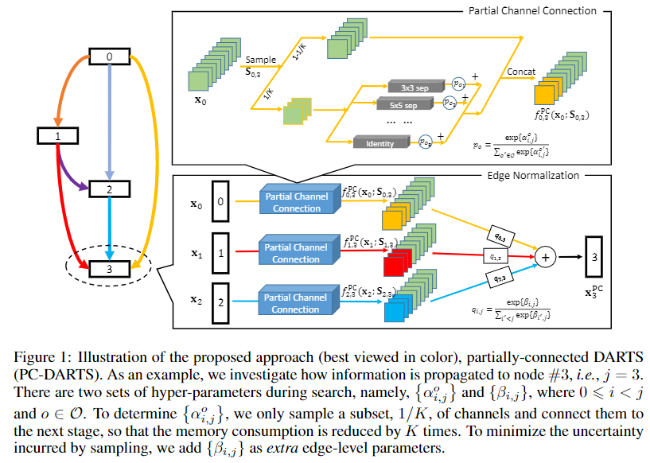
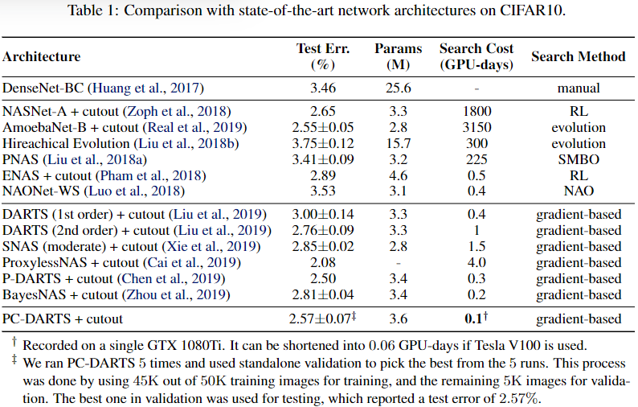
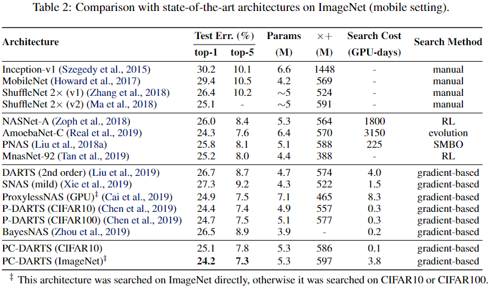

### PC-DARTS

**Paper: [PC-DARTS: Partial Channel Connections for Memory-Efficient Architecture Search. ICLR, 2020.](https://arxiv.org/abs/1907.05737)**

#### Abstract

DARTS 提供了寻找有效网络架构的快速解决方案，但是需要承担联合训练超网络和搜索一个最优架构时的巨大的内存和计算消耗。本文提出了一种新方法，Partially-Connected DARTS，通过采样超网络的一小部分来减小冗余，因此可以在不影响性能的情况下进行更有效的搜索。最终结果在 CIFAR-10 上只用了 0.1 GPU days 达到了 2.57% 的错误率，以及在 ImageNet 上用了 3.8 GPU days 达到了 24.2% 的 top-1 准确率。

**Code: **https://github.com/yuhuixu1993/PC-DARTS

#### 1. Introduction

DARTS 将操作选择转变为一组固定操作的加权，这使得整个架构对架构超参数可微，因此网络搜索可以有效地以端到端的方式进行，虽然设计巧妙，但 DARTS 仍然受限于巨大但荣誉的网络结构，因此需要巨大的内存和计算资源，这使得搜索过程不能使用较大的 batch size 来进行加速和更高的稳定性，之前的工作 P-DARTS 提出减小搜索空间，这会因为一种近似导致牺牲发现架构的最优性。

本文中，我们提出了一种简单但有效的方法，称为 Partially-Connected DARTS (PC-DARTS) 来减小内存和计算的资源需求，核心思想为：相比于将所有的通道送入操作选择模块，我们在每一步随机采样它们的一个子集，同时以 shortcut 的方法绕过剩下的通道，我们假定在子集上的计算是在所有通道上计算的一个代理近似，除了能够大幅降低内存和计算消耗，通道采样还有另外一个好处，操作搜索是正则化的，不太可能陷入局部最优化，但是，PC-DARTS 有一个副作用，随着迭代过程通道的不同子集将会被采样，这会导致选择通道的连通性将会变得不稳定，因此，我们引入了 edge 正则化，通过学习一组额外的边选择超参数来稳定网络连通性的搜索。通过在整个训练过程中共享这些超参数，寻找的网络结构对迭代中采样的通道是不敏感的，因此更加稳定。

受益于部分连接策略，我们能够大幅增加 batch size，具体来说，如果在操作选择中只有 $1/K$ 的通道被随机采样的话，这可以减少约 $K$ 倍的内存需求，这允许我们使用 $K$ 倍大的 batch size，这不仅可以加速网络搜索，也可以是在大规模数据集上的搜索过程更加稳定。

#### 2. Related Work

略

#### 3. The Proposed Approach

##### 3.1 Preliminaries: Differentiable Architecture Search (DARTS)

数学上，DARTS 将搜索的网络分解为 $L$ 个单元，每个单元被表示为一个包含 $N$ 个节点的有向无环图 (DAG)，其中每个节点定义了一个网络层，另外有一个预定义的操作空间记为 $\mathcal{O}$，其中的每一个元素 $o(\cdot)$ 表示网络层执行的一个固定操作。在一个单元中，目标是 $\mathcal{O}$ 中从选择一个操作来连接每一对节点，设有一对节点 $(i,j)$，其中 $0 \le i < j \le N-1$，DARTS 的核心思想是将节点 $i$ 到 $j$ 信息的传播表示为 $|\mathcal{O}|$ 个操作加权和，即 ${f}_{i,j}(x_i)=\sum_{o \in \mathcal{O_{i,j}}} \frac{\exp \left(\alpha_{o}^{(i,j)}\right)}{\sum_{o^{\prime} \in \mathcal{O}} \exp \left(\alpha_{o^{\prime}}^{(i, j)}\right)} o(x_i)$，其中 $x_i$ 表示第 $i$ 个节点的输入，$\alpha_{o}^{(i,j)}$ 是操作 $o(x_i)$ 用来加权的超参数，第 $i$ 个节点的输出为所有输入流的和，即 $x_j = \sum_{i<j}f_{i,j}(x_i)$，整个单元的输出则是通过串联节点 $x_2 \sim x_{N-1}$ 的输出得到，即 $\operatorname{concat}(x_2,\dots,x_{N-1})$，注意一个单元的前两个节点 $x_0,x_1$ 是输入节点，它们在搜索过程中是固定的。

上述设计使得整个框架对于网络层的权重和超参数 $\alpha_{o}^{(i,j)}$ 都是可微的，因此可以以端到端的方式进行架构搜索，在完成搜索过程后，在每条边 $(i,j)$ 上，具有最大权重 $\alpha_{o}^{(i,j)}$ 的操作 $o$ 被保留，同时对于每个节点 $j$，只保留两个具有最大权重 $\alpha_{o}^{(i,j)}$ 的前置连接节点。

##### 3.2 Partial Channel Connection

DARTS 的一个缺点在于内存效率低，在搜索架构时，在各个节点 $|\mathcal{O}|$ 个操作和相应的输出需要被保存，这导致了 $|\mathcal{O}|$ 倍内存需要使用，为了适应 GPU，这必须减少训练时的 batch size，这不可避免地会降低搜索速度，并且可能影响搜索稳定性和准确性。

针对内存效率的一个可选方法是部分通道连接，如上图所示，以 $x_i$ 到 $x_j$ 的连接作为例子，我们定义了一个通道采样掩膜 $S_{i,j}$，它将 1 分配给选择的通道，将 0 分配给未选择的通道，被选择的通道会送入 $|\mathcal{O}|$ 个操作的混合计算，同时被屏蔽的会绕过这些操作，即直接复制到输出中：
$$
f_{i, j}^{\mathrm{PC}}\left(\mathbf{x}_{i} ; \mathbf{S}_{i, j}\right)=\sum_{o \in \mathcal{O}} \frac{\exp \left\{\alpha_{i, j}^{o}\right\}}{\sum_{o^{\prime} \in \mathcal{O}} \exp \left\{\alpha_{i, j}^{o^{\prime}}\right\}} \cdot o\left(\mathbf{S}_{i, j} * \mathbf{x}_{i}\right)+\left(1-\mathbf{S}_{i, j}\right) * \mathbf{x}_{i}
$$
其中 ${S}_{i, j} * {x}_{i}$ 和 $(1 - {S}_{i, j}) * {x}_{i}$ 表示被选择和被屏蔽的通道，在实际中，我们设置被选择通道的比例为 $1/K$，其中 $K$ 被看作是一个超参数， 并且可以通过改变 $K$ 来平和架构搜索精度和效率。

##### 3.3 Edge Normalization

使用通道采样的另一个好处在于减小了对被操作选择的依赖，换句话说就是对于给定输入使用两组操作权重参数得到结果之间的差异大幅降低，因为只有一小部分的通道被选择通过操作混合，这规范了搜索过程中对无权重操作的偏好，因为在早期搜索阶段，搜索算法经常偏向于无权重操作，因为它们没有权重来训练并因此提供更加一致的输出，相比之下，具有权重的操作在它们的权重被优化好之前，会传播不一致的信息，因此在搜索早期，无权重操作经常会积累大量的权重，这使得具有权重的操作即使被训练好了也难以打败它们，这种现象当代理任务苦难时影响更大，也因此 DARTS 在 ImageNet 上不能获得满意的结果。

使用通道采样也有缺陷，与 DARTS 相同，对于每个输出节点 $x_j$，我们需要从前驱节点 ${x_0,x_1, \cdots,x_{j-1}}$ 中选择两个输入节点，这些节点通过 $\max _{o} \alpha_{0, j}^{o}, \max _{o} \alpha_{1, j}^{o}, \ldots, \max _{o} \alpha_{j-1, j}^{o}$ 进行加权。然而，这些架构参数是通过随机采样的通道迭代优化的，因此使用这些参数决定最优的连接性可能随着采样通道的变化变得不稳定，这可能导致不希望出现的结果波动，为了减轻这个问题，我们引入边归一化，即为每一条边 $(i,j)$ 设置一个权重，记为 $\beta_{i,j}$，输出 $x_j$ 的计算为：
$$
\mathrm{x}_{j}^{\mathrm{PC}}=\sum_{i<j} \frac{\exp \left\{\beta_{i, j}\right\}}{\sum_{i^{\prime}<j} \exp \left\{\beta_{i^{\prime}, j}\right\}} \cdot f_{i, j}\left(\mathrm{x}_{i}\right)
$$
具体来说，在架构搜索完成后，边 $(i,j)$ 的连接性同时由 $\{\alpha^o_{i,j} \}$ 和 $\beta_{i,j}$ 决定，即同时乘以归一化的 $\{\alpha^o_{i,j} \}$ 和 $\beta_{i,j}$，然后选择具有最大权重的边，因为 $\beta_{i,j}$ 在整个训练过程中是共享的，学习到的网络结构对于采样的通道是不敏感的，使得结果更加稳定，实验中，我们发现边归一化对于原始的 DARTS 也是有效的，并且边归一化带来的计算消耗是微不足道的。

##### 3.4 Relationship to Prior Work

略

#### 4. Experiments

