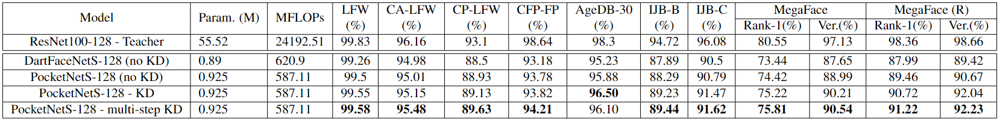

### PocketNet (NAS in FR)

**Paper: [PocketNet: Extreme Lightweight Face Recognition Network using NeuralArchitecture Search and Multi-Step Knowledge Distillation. arXiv, 2021.](https://arxiv.org/abs/2108.10710)**

#### Abstract

本文利用 NAS 建立了一系列人脸识别模型，称为 PocketNet。本文提出了一种新的基于知识蒸馏的训练方式 (称为多步知识蒸馏) 来加强紧凑模型的验证性能，实验验证，在考虑相同模型紧凑性时，PocketNets 在 9 个不同基准数据集上达到了 SOTA水平。

**Code:** https://github.com/fdbtrs/PocketNet

#### 1. Introduction

NAS 使用 DARTS 方法，训练数据集使用 CASIA-WebFace (500K 张图像)，然后在更大的数据集上测试，另外对训练方法进行了改进，即多步知识蒸馏。

#### 2. Methodology

##### 2.1. Neural Architecture Search

对 DARTS 的介绍，略过。

在基础模型的设置中，作者使用全局深度卷积代替全局平均池化，使用1x1卷积代替全连接层，可以参考。

##### 2.2. Loss Function

**ArcFace:**  分类损失使用 ArcFace，即：
$$
L_{a r c}=\frac{1}{M} \sum_{i \in M}-\log \frac{e^{s\left(\cos \left(\theta_{y_{i}}+m\right)\right)}}{e^{s\left(\cos \left(\theta_{y_{i}}+m\right)\right)}+\sum_{j=1, j \neq y_{i}}^{C} e^{s\left(\cos \left(\theta_{y_{j}}\right)\right)}}
$$
**知识蒸馏 (Knowledge distillation, KD):**  知识蒸馏通过将从一个复杂模型 (教师) 上学习到的知识迁移到一个小模型 (学生) 中，以此来提升小模型的表现和泛化性能。本文通过在 embedding 层上使用一个额外的损失函数 (MSE) 实现：
$$
L_{m s e}=\frac{1}{M} \sum_{i \in M} 1-\frac{1}{n} \Sigma_{i=1}^{D}\left(\Phi_{t}^{S}(x)_{i}-\Phi_{t}^{T}(x)_{i}\right)^{2}
$$
其中 $\Phi_{t}^S$ 和 $\Phi_{t}^{T}$ 分别是学生和教师最后的全连接层获得的特征，$D$ 是特征的尺寸，最终的训练损失函数为：
$$
L = L_{arc} + \lambda L_{mse}
$$
由于特征向量被归一化了，$L_{mse}$ 的值很小，因此本文设置 $\lambda=100$。

**多步知识蒸馏:**  有工作观察到将一个非常深的教师网络的知识迁移到一个小的学生网络是困难的，因为教师和学生模型大小之间的差异非常大，一些工作通道通过在教师和学生网络之间插入一个或多个辅助网络 (大小在教师和学生网络之间)，相当于进行多次知识蒸馏，训练多个网络。

之前的方法都是利用一个预先训练且完全收敛的教师网络来进行知识蒸馏，本文提出的方法是在教师网络的训练中每经过若干次迭代就进行一次知识蒸馏，其中的关键思想在于教师网络在不同训练阶段学习到的信息与完全收敛时是不同的，因此，将教师在训练早期学习的知识进行迁移更适合学生来学习，相当于学生学习的知识有一个由易到难的过程，而不是直接学习复杂的知识，这个过程本文称之为多步知识蒸馏，为了简化实现，本文先将教师网络训练至收敛，过程中保存每个 epoch 时教师网络的副本，在训练学生网络时，再加载相应的教师网络进行知识蒸馏。

#### 3. Experimental Setups

##### 3.1. Neural Architecture Search

在 6 块 2080 Ti 上 搜索了 2274 小时 (牛批)，

