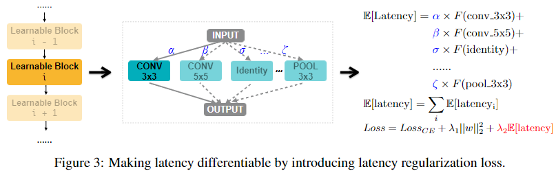

### ProxylessNAS

**Paper: [ProxylessNAS: Direct Neural Architecture Search on Target Task and Hardware. ICLR, 2019.](https://arxiv.org/abs/1812.00332)**

#### Abstract

神经架构搜索 (NAS) 能够自动设计有效的神经网络架构，但是传统 NAS 方法巨大的计算要求 ($10^4 $ GPU hours) 使得在大规模任务 (如 ImageNet) 上直接搜索网络架构十分困难，可微分 NAS 方法可以通过网络架构的连续表征降低 GPU hour 的消耗，但是对 GPU memory 的占用很高。因此，这些需要利用代理任务，比如在较小的数据集上训练，或者只用较少的 block 学习或训练，这些在代理任务上被优化的架构并不能保证在目标任务上也是最优的。本文提出的 *ProxylessNAS*，可以直接在大规模任务和硬件平台上学习架构，本文解决了可微分 NAS 高显存需求的问题，降低了常规训练的计算消耗 (GPU 时间和 GPU 内存)，同时允许较大的候选集。实验说明了 *ProxylessNAS* 的有效性。

#### 1. Introduction

由于传统 NAS 方法巨大的计算资源需求，一些 NAS 方法选择在代理任务上搜索网络模块 (block)，然而，在代理任务上被优化的 block 不能保证在目标任务上也是最优的，特别是考虑了延迟等硬件度量时，更重要的是，为了使模型可迁移，这些方法只搜索少量架构模块然后重复堆叠，这限制了模块的多样性并因此影响性能。

本文提出了一种简单且有效的针对上述限制的解决方案，称之为 *ProxylessNAS*，直接在目标任务和硬件而不是代理上学习架构 (如上图)。我们还移除了之前 NAS 工作中重复堆叠 block 的限制，允许所有模块都能够被学习，为了实现这个，我们通过以下方式减少了架构搜索的计算消耗 (GPU 时间和 GPU 内存)。

在 GPU 时间方面，参考之前的工作，我们将 NAS 看作一个通道级剪枝的过程，具体来说，我们直接训练一个包含所有候选路径的超参数网络，在训练过程中，我们引入架构参数来学习哪些路径是多余的，然后在训练结束时对这些多余的路径进行剪枝来获得一个紧凑的被优化的架构，在这种方法中，我们不需要任何控制器，只需要训练一个网络。

然而，天真地包括所有候选路径会导致 GPU 内存爆炸，因此，在 GPU 内存方面，我们二值化架构参数 (1 或 0) 并强制运行时只有一个路径被激活，这减少了内存的需求，我们提出了一种基于梯度的方法来训练这些二值化的参数 (根据 BinaryConnect)，此外，为了处理在目标硬件上学习特定网络架构中不可微的硬件目标 (如延迟)，我们将网络延迟建模成一个连续函数，将其作为一个正则化损失进行优化，此外，我们也提出了一种基于强化规则的算法作为一个可选的策略来处理硬件度量。

#### 2. Related Work

与本文最相关的工作是 One-Shot (Bender et al., 2018) 和 DARTS (Liu et al., 2018c)，这两个工作都丢弃了控制器，将 NAS 建模成一个包含所有候选路径的超网络的单个训练过程。其中 One-shot 使用 DropPath (Zoph et al., 2018) 根据固定的概率丢弃每条路径，DARTS 则是对每条路径引入一个实值架构参数，然后通过标准梯度下降联合训练权重参数和架构参数，然而，这两种方法需要大量的 GPU 内存消耗，因此需要利用代理任务，本文通过路径二值化解决了这个问题。

另一个相关主题是网络剪枝，旨在通过一处不重要的神经元或通道来提高网络模型的效率，与这些工作相似的是，本文从一个超网络开始，然后对多余的路径进行剪枝，生成优化的架构，二者的区别在于前者关于 layer 级的剪枝，而我们关于通道级剪枝。

#### 3. Method

这节首先描述包含所有候选路径的超网络的构建，然后介绍我们如何利用二值化架构参数来减少训练超网络时的显存消耗，我们提出了一种基于梯度的算法来训练这些二值化架构参数，最后我们提出两种技巧来处理目标硬件上不可微分的度量 (如延迟)。

##### 3.1  Construction of Over-Parameterized Network

记一个神经网络为 $\mathcal{N}(e_1, \cdots, e_n)$，其中 $e_i$ 表示有向无环图 (DAG) 中一条特定的边，令 $\mathcal{O}=\{o_i\}$ 为 ($N$ 个) 候选简单操作集 (包括卷积，池化，identity，zero 等)，我们将每条边设置为一个有 $N$ 条平行路径的混合操作 (记为 $m_{\mathcal{O}}$)，而不是设置为一个特定的简单操作，以此来构建包含搜索空间中任意架构的超网络，因此，超网络可以表示为 $\mathcal{N}(e_1 = m^1_{\mathcal{O}}, \cdots, e_n = m^n_{\mathcal{O}})$。

给定输入 $x$，混合操作 $m_{\mathcal{O}}$ 的输出基于 $N$ 条路径的输出定义，在 One-Shot 中，$m_{\mathcal{O}}(x)$ 是 $\{o_i(x)\}$ 的和，在DARTS中，$m_{\mathcal{O}}(x)$ 是 $\{o_i(x)\}$ 的加权和，其中权重是在 $N$ 个实值架构参数 $\{\alpha_i\}$ 上应用 softmax 得到：
$$
m_{\mathcal{O}}^{\text {One-Shot}}(x)=\sum_{i=1}^{N} o_{i}(x), \quad m_{\mathcal{O}}^{\mathrm{DARTS}}(x)=\sum_{i=1}^{N} p_{i} o_{i}(x)=\sum_{i=1}^{N} \frac{\exp \left(\alpha_{i}\right)}{\sum_{j} \exp \left(\alpha_{j}\right)} o_{i}(x)
$$
在上式中，$N$ 条路经输出的特征响应图都会被计算并储存在显存中，虽然最终得到的紧凑模型只有一条路径，因此，One-Shot 和 DARTS 相比于训练一个紧凑的模型大约需要 $N$ 倍的 GPU 内存和时间，在大规模数据集上，这很容易就超出硬件的内存限制，下文中，我们会介绍基于路径二值化的思想对内存问题的解决方案。

##### 3.2  Learning Binarized Path

为了降低内存占用，我们在训练超网络时只保留一条路径，与 Courbariaux et al. (2015) 中二值化单个权重不同，我们二值化整个路径，我们引入 $N$ 个实值架构参数 $\{\alpha_i\}$，然后将实值的路径权重转化为二值门：
$$
g=\operatorname{binarize}\left(p_{1}, \cdots, p_{N}\right)=
\begin{cases}
[1,0, \cdots, 0] & \text { with probability } p_{1} \\
& \cdots \\
[0,0, \cdots, 1] & \text { with probability } p_{N} \\
\end{cases}
$$
基于二值门 $g$，混合操作的输出为：
$$
m_{\mathcal{O}}^{\text {Binary }}(x)=\sum_{i=1}^{N} g_{i} o_{i}(x)= 
\begin{cases}
o_{1}(x) & \text { with probability } p_{1} \\ 
& \cdots
\\ o_{N}(x) & \text { with probability } p_{N}
\end{cases}
$$
如下图所示，通过使用二值门而不是实值的路径权重，只有一条路径的输出被激活，放在内存中，因此显存占用可以大幅降低。

###### 3.2.1  Training Binarized Architecture Parameters

图 2 显示了超网络中权重参数和架构参数的训练过程：当训练权重参数时，我们先冻结架构参数，对每一个输入的 batch 根据等式 (2) 随机采样二值门，然后被激活路径的权重参数通过标准梯度下降<u>在训练集上</u>进行更新；当训练架构参数时，权重参数被冻结，我们重置二值门后更新架构参数<u>在验证集上</u>进行更新，这两种参数的更新是交替进行的，一旦架构参数完成训练，我们就可以通过对多余的路径进行剪枝得到紧凑的架构，本文中，我们简单选择具有最高权重的路径。

与权重参数不同，架构参数不直接参与计算图，因此不能使用标准梯度下降进行更新，本节中，我们引入基于梯度的方法学习架构参数。

在 BinaryConnect 中，实值权重使用关于二值门的梯度进行更新，本文与架构参数相关的梯度可以使用 $\partial L/ \partial g_i$ 代替 $\partial L/ \partial p_i$ 近似估计：
$$
\frac{\partial L}{\partial \alpha_{i}}=\sum_{j=1}^{N} \frac{\partial L}{\partial p_{j}} \frac{\partial p_{j}}{\partial \alpha_{i}} \approx \sum_{j=1}^{N} \frac{\partial L}{\partial g_{j}} \frac{\partial p_{j}}{\partial \alpha_{i}}=\sum_{j=1}^{N} \frac{\partial L}{\partial g_{j}} \frac{\partial\left(\frac{\exp \left(\alpha_{j}\right)}{\sum_{k} \exp \left(\alpha_{k}\right)}\right)}{\partial \alpha_{i}}=\sum_{j=1}^{N} \frac{\partial L}{\partial g_{j}} p_{j}\left(\delta_{i j}-p_{i}\right)
$$
其中当 $i = j$ 时 $\delta_{ij} = 1$，当 $i \ne j$ 时 $\delta_{ij} = 0$，因此二值门 $g$ 与计算图相关，$\partial L/ \partial g_i$ 可以通过反向传播计算，但是计算 $\partial L/ \partial g_i$ 需要计算并储存 $o_j(x)$，因此，直接使用公式 (4) 更新架构参数相比于训练一个紧凑架构需要大约 $N$ 倍的 GPU 占用。

为了解决这个问题，我们考虑将从 $N$ 个候选操作中选择一条路径的任务分解为多个二值选择任务，直觉就是如果一条路径是某个条件下的最佳选择，那它与其他任意路径一对一比较时应该是更好的。

根据这个想法，在架构参数的一次更新中，我们首先根据多项式分布 $(p_1, \cdots, p_N)$ 采样 2 条路径，然后屏蔽其他所有路径，这样候选操作的数量暂时从 $N$ 下降至 $2$，同时路径权重 $\{p_i\}$ 和二值门 $\{g_i\}$ 也相应重置，然后我们使用公式 (4) 计算梯度更新两条采样路径的架构参数，最后，由于路径权值是通过对架构参数应用 softmax 来计算的，我们需要将两个更新后的架构参数乘以一个比率，以保持未采样路径的路径权值不变。因此，在每一次更新中，采样的两条路径都有一条权重增加，另一条权重下降，其他为采样路径权重则不变。通过这样，每一次更新参数只有两条路径被激活，因此显存需要降低至训练一个紧凑模型的两倍。

##### 3.3  Handling Non-Differentiate Hardware Metrics

除了准确率外，延迟 (不是 FLOPs) 是在硬件上设计网络架构时另一个很重要的指标，但是延迟不能使用损失函数的梯度进行优化，即延迟是不可微分的，这节我们介绍两种处理不可微分指标的方法。

###### 3.3.1  Making Latency Differentiate

为了使延迟可微，我们将网络的延迟建模成一个连续函数：
$$
\mathbb{E}\left[\text{ latency}_{i}\right]=\sum_{j} p_{j}^{i} \times F\left(o_{j}^{i}\right)
$$
其中 $\mathbb{E}\left[\text{latency}_{i}\right]$ 是第 $i$ 个可学习模块的期望延迟，$F \left(\cdot\right)$ 表示延迟预测模型，$F(o_{j}^{i})$ 表示操作 $o_{j}^{i}$ 的预测延迟， $\mathbb{E}\left[\text{latency}_{i}\right]$ 关于架构参数的梯度可以得到：$\partial \mathbb{E}\left[\text{latency}_{i}\right] / \partial p_{j}^{i}=F(o_{j}^{i})$.

如上图所示，整个网络的延迟为：
$$
\mathbb{E}[\text { latency }]=\sum_{i} \mathbb{E}\left[\text { latency }_{i}\right]
$$
我们将网络的期望延迟乘上一个缩放因子 $\lambda_2 (>0)$ 加入到损失函数中，最终损失函数为：
$$
Loss=Loss_{CE}+\lambda_{1}|| w \|_{2}^{2}+\lambda_{2} \mathbb{E}[\text { latency }]
$$
其中 $Loss_{CE}$ 是交叉熵损失，$\lambda_{1}|| w \|_{2}^{2}$ 是权重正则化项。

###### 3.3.2  Reinforce-based Approach

作为 BinaryConnect 的另一个可选方法，我们可以利用 Reinforce 来训练二值化权重，详细过程略。

#### 4. Experiments and Results

##### 4.1  Experiments on CIFAR-10

在 CIFAR-10 数据集上的结果如上图，其中用到了两种本文提出的方法：Proxyless-G (Gradient) 和 Proxyless-R (REINFORCE)，另外 c/o 表示使用了 Cutout (DeVries & Taylor, 2017)。

##### 4.2  Experiments on ImageNet

**Architecture Space: ** 我们使用 MobileNet-V2 作为 backbone 建立架构空间，相比于重复相同的倒置瓶颈卷积 (MBConv)，本文允许一系列不同卷积核尺寸 $\{3,5,7\}$ 和不同扩展系数 $\{3,6\}$ 的 MBConv 层，为了平衡宽度和深度，我们初始化一个更深的超网络，并且通过将零操作添加到混合操作的候选集合中，允许跳过带有残留连接的模块，通过这种方式，因为有延迟预算的限制，网络可以通过跳过更多的模块和使用更大的 MBConv 层来选择变得更浅更宽，或者通过保留更多模型和使用更小的 MBConv 层来选择变得更深更窄。

