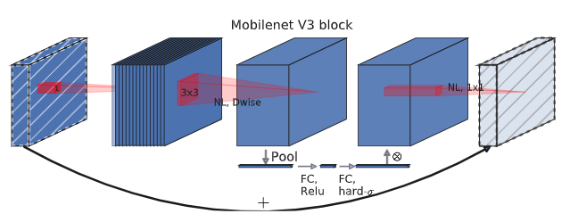

### MobileNet-V3

###### Paper：[Howard A, Sandler M, Chu G, et al. Searching for mobilenetv3[C]. ICCV. 2019.](https://openaccess.thecvf.com/content_ICCV_2019/html/Howard_Searching_for_MobileNetV3_ICCV_2019_paper.html)

#### Abstract

MobileNet-V3 针对手机 GPUs 进行了调整，使用了由 NetAdapt 实现的硬件感知网络架构搜索 (NAS)，探索了自动搜索算法和网络设计如何协同工作。

#### 3. Efficient Mobile Building Blocks

- MobileNet-V1 引入了深度可分离卷积 (depthwise separate convolutions) 替代了传统卷积
- MobileNet-V2 引入了线性瓶颈 (bottleneck) 和倒置残差结构 (inverted residual structure)，
- MnasNet [43] 在 MobileNet-V2 的 bottleneck 结构中引入了基于压缩和激励的轻量注意力模块 (SE Block)

在 MobileNet-V3 中，使用上述 Block/Layer 的组合作为构建块来搜索模型结构，同时使用修改的 swish 非线性激活函数，考虑到 SE Block 和 swish 中用的 sigmoid 对计算效率和准确性的影响， MobileNet-V3 将其替换为 hardsigmoid。

#### 4. Network Search

MobileNet-V3 使用平台感知 NAS，通过优化每个网络 Block 来搜索全局网络结构，然后使用 NetAdapt 算法在搜索每层的卷积核个数。

##### 4.1. Platform-Aware NAS for Block-wise Search

原文的意思好像是 MobileNet-V3 使用与 MnasNet [43] 差不多的平台感知 NAS 搜索到和 [43] 效果差不多的大型 mobile 模型，然后就直接使用了[43]中的 MnasNet-A1 作为初始大型 mobile 模型，接着应用 NetAdapt 和其他优化，得到 MoblieNetV3-Large model。

对于小型 mobile 模型，作者对奖励机制(应该是强化学习的目标)的参数进行了修改，然后重新搜索了一个小型种子模型，然后应用 NetAdapt 和其他优化，得到 MobileNetV3-Small model。

##### 4.2. NetAdapt for Layer-wise Search

NetAdapt [48] 是对平台感知 NAS 的补充，它允许以顺序方式对各个层进行微调，而不是试图推断粗略但全局的架构。

#### 5. Network Improvements

MobileNet-V3引入了几个新组件，进一步改进最终模型

1. 作者发现在搜索得到的模型中，一些较浅和最后的层比其他层更“昂贵”，因此对这些层进行修改，在尽可能保持准确性的情况下降低延迟，这种修改是人工进行的。

2. 使用 h-swish 非线性激活函数
   $$
   \text {h-swish}[x]=x \frac{\operatorname{ReLU} 6(x+3)}{6}
   $$

3. 加入 SE Block，且 SE Block 瓶颈大小固定为扩展层通道数的1/4.

   

#### Conclusion

MobileNet-V3 并没有多大的创新，通篇看下来就是对现有的方法进行结合与修改，其中 NAS 部分就是使用 MnasNet 中的方法加上 NetAdapt 的应用

