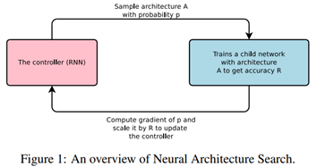
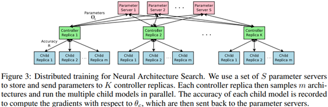
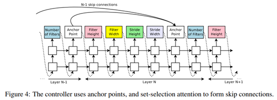

### NAS with RL

**Paper: [Neural Architecture Search with Reinforcement Learning. ICLR, 2017](https://arxiv.org/abs/1611.01578)**

#### Abstract

NAS 的开山之作，同时也是第一种基于强化学习的 NAS 方法，本文使用循环神经网络 (RNN) 生成神经网络的模型描述，同时使用强化学习训练这个模型来最大限度地提高在验证集上的精度。该方法在 CIFAR-10数据集上能够得到比当时的 SOTA 更好更快的模型。

#### 1. Introduction

网络结构的设计需要大量的专家知识和时间，本文介绍了神经架构搜索 (Neural Architecture Search)，这是一种基于梯度的方法，用于寻找好的网络结构。

该工作基于观察到神经网络的结构与连通性通常可以由可变长度的字符串指定，因此可以使用一个 RNN 作为控制器来生成这样的字符串，在真实数据上训练字符串指定的网络（子网络），从而获得验证集上的准确率。使用该准确率作为奖励信号，我们可以计算策略梯度来更新控制器，下一次迭代中，控制器将以更高的概率生成高精度的模型。

#### 3. Methods

##### 3.1  用RNN控制器生成模型描述

神经结构搜索使用一个控制器来生成神经网络的结构超参数，该控制器采用 RNN 实现，假设想要预测仅具有卷积层的前馈神经网络，可以使用RNN控制器将超参数生成为 token 序列，如下图：

实验中，如果卷积层的数量超过某个值，就会停止生成架构，完成一个架构的生成后，就可以对其进行训练，在模型收敛时，记录当前模型在验证集上的精度，然后优化控制器RNN的参数 $\theta_c$，以提高一下次预测架构的精度。其中优化控制器 RNN 的参数 $\theta_c$ 十分关键。

##### 3.2  Training with Reinforce

控制器预测的 token 序列可以看作一个用来设计子网络架构的操作列表 $a_{1:T}$，设该子网络在验证集上收敛时达到的精度为 $R$，可以将精度 $R$ 作为奖励信号，并用强化学习来训练控制器，具体来说，为了找到最佳架构，本文要求控制器的期望回报 $J(\theta_c)$ 最大化，即：
$$
J\left(\theta_{c}\right)= E_{P\left(a_{1: T} ;\theta_{c}\right)} [R]
$$
由于奖励信号 $R$ 是不可导的，我们需要使用策略梯度方法更新 $\theta_{c}$，本文使用 Williams (1992) 的Reinforce 规则：
$$
\nabla_{\theta_{c}} J\left(\theta_{c}\right)=\sum_{t=1}^{T} E_{P\left(a_{1: T} ; \theta_{c}\right)}\left[\nabla_{\theta_{c}} \log P\left(a_{t} \mid a_{(t-1): 1} ; \theta_{c}\right) R\right]
$$
上式的一个经验估计为：
$$
\nabla_{\theta_{c}} J\left(\theta_{c}\right)=\frac{1}{m} \sum_{k=1}^{m} \sum_{t=1}^{T} \nabla_{\theta_{c}} \log P\left(a_{t} \mid a_{(t-1): 1} ; \theta_{c}\right) R_{k}
$$
其中 $m$ 是控制器在一个 batch 中采样的架构数量 (应该类似 minibatch SGD，每次迭代由控制器生成 $m$ 个不同架构，可能通过输入不同的随机数实现)，$T$ 是控制器要预测的超参数数量 (应该是控制器 RNN 输出 token 的数量)。$R_{k}$ 表示 batch中第 $k$ 个神经网络架构训练后得到的验证准确率。

上式中的 $P\left(a_{t} \mid a_{(t-1): 1} ; \theta_{c}\right)$ 不太理解，表面上意思应该是当控制器 RNN 的参数为 $\theta_{c}$ 时，已知控制器 RNN 已经输出的 token 序列为 $a_{(t-1): 1}$，则下一次输出为 $a_t$ 的概率是多少，不太理解为什么要计算概率，可能和 RNN 的输出方式有关，也可能和上述的强化学习规则有关。

上述更新方法是对梯度的无偏估计，但具有非常高的方差。为了减少这种估计的方差，本文采用了 baseline 函数 $b$ ：
$$
\nabla_{\theta_{c}} J\left(\theta_{c}\right)=\frac{1}{m} \sum_{k=1}^{m} \sum_{t=1}^{T} \nabla_{\theta_{c}} \log P\left(a_{t} \mid a_{(t-1): 1} ; \theta_{c}\right)\left(R_{k}-b\right)
$$
本文将baseline函数 $b$ 设为以前架构精度的指数移动平均值 (EMA)。

**使用并行和异步更新加速训练：**在神经架构搜索中，对控制器参数 $\theta_{c}$ 的每次梯度更新都需要训练一个子网络，使其收敛，由于训练子网络需要较长的时间，本文使用分布式训练和异步参数更新来加快控制器的学习过程（没看懂，应该和具体实现相关）

##### 3.3  使用跳跃连接和其他类型的层增加架构复杂度

上述得到的网络结构没有使用分支层，比如 ResNet 中的跳跃连接和 Inception 中的分支结构，因此，本文使用一种方法增加网络的分支层来增加架构复杂度。

本文使用基于注意力机制的 set-selection 方法 (2015)，在第N层，增加一个 Anchor Point，这个 Anchor Point 具有 N-1 个 Sigmoid 的输出，用于指示前面哪些层需要跳跃连接：
$$
\mathrm{P} \text { (Layer } \mathrm{j} \text { is an input to layer i) }=\operatorname{sigmoid}\left(v^{\mathrm{T}} \tanh \left(W_{\text {prev }} * h_{j}+W_{\text {curr }} * h_{i}\right)\right) \text {, }
$$
其中，$h_j$ 表示控制器在第 $j$ 层 Anchor Point 的隐含层状态，其中 $j\in[0,\cdots,N-1]$，然后我们从这个 Sigmoid 输出中采样来决定当前层与前面的哪些层进行连接，其中矩阵 $W_{prev}$ 和 $W_{curr}$ 是可以训练的参数。

如果当前层与前面多个层进行跳跃连接，那么这些层的输出都在深度维度上进行连接，即 concatenate，这要求来自不同层的输出需要相同的高和宽 (深度可以不同)，因此本文使用零填充统一不同大小的层。

上述方法中，并没有预测学习率，并且只含有卷积层，为了能够添加更多类型的层，我们需要在控制器 RNN 中添加一个额外的步骤来预测层类型 (池化、批归一化等)，然后是与之相关的其他超参数 (学习率等)。

##### 3.4  生成循环单元结构

暂时不了解生成RNN网络结构相关的部分。

#### 4. Experiments and Results

略

